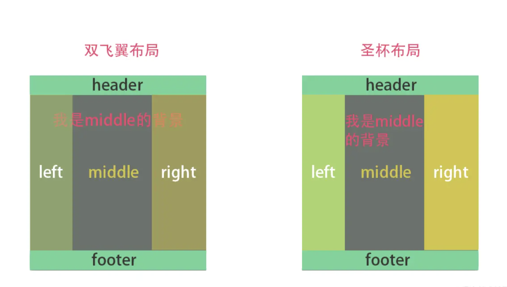

# 第一天

## HTML

**#Question:** 页面导入样式时，使用 link 和@import 有什么区别？

1. `<link>` 是`HTML`的标签。 The `@import` is used to import style rules from other style sheets.

   ```css
   <!-- @import Syntax -->
   @import url;
   @import url list-of-media-queries;
   @import url supports(supports-query);
   @import url supports(supports-query) list-of-media-queries;
   ```

2. `<link>` 引入的样式，在页面加载时，**同时加载**。 @import 引入的样式需要等页面加载完成之后再加载。

3. `<link>` 不存在兼容性问题，`@import` 不兼容 ie5 以下

4. `<link>` 可通过 `js` 操作 `DOM` 动态引入样式， `@import` 不可以

## CSS

**#Question:** 圣杯布局和双飞翼布局的理解和区别，并用代码实现

即 css 三栏布局---改变 viewpoint 宽度，两个边栏的宽度不变(左右定宽)，只会中间的区域变化， 且 中间部分优先渲染



### 圣杯布局 - Holy Grail Layout

[HolyGrailLayout - codepen](https://codepen.io/youkoucoding/pen/WNOEqGJ)

> - 利用 float 和 margin 负值 并列
> - 利用 父容器设置`padding`

Point:

1. 添加 left center right
2. left right 设置各自宽度 (三个部分的外容器的`padding`)
3. center 宽度设置为 100%
4. 给 left main right 设置 `position: relative;` 以及，`left:-100px;` 或者 `right:-100px;`
5. 给三个部分分别添加 `{float: left}` 使其脱离文档流---> 此时，footer 会被 这三部分覆盖
6. left 区域 设置：`margin-left: -100%;` right 区域 设置： `margin-left: -100px;`

```html
<header>HEADER</header>
<div class="container">
  <div class="main">
    <!-- center 优先加载，因此放在第一个 -->
    #center-one; center-two; center-three 中间宽度自适应
  </div>
  <div class="left">left</div>
  <div class="right">right</div>
</div>
<footer>FOOTER</footer>
```

```css
* {
  background: lightgray;
}

.container {
  padding: 0 100px;
}

.container::after {
  /* 清除浮动塌陷*/
  content: '';
  display: block;
  clear: both;
}

.main {
  background: orange;
  width: 100%;
  height: 100px;
  float: left;
}

.left {
  background: brown;
  width: 100px;
  height: 100px;
  margin-left: -100%;
  float: left;
  position: relative;
  left: -100px;
}

.right {
  background: green;
  width: 100px;
  height: 100px;
  margin-left: -100px;
  float: left;
  position: relative;
  right: -100px;
}

header,
footer {
  height: 60px;
  line-height: 60px;
  background-color: green;
  text-align: center;
  font-size: 30px;
  font-weight: bolder;
}

footer {
  background-color: lightcoral;
}
```

### 双飞翼

[shuangfeiyi](https://codepen.io/youkoucoding/pen/qBjPEqX?editors=1100)

```html
<div class="header">头部</div>
<div class="wrapper">
  <div class="center">主要区域</div>
</div>
<div class="left">左侧</div>
<div class="right">右侧</div>
<div class="footer">底部</div>
```

```css
.wrapper {
  width: 100%;
  float: left;
}

.center {
  background-color: coral;
  margin: 0 100px; /*为主区域设置 左右 外边距 压缩主区域，并被包裹*/
}

.left {
  background-color: yellow;
  width: 100px;
  float: left;
  margin-left: -100%;
}

.right {
  background-color: lightblue;
  width: 100px;
  float: left;
  margin-left: -100px;
}

.footer {
  clear: both;
}

.header,
.footer {
  height: 60px;
  line-height: 60px;
  background-color: green;
  text-align: center;
  font-size: 30px;
  font-weight: bolder;
}
```

## Javascript

**#Question:** 用递归算法实现，数组长度为 5 且元素的随机数在 2-32 间不重复的值

Description:

1. 生成一个长度为 5 的空数组 arr
2. 生成一个（2－32）之间的随机整数 rand
3. 把随机数 rand 插入到数组 arr 内，如果数组 arr 内已存在与 rand 相同的数字，则重新生成随机数 rand 并插入到 arr 内[需要使用递归实现，不能使用 for/while 等循环]
4. 最终输出一个长度为 5，且内容不重复的数组 arr

```javascript
var arr = new Array(5);
var num = randomNum();
var i = 0;
randomArr(arr, num);

function randomNum() {
  return Math.floor(Math.random() * 30 + 2);
}

function randomArr(arr, num) {
  if (arr.indexOf(num) === -1) {
    arr[i] = num;
    i++;
  } else {
    num = randomNum();
  }
  if (i > 5) {
    console.log(arr);
    return;
  } else {
    randomArr(arr, num);
  }
}
```

---

- Getting a random Number between two values

```js
// The returned value is no lower than (and may possibly equal) min, and is less than (and not equal) max
function getRandomArbitrary(min, max) {
  return Math.random() * (max - min) + min;
}
```

[Math.random() - JavaScript | MDN](https://developer.mozilla.org/en-US/docs/Web/JavaScript/Reference/Global_Objects/Math/random#getting_a_random_integer_between_two_values)

## Reference

[前端面试每日 3+1-以前端面试题来驱动学习，提倡每日学习与思考，每天进步一点！](http://www.h-camel.com/index.html)
