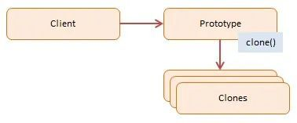

# 第一百零九日

## HTML

### **Question:** 很多网站不常用 table 和 iframe 这两个元素，原因？

#### `iframe`

- cons

  - 是一个单独的容器，因此不会应用全局的 CSS 样式
  - 会和网页共用域名连接池，因此可能由于 iframe 占用了连接数导致加载阻塞
  - 搜索引擎爬虫不易爬取，不利于 SEO
  - 相比直接操作 DOM 元素，使用 iframe 更耗费资源

- pros

  - 可以用其展示广告，可以避免由于添加广告而网站被爬虫拒绝收录的情况

#### `table`

- cons

  - table 的内容会等内部的所有内容加载完成才会显示，比基于 div+css 实现的表格布局加载速度慢。
  - 会导致网页语义发生错误，不利于无障碍功能
  - 改动内部内容会造成整个 table 重绘，消耗更多资源

- pros

  - 前期广泛用于后台管理系统，由于普通的后台管理系统大多都是表格布局，基于 table 编程难度低
  - 且面向内网的管理系统对性能要求不高

## CSS

### **Question:** `cursor` 属性

`cursor` 是鼠标光标的属性。可以给元素设置不同的 cursor 属性来使鼠标在不同的位置显示不同的形状。

| 值        | 描述                                                                                                    |
| --------- | ------------------------------------------------------------------------------------------------------- |
| url       | 需使用的自定义光标的 URL。注释：请在此列表的末端始终定义一种普通的光标，以防没有由 URL 定义的可用光标。 |
| default   | 默认光标（通常是一个箭头）                                                                              |
| auto      | 默认。浏览器设置的光标                                                                                  |
| crosshair | 光标呈现为十字线                                                                                        |
| pointer   | 光标呈现为指示链接的指针                                                                                |
| move      | 此光标指示某对象可被移动                                                                                |
| e-resize  | 此光标指示矩形框的边缘可被向右（东）移动                                                                |
| ne-resize | 此光标指示矩形框的边缘可被向上及向右移动（北/东）                                                       |
| nw-resize | 此光标指示矩形框的边缘可被向上及向左移动（北/西）                                                       |
| n-resize  | 此光标指示矩形框的边缘可被向上（北）移动                                                                |
| se-resize | 此光标指示矩形框的边缘可被向下及向右移动（南/东）                                                       |
| sw-resize | 此光标指示矩形框的边缘可被向下及向左移动（南/西）                                                       |
| s-resize  | 此光标指示矩形框的边缘可被向下移动（南）                                                                |
| w-resize  | 此光标指示矩形框的边缘可被向左移动（西）                                                                |
| text      | 此光标指示文本                                                                                          |
| wait      | 此光标指示程序正忙（通常是一只表或沙漏）                                                                |
| help      | 此光标指示可用的帮助（通常是一个问号或一个气球）                                                        |

## JavaScript

### **Question:** 什么是原型模式？它主要运用在哪些场景

#### 原型模式（prototype）

原型模式（prototype）是指用原型实例(一个共享的原型实例)指向创建对象的种类，并且通过拷贝这些原型创建新的对象。也就是创建一个对象作为另一个对象的 Prototype 属性。用于创建重复的对象，可以提升性能。

原型模式不单是一种设计模式，也被称为一种编程泛型。

从设计模式的角度讲，原型模式是用于创建对象的一种模式。我们不再关心对象的具体类型，而是找到一个对象，然后通过克隆来创建一个一模一样的对象。在其他语言很少使用原型模式，但是 JavaScript 作为原型语言，在构造新对象及其原型时会使用该模式。



#### 实例 Examples

- 经典实现

CustomerPrototype 对象，它可以克隆给定原型对象（Customer）。它的构造函数接受一个 Customer 类型的原型，然后调用克隆方法生成一个新的 Customer 对象，其对象属性值使用原型对象的值进行初始化。

```js
//客户原型类
function CustomerPrototype(proto) {
  this.proto = proto;

  this.clone = function () {
    var customer = new Customer();

    customer.name = proto.name;
    customer.age = proto.age;

    return customer;
  };
}
//客户类
function Customer(name, age) {
  this.name = name;
  this.age = age;

  this.say = function () {
    console.info(
      '%c%s',
      'color:red;font-size:18px',
      '姓名: ' + this.name + ', 年龄: ' + this.age
    );
  };
}

function run() {
  var proto = new Customer('张三', 18);
  var prototype = new CustomerPrototype(proto);

  var customer = prototype.clone();
  customer.say();
}

run();
```

---

- `Object.create()`实现原型模式

`Object.create()`[^1]方法用于创建一个新对象，使用现有的对象来提供新创建的对象的`__proto__`

[^1]: [Object.create() - JavaScript | MDN](https://developer.mozilla.org/zh-CN/docs/Web/JavaScript/Reference/Global_Objects/Object/create)

#### 优点，应用场景

- 在需要一个类的大量对象的时候，使用原型模式是最佳选择，因为原型模式是在内存中对这个对象进行拷贝，要比直接 new 这个对象性能要好很多，在这种情况下，需要的对象越多，原型模式体现出的优点越明显

- 如果一个对象的初始化需要很多其他对象的数据准备或其他资源的繁琐计算，那么可以使用原型模式

- 当需要一个对象的大量公共信息，少量字段进行个性化设置的时候，也可以使用原型模式拷贝出现有对象的副本进行加工处理

## Reference

[haizlin/fe-interview](https://github.com/haizlin/fe-interview)

[前端进阶](https://muyiy.cn/)

[CSS cursor 属性](https://www.w3school.com.cn/cssref/pr_class_cursor.asp)

[设计模式(7)[JS 版]-JavaScript 设计模式之原型模式如何实现](https://cloud.tencent.com/developer/article/1694166)
