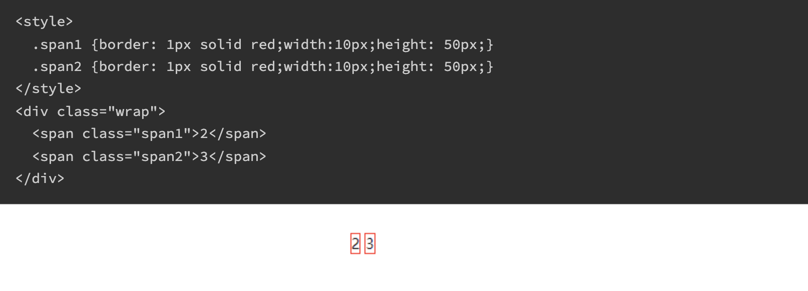

# 第一百一十五日

## HTML

### **Question:** 去除 html 标签之间换行产生的空格



#### 解决方法：

1. 不换行

```html
<div class="wrap"><span class="span1">2</span><span class="span2">3</span></div>
```

2. 给父标签设置 font-size 为 0:

```css
.wrap {
  font-size: 0;
}
```

3. 设置 float

```html
<style>
  .span1 {
    border: 1px solid red;
    width: 10px;
    height: 50px;
    float: left;
  }
  .span2 {
    border: 1px solid red;
    width: 10px;
    height: 50px;
    float: left;
  }
</style>
```

4. flex 布局

```css
.wrap {
  /* font-size: 0; */
  display: flex;
}
```

5. 设置换行的标签否定边距 `margin-left`;

## CSS

### **Question:** Reset CSS 和 Normalize CSS 的区别是什么

1. `Reset CSS`:

   - 将所有浏览器的默认样式都统一化，注重的是跨浏览器统一样式，用户还要自行添加一些默认样式(抹去一些样式)

2. `Normalize`:
   - 会根据各个浏览器的不同保留有用的浏览器特色样式，修复浏览器的一些 BUG，更注重易用性（添加一些样式）

## JavaScript

### **Question:** 防抖和节流 ts again

```js
type Timeout = number; // browser
// type Timeout = NodeJS.Timeout // node

/**
 * 防抖：生成一个函数，它在被调用后会等待一段时间再执行。
 * 如果在等待期间再次调用，之前还未执行的调用会被取消，重新计时。
 * @param fn 要防抖的函数
 * @param timeout 超时时间
 */
function debounce(fn: (...args: any[]) => any, timeout: number) {
  let time: Timeout = null;
  return function _debounced(...args: any[]) {
    if (time !== null) {
      clearTimeout(time);
    }
    time = setTimeout(() => {
      fn(...args);
      time = null;
    }, timeout);
  };
}

/**
 * 节流：生成一个函数，它在被调用后一段时间内再次被调用不起作用。
 * @param fn 要节流的函数
 * @param timeout 超时时间
 */
function throttle(fn: (...args: any[]) => any, timeout: number) {
  let time: Timeout = null;
  return function _throttled(...args: any[]) {
    if (time === null) {
      fn(...args);
      time = setTimeout(() => (time = null), timeout);
    }
  };
}
```

### **Question:** 3 个判断数组的方法，请分别介绍区别和优劣

#### `Object.prototype.toString.call()`

- 每一个继承 Object 的对象都有 toString 方法，如果 toString 方法没有重写的话，会返回 `[object Type]` 其中 `type` 为对象的类型(首字母大写)
- 除了 Object 类型的对象外，其他类型直接使用 toString 方法时，直接返回都是内容的字符串，所以需要使用 `call` 或者 `apply` 方法。

```js
const an = ['Hello', 'An'];
an.toString(); // "Hello,An"
Object.prototype.toString.call(an); // "[object Array]"
```

这种方法对于所有基本数据类型都能进行判断，即使是 `null` 和 `undefined`

```js
Object.prototype.toString.call('An'); // "[object String]"
Object.prototype.toString.call(1); // "[object Number]"
Object.prototype.toString.call(true); // "[object Boolean]"
Object.prototype.toString.call(Symbol(1)); // "[object Symbol]"
Object.prototype.toString.call(null); // "[object Null]"
Object.prototype.toString.call(undefined); // "[object Undefined]"
Object.prototype.toString.call(function () {}); // "[object Function]"
Object.prototype.toString.call({ name: 'An' }); // "[object Object]"
```

> Object.prototype.toString.call() 常用于判断浏览器内置对象

#### `instanceof`

`instanceof` 的内部机制是通过判断对象的原型链中是不是能找到类型的 `prototype`

使用 `instanceof`判断一个对象是否为数组，`instanceof` 会判断这个对象的原型链上是否会找到对应的 `Array` 的原型，找到返回 `true`，否则返回 `false`

> instanceof 只能用来判断对象类型，原始类型不可以。并且所有对象类型 instanceof Object 都是 true

```js
[] instanceof Array; // true
[] instanceof Object; // true
```

#### `Array.isArray()`

- 用来判断对象是否为数组

- `instanceof` 与 `Array.isArray()`

  - 当检测 Array 实例时，Array.isArray 优于 instanceof ，因为 Array.isArray 可以检测出 `iframes`

```js
var iframe = document.createElement('iframe');
document.body.appendChild(iframe);
xArray = window.frames[window.frames.length - 1].Array;
var arr = new xArray(1, 2, 3); // [1,2,3]

// Correctly checking for Array
Array.isArray(arr); // true
Object.prototype.toString.call(arr); // true
// Considered harmful, because doesn't work though iframes
arr instanceof Array; // false
```

- `Array.isArray()` 与 `Object.prototype.toString.call()`

  - Array.isArray()是 ES5 新增的方法，当不存在 Array.isArray() ，可以用 Object.prototype.toString.call() 实现。

```js
if (!Array.isArray) {
  Array.isArray = function (arg) {
    return Object.prototype.toString.call(arg) === '[object Array]';
  };
}
```

## Reference

[haizlin/fe-interview](https://github.com/haizlin/fe-interview)

[前端进阶](https://muyiy.cn/)

[Normalize.css, or not? Here are some considerations | Jeffry.in](https://jeffry.in/normalize-css-or-not/)

[谈谈 Object.prototype.toString](https://juejin.cn/post/6844903477940846600)

[Array.isArray() - JavaScript | MDN](https://developer.mozilla.org/zh-CN/docs/Web/JavaScript/Reference/Global_Objects/Array/isArray#instanceof_%E5%92%8C_isarray)
