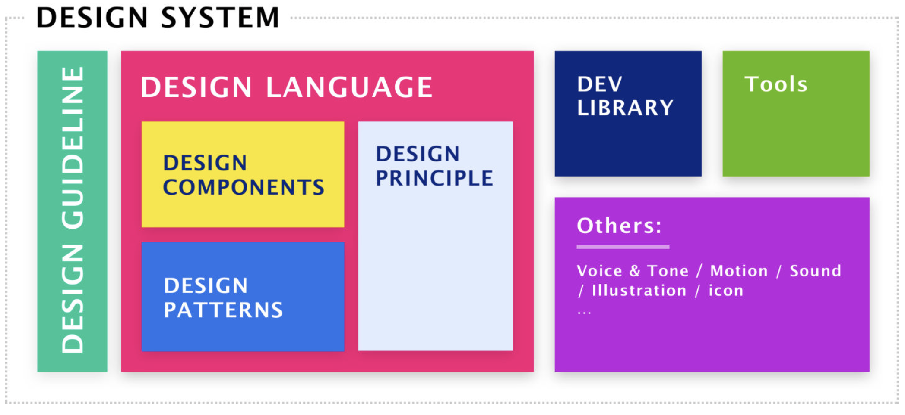

# 第一百一十九日

## HTML

### **Question:** 富文本

富文本格式（Rich Text Format）即 RTF 格式，又称多文本格式，是由微软公司开发的跨平台文档格式。最大的特点是：所见即所得，你把格式调整成什么样子，就会直接显示出什么样的效果。这一点和 words 类似。

富文本区别于普通的 input、textarea 输入内容，能设置文本样式，排版方式以及插入更丰富的媒介如图片、音频、视频等。

## CSS

### **Question:** 什么是 Design System



#### Design Principles（设计原则）

Principles 理解为一系列的规则，它们是我们设计开发产品的核心思想，构建一套有效的 Design System 的起点。用于解决用户体验中的问题，引导业务、开发以及设计向既定（正确）的方向前进。

例如，IBM 的 Carbon Design 为例，他们的 Design Principles 是：

- Be essential （必要的）
- Be inclusive（包容的）
- Be consistent（一致的）
- Be humanistic（人文的）
- Be delightful（愉快的）

#### Components（组件）和 Patterns（模式）

- Components 是整个产品设计的基础，是组成一个界面的最基础元素，为完成一个基础操作提供支持。
- Patterns 要处理的事情会更复杂一些。它的目标是为完成一个任务提供基础操作，是解决一系列问题的全局解决方案。

  - 举例来说：当用户在 App 中执行了一个操作，需要给予反馈，告知用户，而这个 Pattern 要解决的问题就是为这一系列场景提供一套设计解决方案。

- 无论是 Components 还是 Pattern，它们都是目标都是为具体的问题提供实际、可复用的解决方案，为整个产品开发过程提供一致性保障、提供决策依据以及提升效率降低开发成本。

两者差异：

1. Components 相对稳定，是整个 System 中的基础物料（砖、瓦、泥），是解决单点问题的基础元素。大家对它是具备基础认知的；Patterns 则是解决一类问题的整体解决方案，有多种的可能性；
2. 从工程角度来说 Components 也是相对稳定的，Patterns 是基于这些相对稳定的 Components 组合而成的；
3. Pattern 具备领域的差异化，不同的领域它所关注的点以及设计的处理形式都存在着差异；
4. Patterns 更加的复杂，不只是界面，也可以是流程、手势、甚至是透过视觉、动效、文案传递出的一种气质。

## JavaScript

### **Question:** 写一个方法把多维数组降维

```js
const arr = [1, 2, [3, 4, [5, 6]]];
arr.flat(Infinity);
// [1, 2, 3, 4, 5, 6]
```

---

```js
function flattenDeep(arr) {
  return arr.reduce(
    (acc, val) =>
      Array.isArray(val) ? acc.concat(flattenDeep(val)) : acc.concat(val),
    []
  );
}
```

## Reference

[haizlin/fe-interview](https://github.com/haizlin/fe-interview)

[前端进阶](https://muyiy.cn/)

[Rich Text Editor | Components | Design System | Vaadin 14 Docs](https://vaadin.com/docs/v14/ds/components/rich-text-editor)

[Principles – Carbon Design System](https://carbondesignsystem.com/test/list-section/)

[Design Guidelines - Lightning Design System](https://www.lightningdesignsystem.com/guidelines/overview/#content)

[Design Systems 02 - 什么是 Design Principles](https://zhuanlan.zhihu.com/p/31465217)

[Design System 中的 Design Token ](https://zhuanlan.zhihu.com/p/32548767)

[Design System 汇总](https://zhuanlan.zhihu.com/p/42498447)
