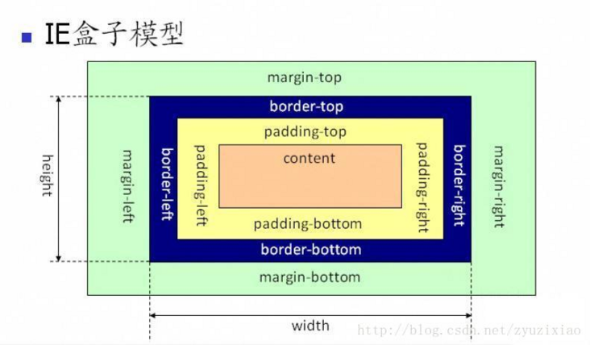

# 第十二日

## HTML

### **#Question:** 常见的浏览器内核都有哪些？并介绍下你对内核的理解

内核主要分为*渲染引擎*和 _JS 引擎_。前者负责页面的渲染，后者负责执行解析 JavaScript。之后，由于 JS 引擎越来越独立，现在所说的**浏览器内核大都指渲染引擎**

目前主流的内核有以下 4 个：

- Trident: 由微软开发，即我们熟知的 IE 内核
- Gecko: 使用 C++ 开发的渲染引擎，包括了 SpiderMonkey 即我们熟悉的 FireFox
- Presto: Opera 使用的内核
- **`Webkit`**: `Safari` 使用的内核
- **Chrome 浏览器内核：** 统称为 `Chromium` 内核，以前是 `Webkit` 内核，现在是`Blink`内核

## CSS

### **#Question:** 说说你对 css 盒子模型的理解

1. 基本概念

   - 标准(W3C)盒子模型(`box-sizing: content-box;`)：包括 `margin`,`border`,`padding`,`content`,并且 `content` 部分不包括其他部分
     
   - IE 盒子模型(`box-sizing: border-box;`)：包括 `margin`,`border`,`padding`,`content`，`content`包含了`border`和`padding`
     

2. 补充说明：

   - `CSS`盒模型， 有内外两个部分。 外部属性 控制盒子本体是否占满一整行； 内部则控制：内部元素的属性。 例如：`display: inline-block`,外部是，`inline` 不占据整行； 内部是 `block`则表明内部遵循块状特性。 因此， `display: inline;` 可理解为 `display: inline-inline;`， `display: block;` 可理解为 `display: block-block;`

   - `display: inline-block` 简单来说就是将对象呈现为 `inline` 对象，但是**对象的内容**作为 `block` 对象呈现。之后的内联对象会被排列在同一行内。比如我们可以给一个 link（a 元素）inline-block 属性值，使其既具有 block 的宽度高度特性又具有 inline 的同行特性

   - `width/height, padding, border, margin` 这几个控制盒子大小的属性。 其中 `width/height` 控制元素内容大小； `margin` 控制元素与其他元素的距离（`margin`的背景色透明， 元素 background-color，只影响到 border）； `border` 是元素外围边框； `padding` 控制元素内容到 border 的距离

## JavaScript

### **#Question:** 写一个获取当前 url 查询字符串中的参数的方法

```js
function urlParams() {
  const search = window.location.search;
  search = search.substr(1, search.length);
  const res = {};
  if (!search) return res;
  search.split('&').map((item) => {
    const [key, value] = item.split('=');
    res[key] = decodeURIComponent(value);
  });
  return res;
}
```

---

```js
function urlParam() {
  const res = {};
  location.search.replace(/([^&=?]+)=([^&]+)/g, (m, c1, c2) => (res[c1] = c2));
  return res;
}
```

## Soft Skills

### **#Question:** 网页应用从服务器主动推送到客户端有那些方式

**`WebSocket`**

WebSocket 是一种在单个 TCP 连接上进行全双工通信的协议

WebSocket 使得客户端和服务器之间的数据交换变得更加简单，允许服务端主动向客户端推送数据。在 WebSocket API 中，浏览器和服务器只需要完成一次握手，两者之间就直接可以创建持久性的连接，并进行双向数据传输。

**`eventsource(SSE)`**

`EventSource` 接口是 Web 内容与服务器发送的事件的接口。一个 `EventSource` 实例打开一个持久连接 `HTTP` 服务器，它发送事件的 `text/event-stream` 格式。连接保持打开状态，直到通过调用关闭 `EventSource.close()`。

与 `WebSocket` 不同，服务器发送的事件是单向的。也就是说，数据消息是从服务器到客户端（例如用户的 Web 浏览器）沿一个方向传递的

[SSE 技术详解：使用 HTTP 做服务端数据推送应用的技术](https://www.cnblogs.com/goloving/p/9196066.html)

**`Web Push`**

## Reference

[面试官：谈谈你对 CSS 盒模型的认识?](https://segmentfault.com/a/1190000015235886)

[block，inline 和 inline-block 概念和区别](https://www.cnblogs.com/keithwang/p/3139517.html)

[前端面试每日 3+1-以前端面试题来驱动学习，提倡每日学习与思考，每天进步一点！](http://www.h-camel.com/index.html)
