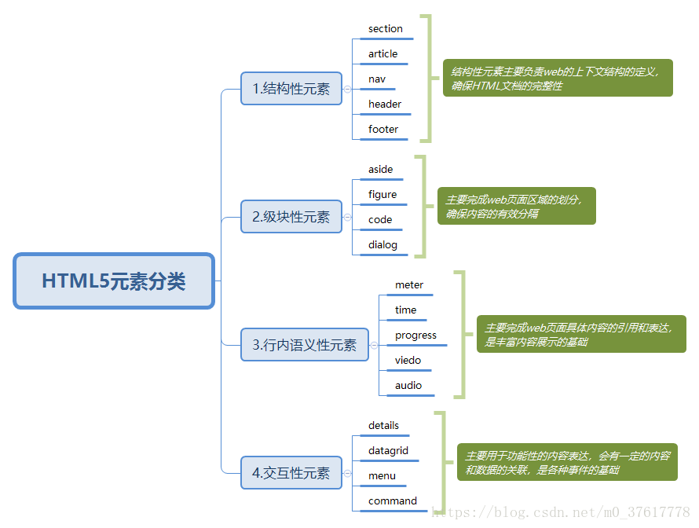

# 第一百二十四日

## HTML

### **Question:** `HTML5`规范将元素分为哪几个大类？特点



#### 构建主体内容

1. 标识文章

article 元素用来表示文档、页面中独立的、完整的、可以独立被外部引用的内容。article 元素可以嵌套使用。article 元素也可以用来表示插件。

2. 给内容分段

section 元素用于对网站或应用程序中页面的内容进行分区，div 元素也可以用来对页面进行分区，当一个容器需要被直接定义样式或通过脚本定义行为时，推荐使用 div，而非 section 元素。div 关注结构的独立性，而 sectio 元素关注内容的独立性，section 元素包含的内容可以单独存储到数据库中或输出到 word 文档中。

section 元素用于对网站或者应用程序中页面上的内容进行分块，一个 section 元素通常由内容以及标题组成，需要办好一个<hn>标题元素，一般不包含 header 头部或者 footer 底部元素，通常用 section 元素为那些有标题的内容进行分段。section 元素是对页面上的内容分块处理，相邻的 section 元素的内容是相关的，而不是像 article 那样独立。事实上，article 可以看做是特殊的 section 元素，article 元素更强调独立性、完整性，section 更强调相关性。

使用 section 元素时应注意以下几个问题：

- 不要将 section 元素当做设置样式的页面容器，对于此类操作应该使用 div 元素实现。
- 如果 article 元素、aside 元素或 nav 元素更符合使用条件，不要使用 section 元素。
- 不要为没有标题的内容区块使用 section 元素。
- 在 HTML5 中，div 元素变成了一种容器，当使用 CSS 样式的时候，可以对这个容器进行一个总体的 CSS 样式的套用。

3. 设计导航信息

nav 元素是一个可以用作页面导航的链接组，其中的导航元素链接到其他页面或当前页面的其他部分。nav 元素可以用以以下场合：

- 传统导航条
- 侧边栏导航
- 页内导航
- 翻页操作
- 设计辅助信息

aside 元素用来表示当前页面或文章的附属信息部分，其中的内容可以是与当前文章相关的参考资料、名词解释等。

4. 设计微格式

微格式是一种利用 HTML 的 class 属性来对网页添加附加信息的方法，主要是简化 WEB 开发的数据提取

time 元素代表 24 小时中的某个时刻或某个日期，标识时刻时允许带时差。

5. 添加发布日期

pubdate 属性是一个可选的布尔值属性，可用在 article 元素中的 time 元素上，time 元素代表了文章或整个网页的发布日期。

#### 添加语义模块

1. 添加标题块

header 元素是一种具有引导和导航作用的结构元素。在 HTML5 中，header 元素通常包含 h1-h6 元素，也可以包含 hgroup、table、form、nav 等元素。

2. 给标题分组

hgroup 元素可以为标题或者子标题进行分组，通常它与 h1~h6 元素组合使用。但如果文章只有一个主标题，则不需要 hgroup 元素。

3. 添加脚注块

footer 元素可以作为内容块的注脚，注脚信息有很多种形式，如作者、相关阅读链接及版权信息等。

4. 添加联系信息

address 元素用来在文档中定义联系信息，包括文档作者或文档编辑者名称、电子邮箱、真实地址、电话号码等。

## CSS

### **Question:** 伪类`:nth-child`、`:first-child`与`:first-of-type` 三者有什么不同

- `div:nth-child(2)` 选中父元素里的第二个子元素 div / 选择当前元素的父元素下的第 n 个子元素（从 1 开始）；
- `p:first-child` 选中父元素里的第一个 p 元素；
- `p:first-of-type` 选中第一个类型为 p 的子元素，选择当前元素的父元素下的第 n 个同类型子元素（从 1 开始）
- `:nth-child(n)`和`:first-child` 是强调父元素里的第 n 个 xx 子元素，首先是第 n 个，然后才是 xx 类型；
- `:first-of-type` 主要强调类型，即一个父元素里，无论我们想选中的那个元素前面有多少个同级元素，都不算，只要找到父元素里的第一个 xx 子元素就行

## Clean Code JavaScript

### **SOLID**

#### 1. Single Responsibility Principle (SRP)

As stated in Clean Code, "There should never be more than one reason for a class to change". It's tempting to jam-pack a class with a lot of functionality, like when you can only take one suitcase on your flight. The issue with this is that your class won't be conceptually cohesive and it will give it many reasons to change. Minimizing the amount of times you need to change a class is important. It's important because if too much functionality is in one class and you modify a piece of it, it can be difficult to understand how that will affect other dependent modules in your codebase.

**Bad:**

```javascript
class UserSettings {
  constructor(user) {
    this.user = user;
  }

  changeSettings(settings) {
    if (this.verifyCredentials()) {
      // ...
    }
  }

  verifyCredentials() {
    // ...
  }
}
```

**Good:**

```javascript
class UserAuth {
  constructor(user) {
    this.user = user;
  }

  verifyCredentials() {
    // ...
  }
}

class UserSettings {
  constructor(user) {
    this.user = user;
    this.auth = new UserAuth(user);
  }

  changeSettings(settings) {
    if (this.auth.verifyCredentials()) {
      // ...
    }
  }
}
```

#### 2. Open/Closed Principle(OCP)

As stated by Bertrand Meyer, "software entities (classes, modules, functions, etc.) should be open for extension, but closed for modification." What does that mean though? This principle basically states that you should allow users to add new functionalities without changing existing code.

**Bad:**

```javascript
class AjaxAdapter extends Adapter {
  constructor() {
    super();
    this.name = 'ajaxAdapter';
  }
}

class NodeAdapter extends Adapter {
  constructor() {
    super();
    this.name = 'nodeAdapter';
  }
}

class HttpRequester {
  constructor(adapter) {
    this.adapter = adapter;
  }

  fetch(url) {
    if (this.adapter.name === 'ajaxAdapter') {
      return makeAjaxCall(url).then((response) => {
        // transform response and return
      });
    } else if (this.adapter.name === 'nodeAdapter') {
      return makeHttpCall(url).then((response) => {
        // transform response and return
      });
    }
  }
}

function makeAjaxCall(url) {
  // request and return promise
}

function makeHttpCall(url) {
  // request and return promise
}
```

**Good:**

```javascript
class AjaxAdapter extends Adapter {
  constructor() {
    super();
    this.name = 'ajaxAdapter';
  }

  request(url) {
    // request and return promise
  }
}

class NodeAdapter extends Adapter {
  constructor() {
    super();
    this.name = 'nodeAdapter';
  }

  request(url) {
    // request and return promise
  }
}

class HttpRequester {
  constructor(adapter) {
    this.adapter = adapter;
  }

  fetch(url) {
    return this.adapter.request(url).then((response) => {
      // transform response and return
    });
  }
}
```

#### 3. Liskov Substitution Principle (LSP)

This is a scary term for a very simple concept. It's formally defined as "If S is a subtype of T, then objects of type T may be replaced with objects of type S (i.e., objects of type S may substitute objects of type T) without altering any of the desirable properties of that program (correctness, task performed, etc.)." That's an even scarier definition.

The best explanation for this is if you have a parent class and a child class, then the base class and child class can be used interchangeably without getting incorrect results. This might still be confusing, so let's take a look at the classic Square-Rectangle example. Mathematically, a square is a rectangle, but if you model it using the "is-a" relationship via inheritance, you quickly get into trouble.

**Bad:**

```javascript
class Rectangle {
  constructor() {
    this.width = 0;
    this.height = 0;
  }

  setColor(color) {
    // ...
  }

  render(area) {
    // ...
  }

  setWidth(width) {
    this.width = width;
  }

  setHeight(height) {
    this.height = height;
  }

  getArea() {
    return this.width * this.height;
  }
}

class Square extends Rectangle {
  setWidth(width) {
    this.width = width;
    this.height = width;
  }

  setHeight(height) {
    this.width = height;
    this.height = height;
  }
}

function renderLargeRectangles(rectangles) {
  rectangles.forEach((rectangle) => {
    rectangle.setWidth(4);
    rectangle.setHeight(5);
    const area = rectangle.getArea(); // BAD: Returns 25 for Square. Should be 20.
    rectangle.render(area);
  });
}

const rectangles = [new Rectangle(), new Rectangle(), new Square()];
renderLargeRectangles(rectangles);
```

**Good:**

```javascript
class Shape {
  setColor(color) {
    // ...
  }

  render(area) {
    // ...
  }
}

class Rectangle extends Shape {
  constructor(width, height) {
    super();
    this.width = width;
    this.height = height;
  }

  getArea() {
    return this.width * this.height;
  }
}

class Square extends Shape {
  constructor(length) {
    super();
    this.length = length;
  }

  getArea() {
    return this.length * this.length;
  }
}

function renderLargeShapes(shapes) {
  shapes.forEach((shape) => {
    const area = shape.getArea();
    shape.render(area);
  });
}

const shapes = [new Rectangle(4, 5), new Rectangle(4, 5), new Square(5)];
renderLargeShapes(shapes);
```

#### 4. Interface Segregation Principle (ISP)

ISP states that "Clients should not be forced to depend upon interfaces that they do not use." Interfaces are implicit contracts in JavaScript because of duck typing.

A good example to look at that demonstrates this principle in JavaScript is for classes that require large settings objects. Not requiring clients to setup huge amounts of options is beneficial, because most of the time they won't need all of the settings. Making them optional helps prevent having a "fat interface".

**Bad:**

```javascript
class DOMTraverser {
  constructor(settings) {
    this.settings = settings;
    this.setup();
  }

  setup() {
    this.rootNode = this.settings.rootNode;
    this.settings.animationModule.setup();
  }

  traverse() {
    // ...
  }
}

const $ = new DOMTraverser({
  rootNode: document.getElementsByTagName('body'),
  animationModule() {}, // Most of the time, we won't need to animate when traversing.
  // ...
});
```

**Good:**

```javascript
class DOMTraverser {
  constructor(settings) {
    this.settings = settings;
    this.options = settings.options;
    this.setup();
  }

  setup() {
    this.rootNode = this.settings.rootNode;
    this.setupOptions();
  }

  setupOptions() {
    if (this.options.animationModule) {
      // ...
    }
  }

  traverse() {
    // ...
  }
}

const $ = new DOMTraverser({
  rootNode: document.getElementsByTagName('body'),
  options: {
    animationModule() {},
  },
});
```

#### 5. Dependency Inversion Principle (DIP)

This principle states two essential things:

1. High-level modules should not depend on low-level modules. Both should depend on abstractions.
2. Abstractions should not depend upon details. Details should depend on abstractions.

This can be hard to understand at first, but if you've worked with AngularJS, you've seen an implementation of this principle in the form of Dependency Injection (DI). While they are not identical concepts, DIP keeps high-level modules from knowing the details of its low-level modules and setting them up. It can accomplish this through DI. A huge benefit of this is that it reduces the coupling between modules. Coupling is a very bad development pattern because it makes your code hard to refactor.

As stated previously, JavaScript doesn't have interfaces so the abstractions that are depended upon are implicit contracts. That is to say, the methods and properties that an object/class exposes to another object/class. In the example below, the implicit contract is that any Request module for an `InventoryTracker` will have a `requestItems` method.

**Bad:**

```javascript
class InventoryRequester {
  constructor() {
    this.REQ_METHODS = ['HTTP'];
  }

  requestItem(item) {
    // ...
  }
}

class InventoryTracker {
  constructor(items) {
    this.items = items;

    // BAD: We have created a dependency on a specific request implementation.
    // We should just have requestItems depend on a request method: `request`
    this.requester = new InventoryRequester();
  }

  requestItems() {
    this.items.forEach((item) => {
      this.requester.requestItem(item);
    });
  }
}

const inventoryTracker = new InventoryTracker(['apples', 'bananas']);
inventoryTracker.requestItems();
```

**Good:**

```javascript
class InventoryTracker {
  constructor(items, requester) {
    this.items = items;
    this.requester = requester;
  }

  requestItems() {
    this.items.forEach((item) => {
      this.requester.requestItem(item);
    });
  }
}

class InventoryRequesterV1 {
  constructor() {
    this.REQ_METHODS = ['HTTP'];
  }

  requestItem(item) {
    // ...
  }
}

class InventoryRequesterV2 {
  constructor() {
    this.REQ_METHODS = ['WS'];
  }

  requestItem(item) {
    // ...
  }
}

// By constructing our dependencies externally and injecting them, we can easily
// substitute our request module for a fancy new one that uses WebSockets.
const inventoryTracker = new InventoryTracker(
  ['apples', 'bananas'],
  new InventoryRequesterV2()
);
inventoryTracker.requestItems();
```

## Reference

[haizlin/fe-interview](https://github.com/haizlin/fe-interview/blob/master/category/history.md)

[ryanmcdermott/clean-code-javascript: Clean Code concepts adapted for JavaScript](https://github.com/ryanmcdermott/clean-code-javascript#introduction)
