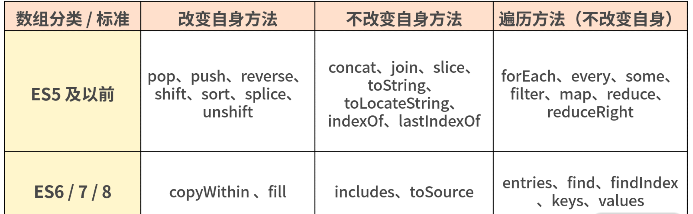

# 第一百四十四日

## HTML

### **Question:** 表单属性`type="hidden"`

- `<input type="hidden">`
  - "hidden" 类型的 `<input>` 元素允许 Web 开发者存放一些用户不可见、不可改的数据，在用户提交表单时，这些数据会一并发送出。比如，正被请求或编辑的内容的 ID，或是一个唯一的安全令牌。这些隐藏的 `<input>`元素在渲染完成的页面中完全不可见，而且**没有方法可以使它重新变为可见**。

---

1. 隐藏域在页面中对于用户是不可见的，在表单中插入隐藏域的目的在于收集或发送信息，以利于被处理表单的程序所使用。浏览者单击发送按钮发送表单的时候，隐藏域的信息也被一起发送到服务器
2. 有些时候要给用户一信息，在提交表单时一同提交,以确定用户身份，如 sessionkey 等．同样也可以用 cookie 实现，但使用隐藏域就简单的多了．兼容性好，且可以避免被禁用`cookies`
3. 一个 form 里有多个提交按钮，怎样使程序能够分清楚到底用户是按那一个按钮提交上来的呢？ 这时可以添加隐藏域，然后在每一个按钮处加上 οnclick="document.form.command.value="xx"， 然后接到数据后先检查 command 的值就会知道用户是按的那个按钮提交上来的
4. 一个网页中有多个 form，我们知道多个 form 是不能同时提交的，但有时这些 form 确实相互作用，我们就可以在 form 中添加隐藏域来使它们联系起来

## JavaScript

### **Question:** 原生 Math 的方法有哪些

常用方法

```js
Math.abs(num) // num绝对值
Math.ceil(num) // num向上取整
Math.floor(num) // num向下取整
Math.max(num1, num2 ...) // 取较大值
Math.min(num1, num2 ...) // 取较小值
Math.pow(num1, num2) // num1的num2次幂
Math.random() // 0-1间伪随机数
Math.sqrt(num) // num的平方根
```

## Tips

### 数组遍历的方法

- 基于 ES6，不会改变自身的遍历方法一共有 12 个，分别为 `forEach`、`every`、`some`、`filter`、`map`、`reduce`、`reduceRight`，以及 ES6 新增的方法 `entries`、`find`、`findIndex`、`keys`、`values`

```js
// forEach方法
var array = [1, 3, 5];
var obj = { name: 'cc' };
// callback 参数顺序 1.数组当前项的值 2.数组当前项的索引 3.数组对象本身
// forEach 不会直接改变调用它的对象，但是那个对象可能会被 callback 函数改变
var sReturn = array.forEach(function (value, index, array) {
  array[index] = value;
  console.log(this.name); // cc被打印了三次, this指向obj
}, obj);
console.log(array); // [1, 3, 5]
console.log(sReturn); // undefined, 可见返回值为undefined

// every方法
// 测试一个数组内的所有元素是否都能通过某个指定函数的测试。它返回一个布尔值。
// every 不会改变原数组。
// 若传入一个空数组，无论如何都会返回 true
var o = { 0: 10, 1: 8, 2: 25, length: 3 };
var bool = Array.prototype.every.call(
  o,
  function (value, index, obj) {
    return value >= 8;
  },
  o
);
console.log(bool); // true 如果回调函数的每一次返回都为 truthy 值，返回 true ，否则返回 false

// some方法
// 测试数组中是不是至少有1个元素通过了被提供的函数测试。它返回的是一个Boolean类型的值。
// 如果用一个空数组进行测试，在任何情况下它返回的都是false。
var array = [18, 9, 10, 35, 80];
var isExist = array.some(function (value, index, array) {
  return value > 20;
});
console.log(isExist); // true 至少一个元素通过回调函数的测试就会返回true；所有元素都没有通过回调函数的测试返回值才会为false。

// map 方法
// 创建一个新数组，其结果是该数组中的每个元素是调用一次提供的函数后的返回值
// callback 函数会被自动传入三个参数：数组元素，元素索引，原数组本身。
var array = [18, 9, 10, 35, 80];
array.map((item) => item + 1);
console.log(array); // [19, 10, 11, 36, 81] 一个由原数组每个元素执行回调函数的结果组成的新数组。

// filter 方法
// 创建一个新数组, 其包含通过所提供函数实现的测试的所有元素。
var array = [18, 9, 10, 35, 80];
var array2 = array.filter(function (value, index, array) {
  return value > 20;
});
console.log(array2); // [35, 80] 一个新的、由通过测试的元素组成的数组，如果没有任何数组元素通过测试，则返回空数组。

// reduce方法
var array = [1, 2, 3, 4];
var s = array.reduce(function (previousValue, value, index, array) {
  return previousValue * value;
}, 1);
console.log(s); // 24
// ES6写法更加简洁
array.reduce((p, v) => p * v); // 24
// reduceRight方法 (和reduce的区别就是从后往前累计)
var array = [1, 2, 3, 4];
array.reduceRight((p, v) => p * v); // 24

// entries方法
// 返回一个新的Array Iterator对象，该对象包含数组中每个索引的键/值对
var array = ['a', 'b', 'c'];
var iterator = array.entries();
console.log(iterator.next().value); // [0, "a"]
console.log(iterator.next().value); // [1, "b"]
console.log(iterator.next().value); // [2, "c"]
console.log(iterator.next().value); // undefined, 迭代器处于数组末尾时, 再迭代就会返回undefined

// find & findIndex方法
// find 返回数组中满足提供的测试函数的第一个元素的值。否则返回 undefined。
var array = [1, 3, 5, 7, 8, 9, 10];
function f(value, index, array) {
  return value % 2 == 0; // 返回偶数
}
function f2(value, index, array) {
  return value > 20; // 返回大于20的数
}
console.log(array.find(f)); // 8
console.log(array.find(f2)); // undefined
console.log(array.findIndex(f)); // 4
console.log(array.findIndex(f2)); // -1

// keys方法
// 返回一个包含数组中每个索引键的Array Iterator对象
[...Array(10).keys()]; // [0, 1, 2, 3, 4, 5, 6, 7, 8, 9]
[...new Array(10).keys()]; // [0, 1, 2, 3, 4, 5, 6, 7, 8, 9]

// values方法
// 返回一个新的 Array Iterator 对象，该对象包含数组每个索引的值
var array = ['abc', 'xyz'];
var iterator = array.values();
console.log(iterator.next().value); //abc
console.log(iterator.next().value); //xyz
for (const value of iterator) {
  console.log(value);
}
```

- `reduce`
  1. `callback`（一个在数组的每一项中调用的函数，接受四个参数）：
     - previousValue（上一次调用回调函数时的返回值，或者初始值）
     - currentValue（当前正在处理的数组元素）
     - currentIndex（当前正在处理的数组元素下标）
     - array（调用 reduce() 方法的数组）
  2. `initialValue`（可选的初始值，作为第一次调用回调函数时传给 previousValue 的值）

```js
/* 题目：数组 arr = [1,2,3,4] 求数组的和：*/
// 第一种方法：
var arr = [1, 2, 3, 4];
var sum = 0;
arr.forEach(function (e) {
  sum += e;
}); // sum = 10
// 第二种方法
var arr = [1, 2, 3, 4];
var sum = 0;
arr.map(function (v) {
  sum += v;
});
// 第三种方法
var arr = [1, 2, 3, 4];
arr.reduce(function (pre, cur) {
  return pre + cur; // 会直接返回最后累加的结果
});
```

---

- var arr = [ {name: 'brick1'}, {name: 'brick2'}, {name: 'brick3'} ] 希望最后返回到 arr 里面每个对象的 name 拼接数据为 'brick1, brick2 & brick3'

```js
var arr = [{ name: 'one' }, { name: 'two' }, { name: 'three' }];
arr.reduce(function (prev, current, index, array) {
  if (index === 0) {
    return current.name;
  } else if (index === array.length - 1) {
    return prev + ' & ' + current.name;
  } else {
    return prev + ', ' + current.name;
  }
}, '');
// 返回结果 "one, two & three"
```



## Reference

[haizlin/fe-interview](https://github.com/haizlin/fe-interview/blob/master/category/history.md)

[前端进阶](https://muyiy.cn/question/)

[Math - JavaScript | MDN](https://developer.mozilla.org/zh-CN/docs/Web/JavaScript/Reference/Global_Objects/Math)
