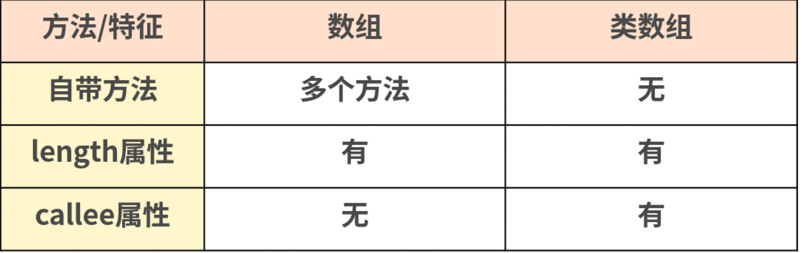

# 第一百四十六日

## HTML

### **Question:** `viewport` 是什么？在什么时候下使用

- `viewport` 是用户网页的可视区域
- 多用于移动端，也可以用在支持类似“固定到边缘”等特性的桌面浏览器
- 移动端的浏览器是把页面放在一个虚拟的"窗口"（viewport）中，通常这个虚拟的"窗口"（viewport）比物理屏幕宽，这样就不用把每个网页挤到很小的窗口中（这样会破坏没有针对手机浏览器优化的网页的布局），用户可以通过平移和缩放来看网页的不同部分
- visual viewport 尺寸所对应的并不是指屏幕区域里的物理像素，而是 CSS 像素。并且它所包含的 CSS 像素的数量也是随着用户缩放而有所改变
- 在 head 加入这行，把默认的 layout viewport 的宽度设为移动设备的屏幕宽度，也就是把当前的 viewport 宽度设置为设备物理屏幕的宽度，实现全屏的效果
- `<meta name="viewport" content="width=device-width, initial-scale=1, minimum-scale=1, maximum-scale=1, user-scalable=no">`

## Tips

### 类数组

1. 函数里面的参数对象 `arguments`
2. 用 getElementsByTagName/ClassName/Name 获得的 `HTMLCollection`
3. 用 querySelector 获得的 `NodeList`

---

#### `arguments`对象

- 只定义在函数体中
- 有一个 length 属性
- callee 属性(此函数自身)

```js
function foo(name, age, sex) {
  console.log(arguments); // [Arguments] { '0': 'jack', '1': '18', '2': 'male' }
  console.log(typeof arguments); // object
  console.log(Object.prototype.toString.call(arguments)); // [object Arguments]
}
foo('jack', '18', 'male');
```

---

- **遍历参数操作**
  - 在函数内部可以直接获取 arguments 这个类数组的值，那么也可以对于参数进行一些操作

```javascript
function add() {
  let sum = 0;
  let len = arguments.length;
  for(let i = 0; i < len; i++){
    sum += arguments[i];
  }
  return sum;
}
add()                           // 0
add(1)                          // 1
add(1，2)                       // 3
add(1,2,3,4);                   // 10
```

- **定义链接字符串函数**

```js
// 函数唯一正式声明了的参数是一个字符串，该参数指定一个字符作为衔接点来连接字符串
function myConcat(separa) {
  var args = Array.prototype.slice.call(arguments, 1);
  return args.join(separa);
}
myConcat(', ', 'red', 'orange', 'blue');
// "red, orange, blue"
myConcat('; ', 'elephant', 'lion', 'snake');
// "elephant; lion; snake"
myConcat('. ', 'one', 'two', 'three', 'four', 'five');
// "one. two. three. four. five"
```

- **传递参数使用**
  - 可以借助 arguments 将参数从一个函数传递到另一个函数

```js
// 通过在 foo 函数内部调用 apply 方法，用 foo 函数的参数传递给 bar 函数，这样就实现了借用参数的妙用
// 使用 apply 将 foo 的参数传递给 bar
function foo() {
  bar.apply(this, arguments);
}
function bar(a, b, c) {
  console.log(a, b, c);
}
foo(1, 2, 3); //1 2 3
```

#### `HTMLCollection`

- HTML DOM 对象的一个接口，这个接口包含了获取到的 **DOM 元素集合**，返回的类型是类数组对象，如果用 typeof 来判断的话，它返回的是 'object'。它是及时更新的，当文档中的 DOM 变化时，它也会随之变化, 自动更新。

```js
var elem1, elem2;
// document.forms 是一个 HTMLCollection
elem1 = document.forms[0];
elem2 = document.forms.item(0);
console.log(elem1);
console.log(elem2);
console.log(typeof elem1); // object
console.log(Object.prototype.toString.call(elem1)); // [object HTMLFormElement]
```

#### `NodeList`

- NodeList 对象是**节点的集合**，通常是由 `querySlector` 返回的。NodeList 不是一个数组，也是一种类数组。虽然 NodeList 不是一个数组，但是**可以使用 `for...of`(values) 来迭代**。在一些情况下，NodeList 是一个**实时集合**，也就是说，如果文档中的节点树发生变化，NodeList 也会随之变化。我们还是利用代码来理解一下 Nodelist 这种类数组。

```js
var list = document.querySelectorAll('input[type=checkbox]');
for (var checkbox of list) {
  checkbox.checked = true;
}
console.log(list);
console.log(typeof list); // object
console.log(Object.prototype.toString.call(list)); // [object NodeList]
```

#### 类数组转换成数组

1. 类数组借用数组方法转数组
   - 类数组因为不是真正的数组，所以没有数组类型上自带的那些方法

```js
var arrayLike = {
  0: 'java',
  1: 'script',
  length: 2,
};

// 借用 array.push 为此对像添加值
Array.prototype.push.call(arrayLike, 'jack', 'lily');
console.log(typeof arrayLike); // 'object'
console.log(arrayLike);
// {0: "java", 1: "script", 2: "jack", 3: "lily", length: 4}
```

---

```js
function sum(a, b) {
  let args = Array.prototype.slice.call(arguments);
  // let args = [].slice.call(arguments); // 这样写也是一样效果
  console.log(args.reduce((sum, cur) => sum + cur));
}

sum(1, 2); // 3

function sum(a, b) {
  let args = Array.prototype.concat.apply([], arguments);
  console.log(args.reduce((sum, cur) => sum + cur));
}
sum(1, 2); // 3
```

---

2. ES6 的方法转数组
   - ES6 新增的 **`Array.from`** 方法以及**展开运算符的方法**

```js
function sum(a, b) {
  let args = Array.from(arguments);
  console.log(args.reduce((sum, cur) => sum + cur));
}
sum(1, 2); // 3
function sum(a, b) {
  let args = [...arguments];
  console.log(args.reduce((sum, cur) => sum + cur));
}
sum(1, 2); // 3
function sum(...args) {
  console.log(args.reduce((sum, cur) => sum + cur));
}
sum(1, 2); // 3
```

---



## Reference

[haizlin/fe-interview](https://github.com/haizlin/fe-interview/blob/master/category/history.md)

[前端进阶](https://muyiy.cn/question/)
