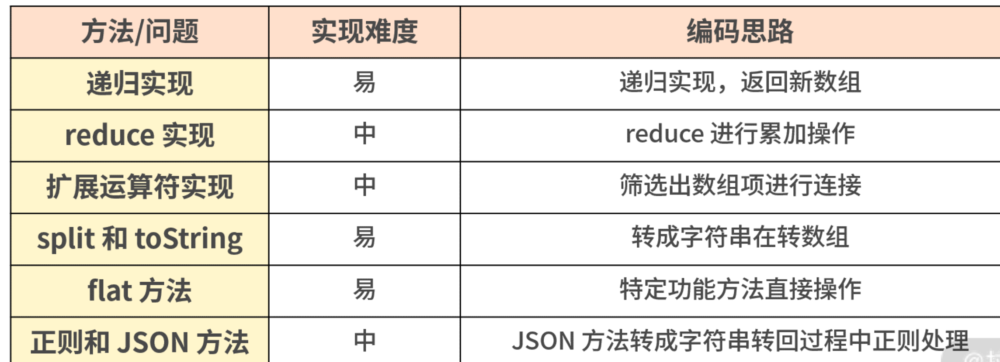

# 第一百四十六日

## HTML

### **Question:** 本地存储的生命周期

- `cookie`: expire 和 max-age 都能控制数据的存储时间。expire 是一个绝对的过期时间，max-age 是文档被访问之后的存活时间（是相对时间）。默认是 session (一次会话)
- `sessionStorage`: 当会话被关闭后（浏览器、标签页被关闭），就会被清除。与 localStorage 用法一样
- `localStorage`: 除非被主动清除，不然永久储存在浏览器中
- `IndexedDB`: 没有过期时间，除非主动清除

## CSS

### **Question:** `background-attachment`属性

- `background-attachment: fixed / scroll / local`： 设置背景图像是否固定或者随着页面的其余部分滚动。
  - `fixed`: 背景图片不会随着页面的滚动而滚动
  - `scroll`: 背景图片随着页面的滚动而滚动，**默认**
  - `local`: 背景图片会随着元素内容的滚动而滚动
  - `inherit`: 指定 background-attachment 的设置应该从父元素继承。

## Tips

### 数组扁平化

> 数组的扁平化其实就是将一个嵌套多层的数组 array（嵌套可以是任何层数）转换为只有一层的数组。

#### 方法一：普通的递归实现

```js
// 方法1
// 在遍历过程中发现数组元素还是数组的时候进行递归操作，
// 把数组的结果通过数组的 concat 方法拼接到最后要返回的 result 数组上，那么最后输出的结果就是扁平化后的数组。
var a = [1, [2, [3, 4, 5]]];
function flatten(arr) {
  let result = [];
  for (let i = 0; i < arr.length; i++) {
    if (Array.isArray(arr[i])) {
      result = result.concat(flatten(arr[i]));
    } else {
      result.push(arr[i]);
    }
  }
  return result;
}
flatten(a); //  [1, 2, 3, 4，5]
```

#### 方法二：利用 `reduce` 函数迭代(递归)

```js
// 方法2
var arr = [1, [2, [3, 4]]];
function flatten(arr) {
  return arr.reduce(function (prev, next) {
    return prev.concat(Array.isArray(next) ? flatten(next) : next);
  }, []);
}
console.log(flatten(arr)); //  [1, 2, 3, 4，5]
```

#### 方法三：扩展运算符实现

```js
// 方法3
// 先用数组的 some 方法把数组中仍然是组数的项过滤出来，然后执行 concat 操作，利用 ES6 的展开运算符，将其拼接到原数组中，最后返回原数组
var arr = [1, [2, [3, 4]]];
function flatten(arr) {
  while (arr.some((item) => Array.isArray(item))) {
    arr = [].concat(...arr);
  }
  return arr;
}
console.log(flatten(arr)); //  [1, 2, 3, 4，5]
```

#### 方法四：`split` 和 `toString` 共同处理

```js
//数组会默认带一个 toString 的方法，所以可以把数组直接转换成逗号分隔的字符串，然后再用 split 方法把字符串重新转换为数组
var arr = [1, [2, [3, 4]]];
function flatten(arr) {
  return arr.toString().split(',');
}
console.log(flatten(arr)); //  [1, 2, 3, 4]
```

#### 方法五：调用 ES6 中的 flat

- `arr.flat([depth])`
  - depth 是 flat 的参数，depth 是可以传递数组的展开深度（默认不填、数值是 1），即展开一层数组
  - 参数也可以传进 `Infinity`，代表不论多少层都要展开
  - 对数组的嵌套层数不确定的时候，最好直接使用 Infinity，可以达到扁平化

```js
// 方法5
var arr = [1, [2, [3, 4]]];
function flatten(arr) {
  return arr.flat(Infinity);
}
console.log(flatten(arr)); //  [1, 2, 3, 4，5]
```

#### 方法六：正则和 JSON 方法共同处理

```js
// 将 JSON.stringify 的方法先转换为字符串，然后通过正则表达式过滤掉字符串中的数组的方括号，最后再利用 JSON.parse 把它转换成数组

// 方法 6
let arr = [1, [2, [3, [4, 5]]], 6];
function flatten(arr) {
  let str = JSON.stringify(arr);
  str = str.replace(/(\[|\])/g, '');
  str = '[' + str + ']';
  return JSON.parse(str);
}
console.log(flatten(arr)); //  [1, 2, 3, 4，5]
```

---



## Reference

[haizlin/fe-interview](https://github.com/haizlin/fe-interview/blob/master/category/history.md)

[前端进阶](https://muyiy.cn/question/)

[String.prototype.split() - JavaScript | MDN](https://developer.mozilla.org/zh-CN/docs/Web/JavaScript/Reference/Global_Objects/String/split)
