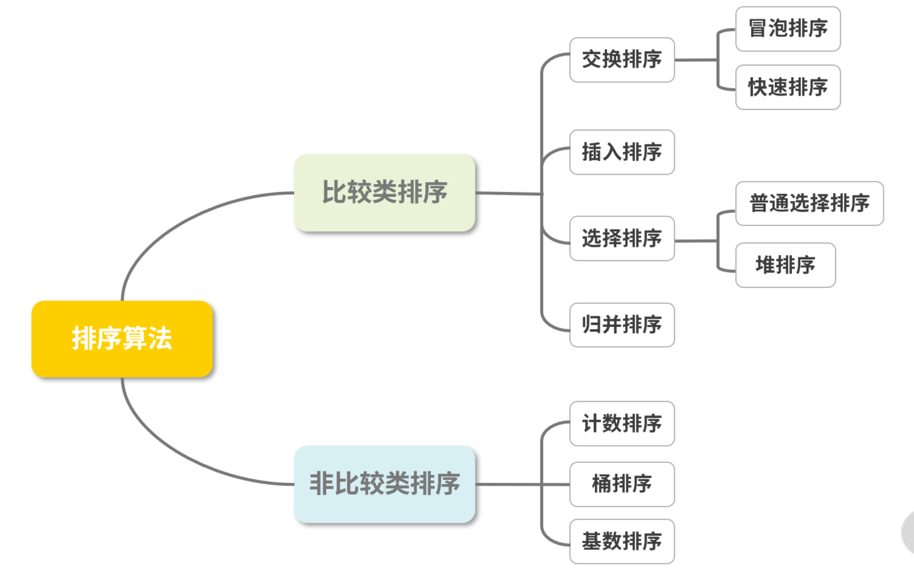
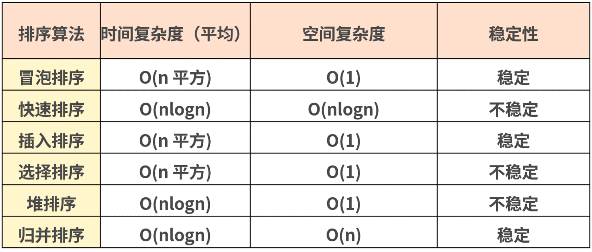

# 第一百四十九日

## HTML

### **Question:** 整个页面中的内容设置成只读，不可编辑的状态

```css
body {
  pointer-events: none !important;
}
```

## Tips

### 数组排序

- 比较类排序：通过比较来决定元素间的相对次序，其时间复杂度不能突破 O(nlogn)，因此也称为非线性时间比较类排序。
- 非比较类排序：不通过比较来决定元素间的相对次序，它可以突破基于比较排序的时间下界，以线性时间运行，因此也称为线性时间非比较类排序。



#### 冒泡排序

```js
let a = [1, 3, 6, 3, 23, 76, 1, 34, 222, 6, 456, 221];
function bubbleSort(array) {
  const len = array.length;
  if (len < 2) return array;
  for (let i = 0; i < len; i++) {
    for (let j = 0; j < i; j++) {
      if (array[j] > array[i]) {
        const temp = array[j];
        array[j] = array[i];
        array[i] = temp;
      }
    }
  }
  return array;
}
bubbleSort(a); // [1, 1, 3, 3, 6, 6, 23, 34, 76, 221, 222, 456]
```

#### 快速排序

- 最主要的思路是从数列中挑出一个元素，称为 “基准”（pivot）；然后重新排序数列，所有元素比基准值小的摆放在基准前面、比基准值大的摆在基准的后面；在这个区分搞定之后，该基准就处于数列的中间位置；然后把小于基准值元素的子数列（left）和大于基准值元素的子数列（right）递归地调用 quick 方法排序完成。

```js
let a = [1, 3, 6, 3, 23, 76, 1, 34, 222, 6, 456, 221];
function quickSort(array) {
  let quick = function (arr) {
    if (arr.length <= 1) return arr;
    const index = Math.floor(len >> 1);
    const pivot = arr.splice(index, 1)[0];
    const left = [];
    const right = [];
    for (let i = 0; i < arr.length; i++) {
      if (arr[i] > pivot) {
        right.push(arr[i]);
      } else if (arr[i] <= pivot) {
        left.push(arr[i]);
      }
    }
    return quick(left).concat([pivot], quick(right));
  };
  const result = quick(array);
  return result;
}
quickSort(a); //  [1, 1, 3, 3, 6, 6, 23, 34, 76, 221, 222, 456]
```

#### 插入排序

- 工作原理是通过构建有序序列，对于未排序数据，在已排序序列中从后向前扫描，找到相应位置并插入，从而达到排序的效果。

```js
var a = [1, 3, 6, 3, 23, 76, 1, 34, 222, 6, 456, 221];
function insertSort(array) {
  const len = array.length;
  let current;
  let prev;
  for (let i = 1; i < len; i++) {
    current = array[i];
    prev = i - 1;
    while (prev >= 0 && array[prev] > current) {
      array[prev + 1] = array[prev];
      prev--;
    }
    array[prev + 1] = current;
  }
  return array;
}
insertSort(a); // [1, 1, 3, 3, 6, 6, 23, 34, 76, 221, 222, 456]
```

#### 选择排序

- 首先将最小的元素存放在序列的起始位置，再从剩余未排序元素中继续寻找最小元素，然后放到已排序的序列后面……以此类推，直到所有元素均排序完毕 `O(n^2)`

```js
var a = [1, 3, 6, 3, 23, 76, 1, 34, 222, 6, 456, 221];
function selectSort(array) {
  const len = array.length;
  let temp;
  let minIndex;
  for (let i = 0; i < len - 1; i++) {
    minIndex = i;
    for (let j = i + 1; j < len; j++) {
      if (array[j] <= array[minIndex]) {
        minIndex = j;
      }
    }
    temp = array[i];
    array[i] = array[minIndex];
    array[minIndex] = temp;
  }
  return array;
}
selectSort(a); // [1, 1, 3, 3, 6, 6, 23, 34, 76, 221, 222, 456]
```

#### 堆排序

- 堆排序是指利用堆这种数据结构所设计的一种排序算法。堆积是一个近似完全二叉树的结构，并同时满足堆积的性质，即子结点的键值或索引总是小于（或者大于）它的父节点。堆的底层实际上就是一棵完全二叉树，可以用数组实现。

```js
// 根节点最大的堆叫作大根堆，根节点最小的堆叫作小根堆，你可以根据从大到小排序或者从小到大来排序，分别建立对应的堆
var a = [1, 3, 6, 3, 23, 76, 1, 34, 222, 6, 456, 221];
function heap_sort(arr) {
  var len = arr.length;
  var k = 0;
  function swap(i, j) {
    var temp = arr[i];
    arr[i] = arr[j];
    arr[j] = temp;
  }
  function max_heapify(start, end) {
    var dad = start;
    var son = dad * 2 + 1;
    if (son >= end) return;
    if (son + 1 < end && arr[son] < arr[son + 1]) {
      son++;
    }
    if (arr[dad] <= arr[son]) {
      swap(dad, son);
      max_heapify(son, end);
    }
  }
  for (var i = Math.floor(len / 2) - 1; i >= 0; i--) {
    max_heapify(i, len);
  }
  for (var j = len - 1; j > k; j--) {
    swap(0, j);
    max_heapify(0, j);
  }

  return arr;
}
heap_sort(a); // [1, 1, 3, 3, 6, 6, 23, 34, 76, 221, 222, 456]
```

1. 堆排序最核心的点就在于排序前先建堆
2. 由于堆其实就是完全二叉树，如果父节点的序号为 n，那么叶子节点的序号就分别是 `2n` 和 `2n+1`
3. 堆排序最后有两个循环：第一个是处理父节点的顺序；第二个循环则是根据父节点和叶子节点的大小对比，进行堆的调整。通过这两轮循环的调整，最后堆排序完成。

#### 归并排序

- 归并排序是建立在归并操作上的一种有效的排序算法，该算法是采用分治法的一个非常典型的应用。将已有序的子序列合并，得到完全有序的序列；先使每个子序列有序，再使子序列段间有序。若将两个有序表合并成一个有序表，称为二路归并。

```js
var a = [1, 3, 6, 3, 23, 76, 1, 34, 222, 6, 456, 221];
function mergeSort(array) {
  const merge = (right, left) => {
    const result = [];
    let il = 0;
    let ir = 0;
    while (il < left.length && ir < right.length) {
      if (left[il] < right[ir]) {
        result.push(left[il++]);
      } else {
        result.push(right[ir++]);
      }
    }
    while (il < left.length) {
      result.push(left[il++]);
    }
    while (ir < right.length) {
      result.push(right[ir++]);
    }
    return result;
  };
  const mergeSort = (array) => {
    if (array.length === 1) {
      return array;
    }
    const mid = Math.floor(array.length / 2);
    const left = array.slice(0, mid);
    const right = array.slice(mid, array.length);
    return merge(mergeSort(left), mergeSort(right));
  };
  return mergeSort(array);
}
mergeSort(a); // [1, 1, 3, 3, 6, 6, 23, 34, 76, 221, 222, 456]
```

- 通过 mid 可以把该数组分成左右两个数组，分别对这两个进行递归调用排序方法，最后将两个数组按照顺序归并起来
- 归并排序是一种稳定的排序方法，和选择排序一样，归并排序的性能不受输入数据的影响，但表现比选择排序好得多，因为始终都是 O(nlogn) 的时间复杂度。而代价是需要额外的内存空间。

---



## Reference

[haizlin/fe-interview](https://github.com/haizlin/fe-interview/blob/master/category/history.md)
