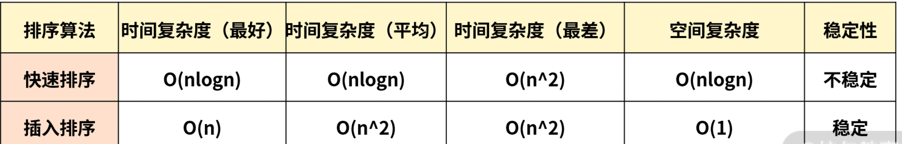

# 第一百五十日

## HTML

### **Question:** HTML5 如何使某个页面元素或整个页面可编辑

- 让某个元素可以编辑，可以使用 `contenteditable` 属性
- 让整个页面可编辑可以使用 `document.designMode` 属性

## CSS

### **Question:** 什么时候用 transition？什么时候使用 animation

- `transition` 相当于是个过度动画，需要又过度效果才会触发。一般用来做元素的放大缩小、平移旋转等简单的操作
  - `transition` 只执行一次，当需要执行多次时，一般会利用 `:hover` 等时机或者使用 javaScript 改变类名进行控制。
- `animation` 需要自己设定关键帧，可以做相对复杂的操作，比如延迟、循环播放等。一般在需要比较复杂的情况才会使用 animation

## Tips

### `sort`排序算法实现原理

- `arr.sort([compareFunction])` 数组已原地排序，并且不进行复制
- `compareFunction` 用来指定按某种顺序进行排列的函数，如果省略不写，元素按照**转换为字符串的各个字符的 `Unicode` 位点进行排序**

```js
const months = ['March', 'Jan', 'Feb', 'Dec'];
months.sort();
console.log(months);
// ["Dec", "Feb", "Jan", "March"]
const array1 = [1, 30, 4, 21, 100000];
array1.sort();
console.log(array1);
// [1, 100000, 21, 30, 4]
```

- 如果指明了 compareFunction 参数 ，那么数组会按照调用该函数的返回值排序，即 a 和 b 是两个将要被比较的元素：
  - 如果 `compareFunction（a, b)`小于 0，那么 a 会被排列到 b 之前；
  - 如果 `compareFunction（a, b)`等于 0，a 和 b 的相对位置不变；
  - 如果 `compareFunction（a, b)`大于 0，b 会被排列到 a 之前。

---

`sort` 源码分析

- 如果要排序的元素个数是 n 的时候，那么就会有以下几种情况：
  1. 当 n<=10 时，采用插入排序；
  2. 当 n>10 时，采用三路快速排序；
  3. 10<n <=1000，采用中位数作为哨兵元素；
  4. n>1000，每隔 200~215 个元素挑出一个元素，放到一个新数组中，然后对它排序，找到中间位置的数，以此作为中位数。

1. 为什么元素个数少的时候要采用插入排序？

- 虽然插入排序理论上是平均时间复杂度为 `O(n^2)` 的算法，快速排序是一个平均 `O(nlogn)` 级别的算法。但是，这只是理论上平均的时间复杂度估算，但是它们也有最好的时间复杂度情况，而**插入排序**在最好的情况下时间复杂度是 `O(n)`。
- 当 n 足够小的时候，快速排序 nlogn 的优势会越来越小。倘若插入排序的 n 足够小，那么就会超过快排。

2. 为什么要选择哨兵元素

- 快速排序的性能瓶颈在于递归的深度，最坏的情况是每次的哨兵都是最小元素或者最大元素
- 进行 partition（一边是小于哨兵的元素，另一边是大于哨兵的元素）时，就会有一边是空的。这么排下去，递归的层数就达到了 n , 而每一层的复杂度是 O(n)，因此快排这时候会退化成 O(n^2) 级别
- 让哨兵元素尽可能地处于数组的中间位置，让最大或者最小的情况尽可能少

```js
// 官方实现的 sort 排序算法的代码基本结构
// 时间复杂度是根据数据量的大小，从而进行变化的
function ArraySort(comparefn) {
  CHECK_OBJECT_COERCIBLE(this, 'Array.prototype.sort');
  var array = TO_OBJECT(this);
  var length = TO_LENGTH(array.length);
  return InnerArraySort(array, length, comparefn);
}

function InnerArraySort(array, length, comparefn) {
  // 比较函数未传入
  if (!IS_CALLABLE(comparefn)) {
    comparefn = function (x, y) {
      if (x === y) return 0;
      if (%_IsSmi(x) && %_IsSmi(y)) {
        return %SmiLexicographicCompare(x, y);
      }
      x = TO_STRING(x);
      y = TO_STRING(y);
      if (x == y) return 0;
      else return x < y ? -1 : 1;
    };
  }
  function InsertionSort(a, from, to) {
    // 插入排序
    for (var i = from + 1; i < to; i++) {
      var element = a[i];
      for (var j = i - 1; j >= from; j--) {
        var tmp = a[j];
        var order = comparefn(tmp, element);
        if (order > 0) {
          a[j + 1] = tmp;
        } else {
          break;
        }
      }
      a[j + 1] = element;
    }
  }
  function GetThirdIndex(a, from, to) {
    // 元素个数大于1000时寻找哨兵元素
    var t_array = new InternalArray();
    var increment = 200 + ((to - from) & 15);
    var j = 0;
    from += 1;
    to -= 1;
    for (var i = from; i < to; i += increment) {
      t_array[j] = [i, a[i]];
      j++;
    }

    t_array.sort(function (a, b) {
      return comparefn(a[1], b[1]);
    });

    var third_index = t_array[t_array.length >> 1][0];
    return third_index;
  }

  function QuickSort(a, from, to) {
    // 快速排序实现
    //哨兵位置
    var third_index = 0;
    while (true) {
      if (to - from <= 10) {
        InsertionSort(a, from, to); // 数据量小，使用插入排序，速度较快
        return;
      }
      if (to - from > 1000) {
        third_index = GetThirdIndex(a, from, to);
      } else {
        // 小于1000 直接取中点
        third_index = from + ((to - from) >> 1);
      }
      // 下面开始快排
      var v0 = a[from];
      var v1 = a[to - 1];
      var v2 = a[third_index];
      var c01 = comparefn(v0, v1);
      if (c01 > 0) {
        var tmp = v0;
        v0 = v1;
        v1 = tmp;
      }
      var c02 = comparefn(v0, v2);
      if (c02 >= 0) {
        var tmp = v0;
        v0 = v2;
        v2 = v1;
        v1 = tmp;
      } else {
        var c12 = comparefn(v1, v2);
        if (c12 > 0) {
          var tmp = v1;
          v1 = v2;
          v2 = tmp;
        }
      }
      a[from] = v0;
      a[to - 1] = v2;
      var pivot = v1;
      var low_end = from + 1;
      var high_start = to - 1;
      a[third_index] = a[low_end];
      a[low_end] = pivot;
      partition: for (var i = low_end + 1; i < high_start; i++) {
        var element = a[i];
        var order = comparefn(element, pivot);
        if (order < 0) {
          a[i] = a[low_end];
          a[low_end] = element;
          low_end++;
        } else if (order > 0) {
          do {
            high_start--;
            if (high_start == i) break partition;
            var top_elem = a[high_start];
            order = comparefn(top_elem, pivot);
          } while (order > 0);
          a[i] = a[high_start];
          a[high_start] = element;
          if (order < 0) {
            element = a[i];
            a[i] = a[low_end];
            a[low_end] = element;
            low_end++;
          }
        }
      }
      // 快排的核心思路，递归调用快速排序方法
      if (to - high_start < low_end - from) {
        QuickSort(a, high_start, to);
        to = low_end;
      } else {
        QuickSort(a, from, low_end);
        from = high_start;
      }
    }
  }
}
```

> 稳定性定义：排序前后两个相等的数相对位置不变，则算法稳定。

---



## Reference

[haizlin/fe-interview](https://github.com/haizlin/fe-interview/blob/master/category/history.md)

[contenteditable - HTML（超文本标记语言） | MDN](https://developer.mozilla.org/zh-CN/docs/Web/HTML/Global_attributes/contenteditable)

[Document.designMode - Web API 接口参考 | MDN](https://developer.mozilla.org/zh-CN/docs/Web/API/Document/designMode)

[Array.prototype.sort() - JavaScript | MDN](https://developer.mozilla.org/zh-CN/docs/Web/JavaScript/Reference/Global_Objects/Array/sort)
