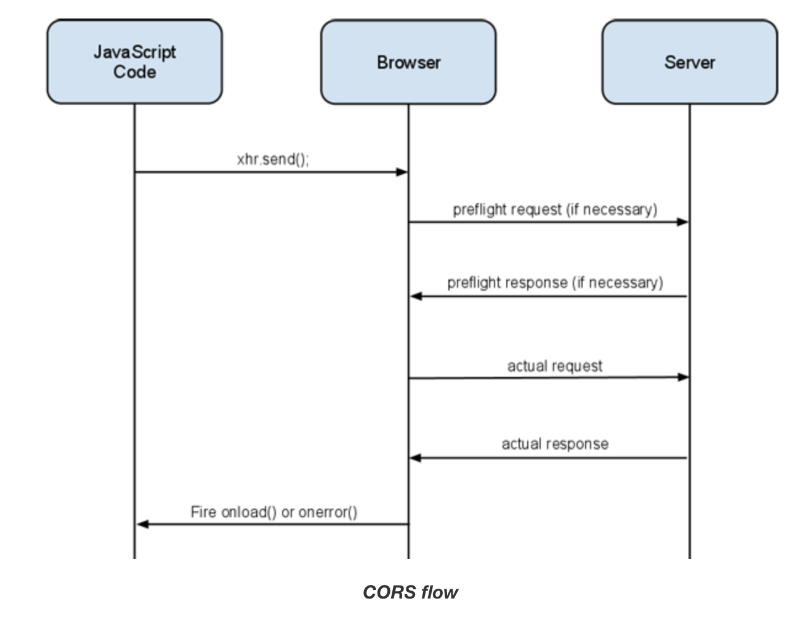
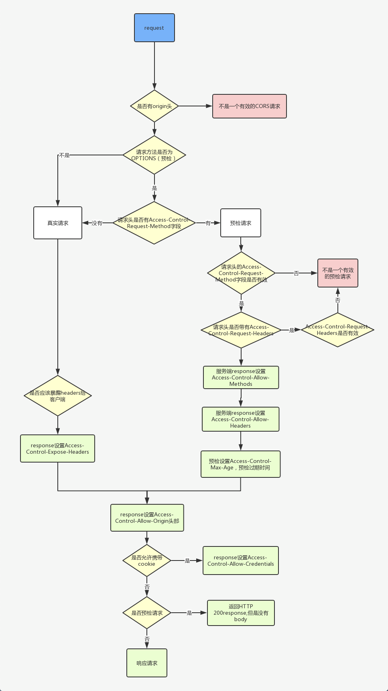

# 第一百五十二日

## HTML

### `small`标签

- `<small>`元素將使文本的字体变小一号。(例如从大变成中等，从中等变成小，从小变成超小)。在 HTML5 中，除了它的样式含义，这个元素被重新定义为表示边注释和附属细则，包括版权和法律文本。

## JavaScript

### `CORS` 预检请求 简单请求

> 同源策略是一个重要的安全策略，它用于限制一个 origin 的文档或者它加载的脚本如何能与另一个源的资源进行交互。它能帮助阻隔恶意文档，减少可能被攻击的媒介。
> 当一个资源从与该资源本身所在的服务器**不同的域、协议、端口**请求一个资源时，资源会发起一个跨域 HTTP 请求。

- 出于安全原因，浏览器限制从脚本内发起的跨源 HTTP 请求，XMLHttpRequest 和 Fetch API，_只能从加载应用程序的同一个域请求 HTTP 资源，除非使用 CORS 头文件_

#### CORS 概述

跨域资源共享标准新增了一组 HTTP 首部字段，允许服务器声明哪些源站通过浏览器有权限访问哪些资源。

另外，规范要求，对那些可能对服务器数据产生副作用的 HTTP 请求方法（特别是 GET 以外的 HTTP 请求，或者搭配某些 MIME 类型的 POST 请求），浏览器必须首先使用 OPTIONS 方法发起一个预检请求（preflight request），从而获知服务端是否允许该跨域请求。

**服务器确认允许之后，才发起实际的 HTTP 请求。在预检请求的返回中，服务器端也可以通知客户端，是否需要携带身份凭证（包括 Cookies 和 HTTP 认证相关数据）**

#### 简单请求

- 不会触发 CORS 预检的请求称为简单请求，满足以下所有条件的才会被视为简单请求:
  1. 使用`GET`、`POST`、`HEAD`其中一种方法
  2. 只使用了如下的安全首部字段，不得人为设置其他首部字段
     - `Accept`
     - `Accept-Language`
     - `Content-Language`
     - `Content-Type` 仅限以下三种
       - `text/plain`
       - `multipart/form-data`
       - `application/x-www-form-urlencoded`
     - HTML 头部 header field 字段：DPR、Download、Save-Data、Viewport-Width、Width
  3. 请求中的任意`XMLHttpRequestUpload` 对象均没有注册任何事件监听器；`XMLHttpRequestUpload`对象可以使用 `XMLHttpRequest.upload` 属性访问
  4. 请求中没有使用 `ReadableStream` 对象

#### 预检请求

需预检的请求要求必须首先使用 OPTIONS 方法发起一个预检请求到服务器，以获知服务器是否允许该实际请求。"预检请求“的使用，可以避免跨域请求对服务器的用户数据产生未预期的影响

1. 使用了`PUT`、`DELETE`、`CONNECT`、`OPTIONS`、`TRACE`、`PATCH`方法
2. 人为设置了非规定内的其他首部字段，参考上面简单请求的安全字段集合，还要特别注意`Content-Type`的类型
3. `XMLHttpRequestUpload` 对象注册了任何事件监听器
4. 请求中使用了`ReadableStream`对象

#### 请求附带身份凭证`cookies`

- 如果发起请求时设置`withCredentials` 标志设置为 `true`，从而向服务器发送`cookie`， 但是如果服务器端的响应中未携带`Access-Control-Allow-Credentials: true`，浏览器将不会把响应内容返回给请求的发送者

- 对于附带身份凭证的请求，服务器不得设置 `Access-Control-Allow-Origin` 的值为`*`， 必须是某个具体的域名

- 简单 GET 请求不会被预检；如果对此类带有身份凭证请求的响应中不包含该字段，这个响应将被忽略掉，并且浏览器也不会将相应内容返回给网页

---

## Reference

[haizlin/fe-interview](https://github.com/haizlin/fe-interview/blob/master/category/history.md)

[`<small>` - HTML（超文本标记语言） | MDN](https://developer.mozilla.org/zh-CN/docs/Web/HTML/Element/small)

[浏览器的同源策略 - Web 安全 | MDN](https://developer.mozilla.org/zh-CN/docs/Web/Security/Same-origin_policy)

[跨源资源共享（CORS） - HTTP | MDN](https://developer.mozilla.org/zh-CN/docs/Web/HTTP/CORS)

[跨域资源共享 (CORS)](https://web.dev/cross-origin-resource-sharing/)
