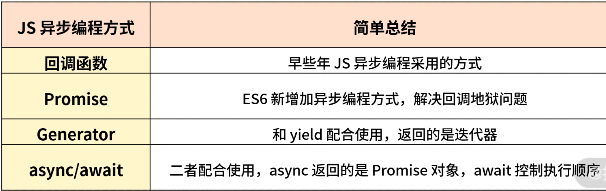

# 第一百五十三日

## HTML

### 单词标志缩写

- [`<abbr>` - HTML（超文本标记语言） | MDN](https://developer.mozilla.org/zh-CN/docs/Web/HTML/Element/abbr)

## CSS

### 背景裁剪

- background-clip`:
  - `border-box`: 默认,背景延伸至边框外沿,但是在边框的下层
  - `padding-box`: 背景延伸至 padding 的外沿
  - `content-box`: 背景延伸至内容的外沿
  - `text`: 背景剪裁成文字的样式

## Tips

### 异步编程

#### 什么是同步

所谓的同步就是在执行某段代码时，在该代码没有得到返回结果之前，其他代码暂时是无法执行的，但是一旦执行完成拿到返回值之后，就可以执行其他代码了。换句话说，在此段代码执行完未返回结果之前，会阻塞之后的代码执行，这样的情况称为同步。

#### 什么是异步

所谓异步就是当某一代码执行异步过程调用发出后，这段代码不会立刻得到返回结果。而是在异步调用发出之后，一般通过回调函数处理这个调用之后拿到结果。异步调用发出后，不会影响阻塞后面的代码执行，这样的情形称为异步。

#### `Promise`

```js
function read(url) {
  return new Promise((resolve, reject) => {
    fs.readFile(url, 'utf8', (err, data) => {
      if (err) reject(err);
      resolve(data);
    });
  });
}
// 通过 Promise.all 可以实现多个异步并行执行，同一时刻获取最终结果的问题
Promise.all([read(A), read(B), read(C)])
  .then((data) => {
    console.log(data);
  })
  .catch((err) => console.log(err));
```

- 简单来说`Promise`就是一个容器，里面保存着某个未来才会结束的事件（通常是异步操作）的结果。从语法上说，`Promise` 是一个对象，从它可以获取异步操作的消息

- `Promise` 内部的状态流转情况：（Promise 对象在被创建出来时是待定的状态）(内部状态改变之后不可逆)
  1. 待定（`pending`）：初始状态，既没有被完成，也没有被拒绝。
  2. 已完成（`fulfilled`）：操作成功完成。
  3. 已拒绝（`rejected`）：操作失败。

```js
let readFilePromise = (filename) => {
  return new Promise((resolve, reject) => {
    fs.readFile(filename, (err, data) => {
      if (err) {
        reject(err);
      } else {
        resolve(data);
      }
    });
  });
};
readFilePromise('1.json').then((data) => {
  return readFilePromise('2.json');
});
```

- 回调函数不是直接声明的，而是通过后面的 then 方法传入的，即延迟传入，这就是回调函数延迟绑定

---

```js
readFilePromise('1.json')
  .then((data) => {
    return readFilePromise('2.json');
  })
  .then((data) => {
    return readFilePromise('3.json');
  })
  .then((data) => {
    return readFilePromise('4.json');
  })
  .catch((err) => {
    // xxx Promise 采用了错误冒泡
  });
```

---

##### `Promise` 的静态方法

1. `all` 方法
   - 语法： `Promise.all（iterable）`
   - 参数： 一个可迭代对象，如 `Array`。
   - 描述： 此方法对于汇总多个 promise 的结果很有用，在 ES6 中可以将多个 Promise.all 异步请求并行操作，返回结果一般有下面两种情况。
     - 当所有结果成功返回时按照请求顺序返回成功。
     - 当其中有一个失败方法时，则进入失败方法。

```js
//1.获取轮播数据列表
function getBannerList() {
  return new Promise((resolve, reject) => {
    setTimeout(function () {
      resolve('轮播数据');
    }, 300);
  });
}
//2.获取店铺列表
function getStoreList() {
  return new Promise((resolve, reject) => {
    setTimeout(function () {
      resolve('店铺数据');
    }, 500);
  });
}
//3.获取分类列表
function getCategoryList() {
  return new Promise((resolve, reject) => {
    setTimeout(function () {
      resolve('分类数据');
    }, 700);
  });
}
function initLoad() {
  Promise.all([getBannerList(), getStoreList(), getCategoryList()])
    .then((res) => {
      console.log(res);
    })
    .catch((err) => {
      console.log(err);
    });
}
initLoad();
```

2. `allSettled` 方法

- Promise.allSettled 的语法及参数跟 Promise.all 类似，其参数接受一个 Promise 的数组，返回一个新的 Promise。唯一的不同在于，执行完之后不会失败，也就是说当 Promise.allSettled 全部处理完成后，我们可以拿到每个 Promise 的状态，而不管其是否处理成功。

```js
const resolved = Promise.resolve(2);
const rejected = Promise.reject(-1);
const allSettledPromise = Promise.allSettled([resolved, rejected]);
allSettledPromise.then(function (results) {
  console.log(results);
});
// 返回结果：
// [
//    { status: 'fulfilled', value: 2 },
//    { status: 'rejected', reason: -1 }
// ]
```

> 返回的是一个数组，记录传进来的参数中每个 Promise 的返回值

3. `any` 方法
   - 语法： Promise.any（iterable）
   - 参数： iterable 可迭代的对象，例如 Array。
   - 描述： any 方法返回一个 Promise，只要参数 Promise 实例有一个变成 fulfilled 状态，最后 any 返回的实例就会变成 fulfilled 状态；如果所有参数 Promise 实例都变成 rejected 状态，包装实例就会变成 rejected 状态。

```js
const resolved = Promise.resolve(2);
const rejected = Promise.reject(-1);
const anyPromise = Promise.any([resolved, rejected]);
anyPromise.then(function (results) {
  console.log(results);
});
// 返回结果：
// 2
```

4. race 方法
   - 语法： `Promise.race(iterable)`
   - 参数： iterable 可迭代的对象，例如 Array。
   - 描述： race 方法返回一个 Promise，只要参数的 Promise 之中有一个实例率先改变状态，则 race 方法的返回状态就跟着改变。那个率先改变的 Promise 实例的返回值，就传递给 race 方法的回调函数。

```js
//请求某个图片资源
function requestImg() {
  var p = new Promise(function (resolve, reject) {
    var img = new Image();
    img.onload = function () {
      resolve(img);
    };
    img.src = 'http://www.somesite.com/img/flexible/logo/pc/result.png';
  });
  return p;
}
//延时函数，用于给请求计时
function timeout() {
  var p = new Promise(function (resolve, reject) {
    setTimeout(function () {
      reject('图片请求超时');
    }, 5000);
  });
  return p;
}
Promise.race([requestImg(), timeout()])
  .then(function (results) {
    console.log(results);
  })
  .catch(function (reason) {
    console.log(reason);
  });
```


---

#### `Generator`

- `Generator`（生成器）是 ES6 的新关键词
- Generator 是一个带星号的“函数”（它并不是真正的函数），可以配合 yield 关键字来暂停或者执行函数

```js
function* gen() {
  console.log('enter');
  let a = yield 1;
  let b = yield (function () {
    return 2;
  })();
  return 3;
}
var g = gen(); // 阻塞住，不会执行任何语句
console.log(g.next()); // 每当执行一次 next 方法，Generator 函数会执行到下一个存在 yield 关键词的位置。
console.log(g.next());
console.log(g.next());
console.log(g.next());
// output:
// { value: 1, done: false }
// { value: 2, done: false }
// { value: 3, done: true }
// { value: undefined, done: true }
```

1. 调用 gen() 后，程序会阻塞住，不会执行任何语句。
2. 调用 g.next() 后，程序继续执行，直到遇到 yield 关键词时执行暂停。
3. 一直执行 next 方法，最后返回一个对象，其存在两个属性：value 和 done。

##### `thunk`

> 基本思路都是接收一定的参数，会生产出定制化的函数，最后使用定制化的函数去完成想要实现的功能。

```js
let isType = (type) => {
  return (obj) => {
    return Object.prototype.toString.call(obj) === `[object ${type}]`;
  };
};

let isString = isType('String');
let isArray = isType('Array');
isString('123'); // true
isArray([1, 2, 3]); // true
```

---

#### `async/await`

> `async` 是 `Generator` 函数的语法糖

```js
function testWait() {
  return new Promise((resolve, reject) => {
    setTimeout(function () {
      console.log('testWait');
      resolve();
    }, 1000);
  });
}
async function testAwaitUse() {
  await testWait();
  console.log('hello');
  return 123;
  // 输出顺序：testWait，hello
  // 第十行如果不使用await输出顺序：hello , testWait
}
console.log(testAwaitUse());
```

---

```js
// readFilePromise 依旧返回 Promise 对象
const readFilePromise = (filename) => {
  return new Promise((resolve, reject) => {
    fs.readFile(filename, (err, data) => {
      if (err) {
        reject(err);
      } else {
        resolve(data);
      }
    });
  }).then((res) => res);
};
// 这里把 Generator的 * 换成 async，把 yield 换成 await
const gen = async function () {
  const data1 = await readFilePromise('1.txt');
  console.log(data1.toString());
  const data2 = await readFilePromise('2.txt');
  console.log(data2.toString);
};
```

- async 函数对 Generator 函数的改进:
  1. 内置执行器：Generator 函数的执行必须靠执行器，因为不能一次性执行完成，所以之后才有了开源的 co 函数库。但是，async 函数和正常的函数一样执行，也不用 co 函数库，也不用使用 next 方法，而 async 函数自带执行器，会自动执行。
  2. 适用性更好：co 函数库有条件约束，yield 命令后面只能是 Thunk 函数或 Promise 对象，但是 async 函数的 await 关键词后面，可以不受约束。
  3. 可读性更好：async 和 await，比起使用 \* 号和 yield，语义更清晰明了。

> sync 函数 返回的结果直接是 Promise 对象，比较方便让开发者继续往后处理。而之前 Generator 并不会自动执行，需要通过 next 方法控制，最后返回的也并不是 Promise 对象，而是需要通过 co 函数库来实现最后返回 Promise 对象。

---


---



## Reference

[haizlin/fe-interview](https://github.com/haizlin/fe-interview/blob/master/category/history.md)

[background-clip - CSS（层叠样式表） | MDN](https://developer.mozilla.org/zh-CN/docs/Web/CSS/background-clip)
