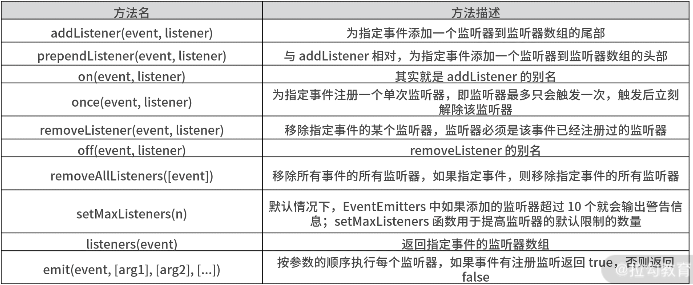

# 第一百五十四日

## JavaScript

### 并行和并发、同步和异步、阻塞和非阻塞

- 并发并行是处理任务的方式
  - 并发是在一个时间段可以处理多个任务，但是在相同的时间内只能处理一个任务
  - 并行是同时可以处理多个任务
- 同步异步是处理运行结果的方式
  - 同步是在上一个返回结果还没返回的时候就不进行下一步的调用
  - 异步是上一个结果还没返回就继续执行下一步，直到有返回结果了再调用对应的异步回调
- 阻塞和非阻塞是运行时的状态
  - 阻塞是在上一个任务还在执行时，下一个任务处于无法执行的状态，需要继续等待，直到上一个任务执行完毕
  - 非阻塞就是任务的执行状态一直是上一个执行了，下一个就继续执行，没有多余的等待时间

## Tips

### `EventEmitter`(node)



#### `addListener` 和 `removeListener`、`on` 和 `off` 方法对比

- `addListener` 方法的作用是为指定事件添加一个监听器，其实和 on 方法实现的功能是一样的，on 其实就是 addListener 方法的一个别名。二者实现的作用是一样的
- `removeListener` 方法的作用是为移除某个事件的监听器，同样 off 也是 removeListener 的别名

```js
var events = require('events');
var emitter = new events.EventEmitter();
function hello1(name) {
  console.log('hello 1', name);
}

function hello2(name) {
  console.log('hello 2', name);
}

emitter.addListener('say', hello1);
emitter.addListener('say', hello2);
emitter.emit('say', 'John');
//输出hello 1 John
//输出hello 2 John
emitter.removeListener('say', hello1);
emitter.emit('say', 'John');
//相应的，监听say事件的hello1事件被移除
//只输出hello 2 John
```

#### `removeListener` 和 `removeAllListeners`

- `removeListener` 方法是指移除一个指定事件的某一个监听器
- `removeAllListeners` 指的是移除某一个指定事件的全部监听器

```js
var events = require('events');
var emitter = new events.EventEmitter();
function hello1(name) {
  console.log('hello 1', name);
}
function hello2(name) {
  console.log('hello 2', name);
}
emitter.addListener('say', hello1);
emitter.addListener('say', hello2);
emitter.removeAllListeners('say');
emitter.emit('say', 'John');
//removeAllListeners 移除了所有关于 say 事件的监听
//因此没有任何输出
```

#### `on` 和 `once` 方法区别

- `on` 和 `once` 的区别是：
  - `on` 的方法对于某一指定事件添加的监听器可以持续不断地监听相应的事件；
  - `once` 方法添加的监听器，监听一次后，就会被消除

```js
var events = require('events');
var emitter = new events.EventEmitter();
function hello(name) {
  console.log('hello', name);
}
emitter.on('say', hello);
emitter.emit('say', 'John');
emitter.emit('say', 'Lily');
emitter.emit('say', 'Lucy');
//会输出 hello John、hello Lily、hello Lucy，之后还要加也可以继续触发
emitter.once('see', hello);
emitter.emit('see', 'Tom');
//只会输出一次 hello Tom
```

### 浏览器端，实现一个 `EventEmitter` 方法(自定义事件的订阅和发布)

1. EventEmitter 的初始化代码

```js
function EventEmitter() {
  // 内部的__events 的对象，用来存放自定义事件，以及自定义事件的回调函数
  this.__events = {};
}
EventEmitter.VERSION = '1.0.0';
```

2. `EventEmitter`的 `on` 的方法

```js
/**
 * 核心思路就是，当调用订阅一个自定义事件的时候，只要该事件通过校验合法之后，
 * 就把该自定义事件 push 到 this.__events 这个对象中存储，等需要出发的时候，
 * 则直接从通过获取 __events 中对应事件的 listener 回调函数，而后直接执行该回调方法就能实现
 **/
EventEmitter.prototype.on = function (eventName, listener) {
  if (!eventName || !listener) return;
  // 判断回调的 listener 是否为函数
  if (!isValidListener(listener)) {
    throw new TypeError('listener must be a function');
  }
  var events = this.__events;
  var listeners = (events[eventName] = events[eventName] || []);
  var listenerIsWrapped = typeof listener === 'object';
  // 不重复添加事件，判断是否有一样的
  if (indexOf(listeners, listener) === -1) {
    listeners.push(
      listenerIsWrapped
        ? listener
        : {
            listener: listener,
            once: false,
          }
    );
  }
  return this;
};
// 判断是否是合法的 listener
function isValidListener(listener) {
  if (typeof listener === 'function') {
    return true;
  } else if (listener && typeof listener === 'object') {
    return isValidListener(listener.listener);
  } else {
    return false;
  }
}
// 顾名思义，判断新增自定义事件是否存在
function indexOf(array, item) {
  var result = -1;
  item = typeof item === 'object' ? item.listener : item;
  for (var i = 0, len = array.length; i < len; i++) {
    if (array[i].listener === item) {
      result = i;
      break;
    }
  }
  return result;
}
```

3. `emit` 方法实现触发效果

```js
/**
 * 拿到对应自定义事件进行 apply 执行，
 * 在执行过程中对于一开始 once 方法绑定的自定义事件进行特殊的处理，
 * 当once 为 true的时候，再触发 off 方法对该自定义事件进行解绑，从而实现自定义事件一次执行的效果
 **/
EventEmitter.prototype.emit = function (eventName, args) {
  // 直接通过内部对象获取对应自定义事件的回调函数
  var listeners = this.__events[eventName];
  if (!listeners) return;
  // 需要考虑多个 listener 的情况
  for (var i = 0; i < listeners.length; i++) {
    var listener = listeners[i];
    if (listener) {
      listener.listener.apply(this, args || []);
      // 给 listener 中 once 为 true 的进行特殊处理
      if (listener.once) {
        this.off(eventName, listener.listener);
      }
    }
  }
  return this;
};
EventEmitter.prototype.off = function (eventName, listener) {
  var listeners = this.__events[eventName];
  if (!listeners) return;
  var index;
  for (var i = 0, len = listeners.length; i < len; i++) {
    if (listeners[i] && listeners[i].listener === listener) {
      index = i;
      break;
    }
  }
  // off 的关键
  if (typeof index !== 'undefined') {
    listeners.splice(index, 1, null);
  }
  return this;
};
```

4. `once` 和 `alloff`实现

```js
EventEmitter.prototype.once = function(eventName, listener）{
    // 直接调用 on 方法，once 参数传入 true，待执行之后进行 once 处理
     return this.on(eventName, {
         listener: listener,
         once: true
     })
 };
EventEmitter.prototype.allOff = function(eventName) {
     // 如果该 eventName 存在，则将其对应的 listeners 的数组直接清空
     if (eventName && this.__events[eventName]) {
         this.__events[eventName] = []
     } else {
         this.__events = {}
     }
};
```

- `once` 方法的本质还是调用 on 方法，只不过传入的参数区分和非一次执行的情况。当再次触发 emit 方法的时候，once 绑定的执行一次之后再进行解绑
- `alloff` 方法就是对内部的`__events` 对象进行清空，清空之后如果再次触发自定义事件，也就无法触发回调函数了

---
