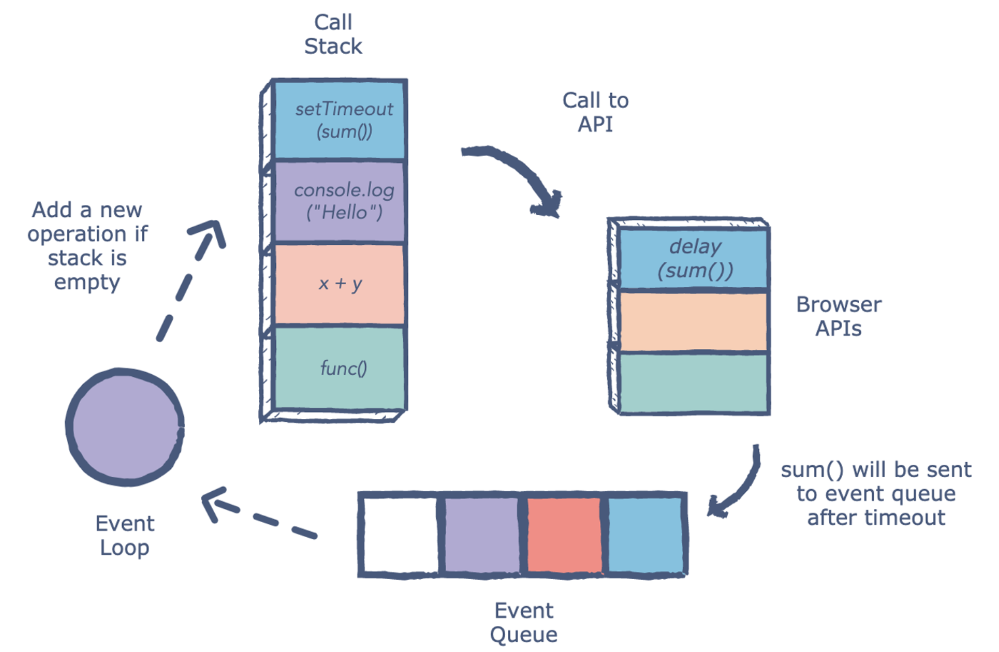
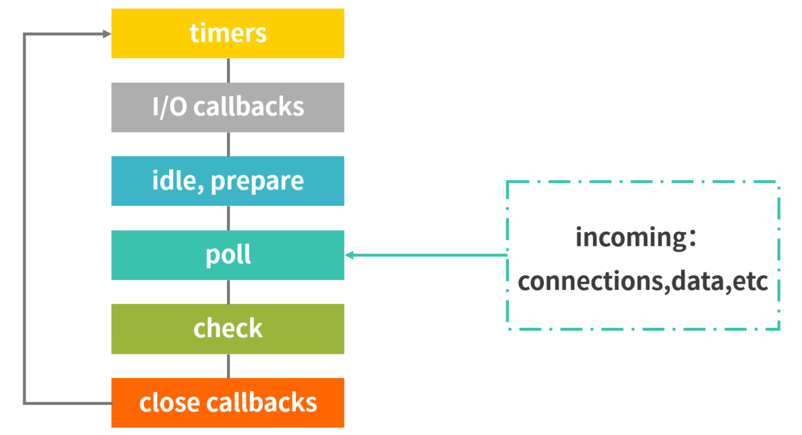
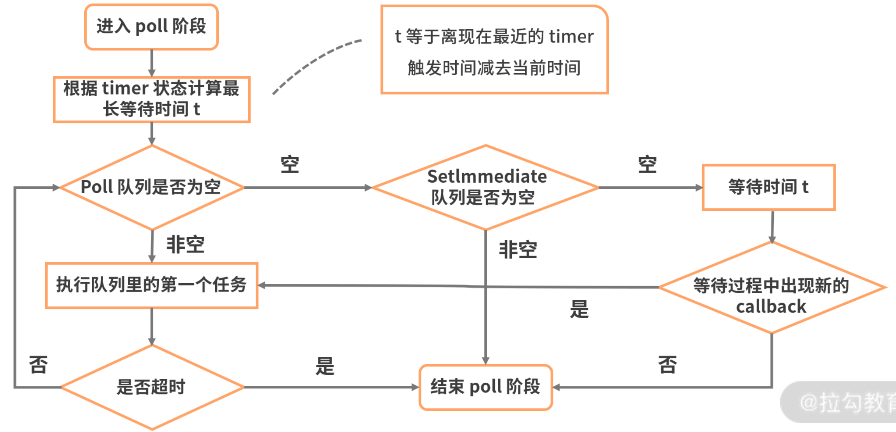

# 第一百五十七日

## HTML

### bdo 标签

- 将内部的文字反序输出
  - 属性是`dir`
    - 默认是`ltr`
    - 需要倒叙就改成`rtl`

## CSS

### 外边距重叠

1. 外边距重叠是什么？

   - 外边距重叠指的是，当两个垂直外边距相遇时，它们将形成一个外边距。 重叠后的外边距的高度等于两个发生重叠的外边距的高度中的较大者。
   - 发生的条件：属于同一个 BFC 的两个相邻元素上下 margin 会重叠。

2. 重叠的结果是什么？

   - 举例 1：当一个元素出现在另一个元素上面时，重叠后的外边距的高度等于两个发生重叠的外边距的高度中的较大者。
   - 举例 2： 当一个元素包含在另一个元素中时（假设没有内边距或边框把外边距分隔开），它们的上和/或下外边距也会发生重叠。如果这个外边距遇到另一个元素的外边距，它还会发生重叠。

3. 怎么防止外边距重叠？
   - 浮动元素、inline-block 元素、绝对定位元素的 margin 不会和垂直方向上其他元素的 margin 折叠（注意这里指的是上下相邻的元素）
   - 外层元素 padding 代替
   - 内层元素透明边框 border:1px solid transparent;
   - 用同一方向的 margin，都设置为 top 或者 bottom。

## Tips

### 浏览器的 `Eventloop`

#### 1.调用堆栈（`call stack`）负责跟踪所有要执行的代码

- 每当一个函数执行完成时，就会从堆栈中弹出（pop）该执行完成函数
- 如果有代码需要进去执行的话，就进行 push 操作

#### 2.事件队列（`event queue`）负责将新的 `function` 发送到队列中进行处理

- 遵循 queue 的数据结构特性，先进先出，在该顺序下发送所有操作以进行执行

#### 3.每当调用事件队列（`event queue`）中的异步函数时，都会将其发送到浏览器 API

- 根据从调用堆栈收到的命令，API 开始自己的单线程操作
- 其中 `setTimeout` 方法就是一个比较典型的例子，在堆栈中处理 `setTimeout` 操作时，会将其发送到相应的 API，该 API 一直等到指定的时间将此操作送回进行处理
- 操作发送到 事件队列（event queue）

#### 4.JavaScript 语言本身是单线程的，而浏览器 API 充当单独的线程

- 事件循环（Eventloop），会不断检查调用堆栈是否为空
  - 如果为空，则从事件队列中添加新的函数进入调用栈（call stack）；
  - 如果不为空，则处理当前函数的调用。我们把整个过程串起来就是这样的一个循环执行流程

#### `Eventloop` 的内部

- Eventloop 通过内部两个队列来实现 Event Queue 放进来的异步任务。
  - 以 `setTimeout` 为代表的任务被称为宏任务，放到宏任务队列（macrotask queue）中
    - `script`(整体代码),`setTimeout`,`setInterval`,`setImmediate`,`I/O`,`UI rendering`,`event listner`
  - 以 `Promise` 为代表的任务被称为微任务，放到微任务队列（microtask queue）中
    - `process.nextTick`, `Promises`, `Object.observe`, `MutationObserver`

1. JavaScript 引擎首先从宏任务队列（macrotask queue）中取出第一个任务；
2. 执行完毕后，再将微任务（microtask queue）中的所有任务取出，按照顺序分别全部执行（这里包括不仅指开始执行时队列里的微任务），如果在这一步过程中产生新的微任务，也需要执行；
3. 然后再从宏任务队列中取下一个，执行完毕后，再次将 microtask queue 中的全部取出，循环往复，直到两个 queue 中的任务都取完。

> 一次 `Eventloop` 循环会处理一个宏任务和所有这次循环中产生的微任务。

### `Node.js` 的 `Eventloop`

> When Node.js starts, it initializes the event loop, processes the provided input script (or drops into the REPL, which is not covered in this document) which may make async API calls, schedule timers, or call process.nextTick(), then begins processing the event loop.

> 当 Node.js 开始启动时，会初始化一个 Eventloop，处理输入的代码脚本，这些脚本会进行 API 异步调用，`process.nextTick()` 方法会开始处理事件循环

- 整个流程分为六个阶段，当这六个阶段执行完一次之后，才可以算得上执行了一次 Eventloop 的循环过程:

  1. `Timers` 阶段：这个阶段执行 setTimeout 和 setInterval。
  2. `I/O callbacks` 阶段：这个阶段主要执行系统级别的回调函数，比如 TCP 连接失败的回调。
  3. `idle，prepare` 阶段：只是 Node.js 内部闲置、准备，可以忽略。
  4. `poll` 阶段：poll 阶段是一个重要且复杂的阶段，几乎所有 I/O 相关的回调，都在这个阶段执行（除了 setTimeout、setInterval、setImmediate 以及一些因为 exception 意外关闭产生的回调）
     
  5. `check` 阶段：执行 setImmediate() 设定的 callbacks。
  6. `close callbacks` 阶段：执行关闭请求的回调函数，比如 socket.on('close', ...)

- node 引入了一个新的任务队列 `Process.nextTick()`
  - `process.nextTick()`is not technically part of the event loop. Instead, thenextTickQueuewill be processed after the current operation is completed, regardless of the current phase of the event loop. Here, an operation is defined as a transition from the underlying C/C++ handler, and handling the JavaScript that needs to be executed.
  - `Process.nextTick()` 会在上述各个阶段结束时，在进入下一个阶段之前立即执行（优先级甚至超过 microtask 队列）

---

> Node.js 和浏览器端宏任务队列的另一个很重要的不同点是，浏览器端任务队列每轮事件循环仅出队一个回调函数接着去执行微任务队列；而 Node.js 端只要轮到执行某个宏任务队列，则会执行完队列中所有的当前任务，但是当前轮次新添加到队尾的任务则会等到下一轮次才会执行。

### `EventLoop` 对渲染的影响

- 浏览器作为一个复杂的应用是多线程工作的，除了运行 JS 的线程外，还有渲染线程、定时器触发线程、HTTP 请求线程，等等。JS 线程可以读取并且修改 DOM，而渲染线程也需要读取 DOM，这是一个典型的多线程竞争临界资源的问题。所以浏览器就把这两个线程设计成互斥的，即同时只能有一个线程在执行

[window.requestAnimationFrame - Web API 接口参考 | MDN](https://developer.mozilla.org/zh-CN/docs/Web/API/window/requestAnimationFrame)

[HTML Standard](https://html.spec.whatwg.org/multipage/webappapis.html#rendering-opportunity)

## Reference

[haizlin/fe-interview](https://github.com/haizlin/fe-interview/blob/master/category/history.md)

[`<bdo>`: 双向文本替代元素 - HTML（超文本标记语言） | MDN](https://developer.mozilla.org/zh-CN/docs/Web/HTML/Element/bdo)
