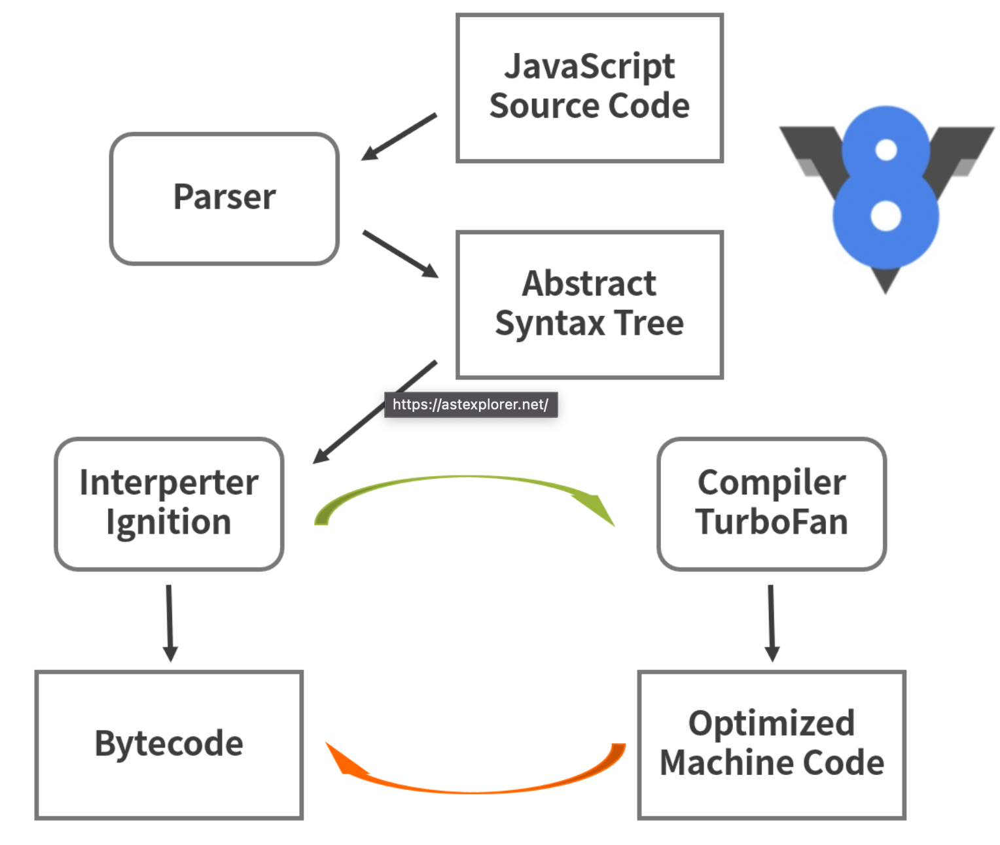

# 第一百五十八日

## Tips

### V8 引擎

#### V8 引擎执行 JS 代码都要经过哪些阶段

1. `Parse` 阶段：V8 引擎负责将 JS 代码转换成 AST（抽象语法树）；
2. `Ignition` 阶段：解释器将 AST 转换为字节码，解析执行字节码也会为下一个阶段优化编译提供需要的信息；
3. `TurboFan` 阶段：编译器利用上个阶段收集的信息，将字节码优化为可以执行的机器码；
4. `Orinoco` 阶段：垃圾回收阶段，将程序中不再使用的内存空间进行回收。

#### 生成 AST

- AST 抽象语法树的应用场景

  1. JS 反编译，语法解析；
  2. Babel 编译 ES6 语法；
  3. 代码高亮；
  4. 关键字匹配；
  5. 代码压缩。

- AST 分为两个阶段
  1. 词法分析：
     - 这个阶段会将源代码拆成最小的、不可再分的词法单元，称为 token。比如这行代码 var a =1；通常会被分解成 var 、a、=、2、; 这五个词法单元。另外刚才代码中的空格在 JavaScript 中是直接忽略的。
  2. 语法分析
     - 这个过程是将词法单元转换成一个由元素逐级嵌套所组成的代表了程序语法结构的树，这个树被称为抽象语法树。

```js
// 第一段代码
var a = 1;
// 第二段代码
function sum(a, b) {
  return a + b;
}
```

分别转换成 AST 抽象语法树之后返回的 JSON 格式如下

```js
{
  "type": "Program",
  "start": 0,
  "end": 10,
  "body": [
    {
      "type": "VariableDeclaration",
      "start": 0,
      "end": 10,
      "declarations": [
        {
          "type": "VariableDeclarator",
          "start": 4,
          "end": 9,
          "id": {
            "type": "Identifier",
            "start": 4,
            "end": 5,
            "name": "a"
          },
          "init": {
            "type": "Literal",
            "start": 8,
            "end": 9,
            "value": 1,
            "raw": "1"
          }
        }
      ],
      "kind": "var"
    }
  ],
  "sourceType": "module"
}
```

---

```js
{
  "type": "Program",
  "start": 0,
  "end": 38,
  "body": [
    {
      "type": "FunctionDeclaration",
      "start": 0,
      "end": 38,
      "id": {
        "type": "Identifier",
        "start": 9,
        "end": 12,
        "name": "sum"
      },
      "expression": false,
      "generator": false,
      "async": false,
      "params": [
        {
          "type": "Identifier",
          "start": 14,
          "end": 15,
          "name": "a"
        },
        {
          "type": "Identifier",
          "start": 16,
          "end": 17,
          "name": "b"
        }
      ],
      "body": {
        "type": "BlockStatement",
        "start": 19,
        "end": 38,
        "body": [
          {
            "type": "ReturnStatement",
            "start": 23,
            "end": 36,
            "argument": {
              "type": "BinaryExpression",
              "start": 30,
              "end": 35,
              "left": {
                "type": "Identifier",
                "start": 30,
                "end": 31,
                "name": "a"
              },
              "operator": "+",
              "right": {
                "type": "Identifier",
                "start": 34,
                "end": 35,
                "name": "b"
              }
            }
          }
        ]
      }
    }
  ],
  "sourceType": "module"
}
```

#### 生成字节码

- 将抽象语法树转换为字节码，也就是上面提到的 Ignition 阶段。这个阶段就是将 AST 转换为字节码，但是之前的 V8 版本不会经过这个过程，最早只是通过 AST 直接转换成机器码，而后面几个版本中才对此进行了改进。如果将 AST 直接转换为机器码还是会有一些问题存在的，例如：

  - 直接转换会带来内存占用过大的问题，因为将抽象语法树全部生成了机器码，而机器码相比字节码占用的内存多了很多
  - 某些 JavaScript 使用场景使用解释器更为合适，解析成字节码，有些代码没必要生成机器码，进而尽可能减少了占用内存过大的问题
  - 抽象语法树转换成字节码后，内存占用显著下降了，同时也可以使用 JIT 编译器做进一步的优化

> 字节码是介于 AST 和机器码之间的一种代码，需要将其转换成机器码后才能执行，字节码可以理解为是机器码的一种抽象

#### 生成机器码

- 在 Ignition 解释器处理完之后，如果发现一段代码被重复执行多次的情况，生成的字节码以及分析数据会传给 TurboFan 编译器，它会根据分析数据的情况生成优化好的机器码。再执行这段代码之后，只需要直接执行编译后的机器码，这样性能就会更好。
- TurboFan 编译器，它是 JIT 优化的编译器，因为 V8 引擎是多线程的，TurboFan 的编译线程和生成字节码不会在同一个线程上，这样可以和 Ignition 解释器相互配合着使用，不受另一方的影响。



## Reference

[AST explorer 转换](https://astexplorer.net/)
