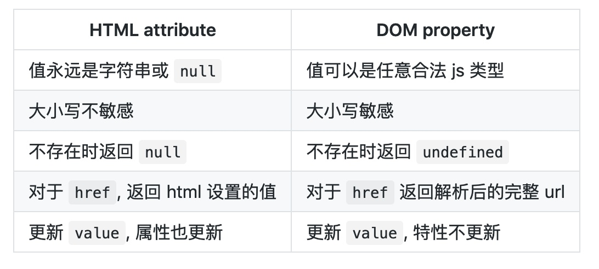

# 第一百五十九日

## HTML

### html 实现下拉提示

- [datalist - HTML（超文本标记语言） | MDN](https://developer.mozilla.org/zh-CN/docs/Web/HTML/Element/datalist)

```html
<label for="favorite_team">Favorite Team:</label>
    <!-- 注意input的list属性与datalist的id属性进行绑定 -->
  <input type="text" name="team" id="favorite_team" list="team_list" autocomplete="off"/>
    <datalist id="team_list">
        <!-- 指定了value值之后，value和innerHTML类似于标题与副标题之间的关系，选中后input的值是value -->
        <option value="A">Aus Tigers</option>
        <option value="B">Detroit Lions</option>
        <option value="C">Detroit Pistons</option>
        <option value="D">Detroit Red Wings</option>
        <option value="E">Detroit Tigers</option>
    </datalist>
</datalist>
```

## CSS

### 两端对齐

- 对于文字，利用 `text-align-last:justify;` or `:before` 模拟成多行然后 `text-align: justify`
- 子元素的两端对齐，用 float 或 `flex` 或 `grid`

## Tips

### `attribute` 和 `property` 区别

- `attribute`

  - 元素在 HTML 中的键值对
  - attribute 会始终保持 html 代码中的初始值(除了 href)

- `property`

  - attribute 在对应的 JS DOM 节点上的对象属性
  - Property 是可以变化的(跟随用户操作).



## Reference

[haizlin/fe-interview](https://github.com/haizlin/fe-interview/blob/master/category/history.md)

[详解 HTML attribute 和 DOM property](https://zhuanlan.zhihu.com/p/70671215)
