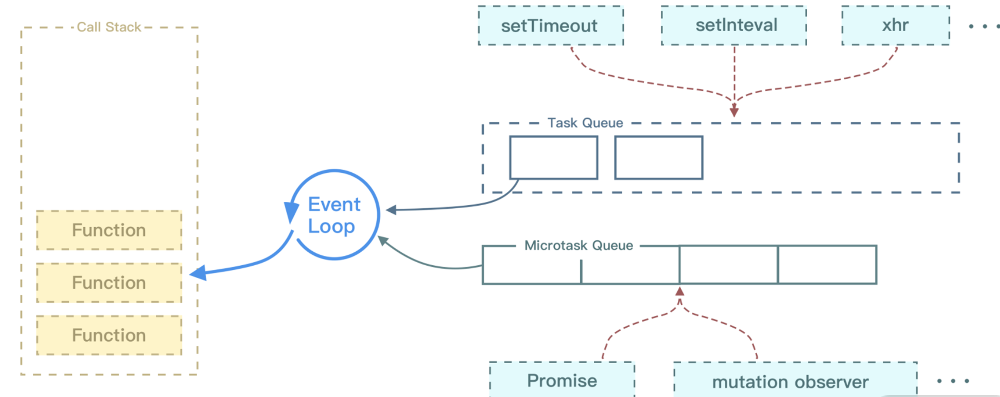
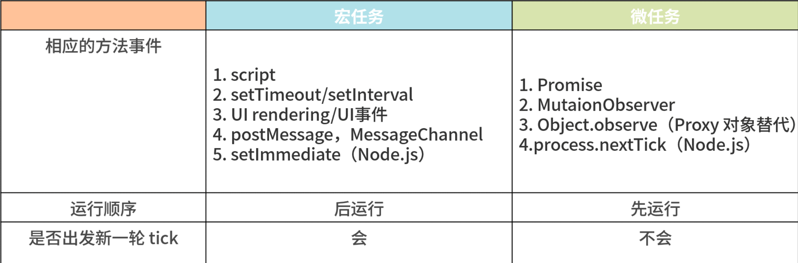

## CSS

### 第一行和第二行的颜色分别是什么

```html
<style>
  .red {
    color: red;
  }
  .green {
    color: green;
  }
</style>

<div class="red green">第一行：颜色是什么？</div>
<div class="green red">第二行：颜色是什么？</div>
```

- 都是绿色。CSS 的覆盖顺序与标签内 class 定义的顺序无关，只与 style 中的顺序有关，后面的覆盖前面的属性

## JavaScript

### 有些 js 库习惯在代码开头处添加分号有什么作用

- js 文件结束 处是 没有 分号的。若几个 js 连在一起时，2 个 js 连接处 会发生语法上的混淆。 开头加`;` 用于分隔， 可以避免多文件压缩在一起时引起的错误。分号和分号放在一起也没问题，相当于 “空语句”。
- 可以用`void` `!` `+` `~` 代替

### 宏任务和微任务

- 代码执行顺序

```js
console.log('begin');
setTimeout(() => {
  console.log('setTimeout');
}, 0);
new Promise((resolve) => {
  console.log('promise');
  resolve();
})
  .then(() => {
    console.log('then1');
  })
  .then(() => {
    console.log('then2');
  });
console.log('end');

// ======
// begin
// promise
// end
// then1
// then2
// setTimeout
```

- 在 EventLoop 中，每一次循环称为一次 tick，主要的任务顺序:
  1. 执行栈选择最先进入队列的宏任务，执行其同步代码直至结束；
  2. 检查是否有微任务，如果有则执行直到微任务队列为空；
  3. 如果是在浏览器端，那么渲染页面；
  4. 开始下一轮的循环（tick），执行宏任务中的一些异步代码，例如 setTimeout 等。



- Call-Stack 执行栈，是一个栈的结构，符合先进后出的机制，每次一个循环
- 先执行最先入队的宏任务，然后再执行微任务
- 不管微任务还是宏任务，它们只要按照顺序进入了执行栈，那么执行栈就还是按照先进后出的规则，一步一步执行

#### 浏览器的环境下，宏任务主要分为下面这几个大类

1. 渲染事件（比如解析 DOM、计算布局、绘制）；
2. 用户交互事件（比如鼠标点击、滚动页面、放大缩小等）；
3. setTimeout、setInterval 等；
4. 网络请求完成、文件读写完成事件

---

```js
function callback2() {
  console.log(2);
}
function callback() {
  console.log(1);
  setTimeout(callback2, 0);
}
setTimeout(callback, 0);
```

- 在上面这段代码目的是想通过 setTimeout 来设置两个回调任务，并让它们按照前后顺序来执行，中间也不要再插入其他的任务。
- 实际情况我们难以控制，比如在调用 setTimeout 来设置回调任务的间隙，消息队列中就有可能被插入很多系统级的任务。
- 如果中间被插入的任务执行时间过久的话，那么就会影响到后面任务的执行了。
- **所以说宏任务的时间粒度比较大，执行的间隔是不能精确控制的**。不适用于一些高实时性的需求了

---

#### 微任务

- 微任务就是一个需要异步执行的函数，执行时机是在主函数执行结束之后、当前宏任务结束之前
- 浏览器里面，产生微任务有两种方式:
  - 使用 `MutationObserver` 监控某个 DOM 节点，或者为这个节点添加、删除部分子节点，当 DOM 节点发生变化时，就会产生 DOM 变化记录的微任务。
  - 使用 Promise，**当调用** `Promise.resolve()` 或者 `Promise.reject()` 的时候，也会产生微任务

---

- 微任务队列是何时被执行的?
  - 通常情况下，在当前宏任务中的 JavaScript 快执行完成时，也就是在 JavaScript 引擎准备退出全局执行上下文并清空调用栈的时候，JavaScript 引擎会检查全局执行上下文中的微任务队列，然后按照顺序执行队列中的微任务。
  - 如果在执行微任务的过程中，产生了新的微任务，一样会将该微任务添加到微任务队列中，V8 引擎一直循环执行微任务队列中的任务，直到队列清空才算执行结束。
  - 也就是说**在执行微任务过程中产生的新的微任务并不会推迟到下一个循环中执行，而是在当前的循环中继续执行**

1. 微任务和宏任务是绑定的，每个宏任务在执行时，会创建自己的微任务队列。
2. 微任务的执行时长会影响当前宏任务的时长。比如一个宏任务在执行过程中，产生了 10 个微任务，执行每个微任务的时间是 10ms，那么执行这 10 个微任务的时间就是 100ms，也可以说这 10 个微任务让宏任务的执行时间延长了 100ms。
3. **在一个宏任务中，分别创建一个用于回调的宏任务和微任务，无论什么情况下，微任务都早于宏任务执行**。

#### 监听 DOM 变化应用场景

- 从 DOM 4 开始，W3C 推出了 MutationObserver。MutationObserver API 可以用来监视 DOM 的变化，包括属性的变更、节点的增加、内容的改变等。
- MutationObserver 采用了“异步 + 微任务”的策略：
  - 通过异步操作解决了同步操作的性能问题；
  - 通过微任务解决了实时性的问题。

---

```js
// 代码执行顺序
async function async1() {
  console.log('async1 start');
  await async2();
  console.log('async1 end');
}
async function async2() {
  console.log('async2');
}
async1();
setTimeout(() => {
  console.log('timeout');
}, 0);
new Promise(function (resolve) {
  console.log('promise1');
  resolve();
}).then(function () {
  console.log('promise2');
});
console.log('script end');
```

```js
async1 start
async2
promise1
script end
async1 end
promise2
timeout
```

---



## Reference

[haizlin/fe-interview](https://github.com/haizlin/fe-interview/blob/master/category/history.md)
