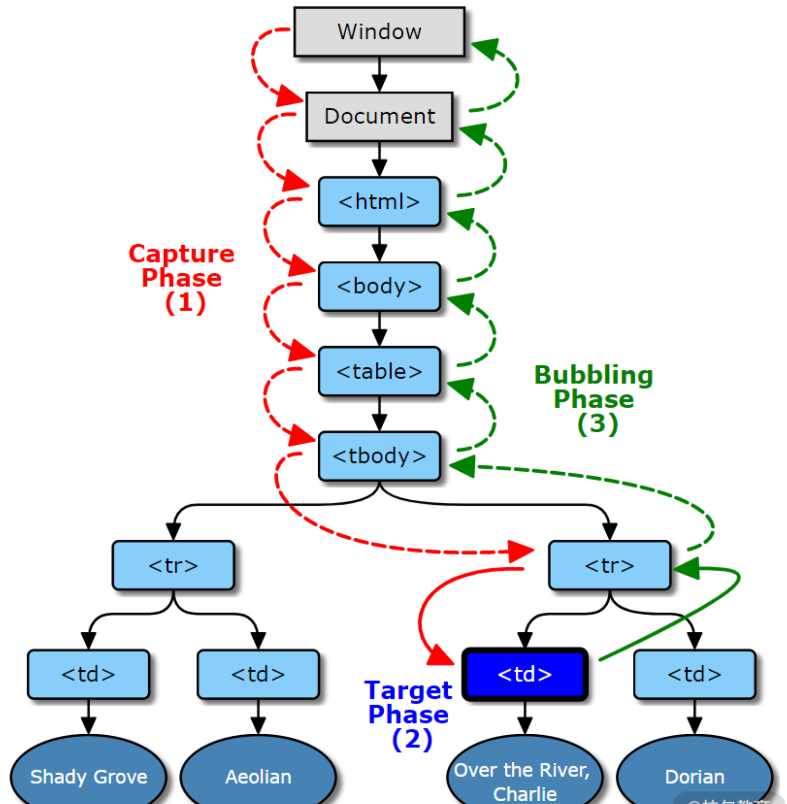

## HTML

### HTML5 不需要 `DTD`

- DTD 是什么
  - DTD 的全称是 Document Type Defination，即文档类型定义。通过定义 DTD，使浏览器使用相应的渲染模式对页面进行渲染
- 为什么需要 DTD
  - 在 html5 之前，html 实际上是 SGML（一种标记语言）中规定的一种格式；由于 SGML 是通过 DTD 来定义文档类型的，所以不出意外地 html5 以前的 DTD 也需要符合 SGML 规定的 DTD
  - 每一个 XML 文件均可携带一个有关其自身格式的描述
- DTD 有哪些定义

  - html4.0.1 有三种 DTD
    - 严格模式
      - `<!DOCTYPE HTML PUBLIC "-//W3C//DTD HTML 4.01//EN" "http://www.w3.org/TR/html4/strict.dtd">`
    - 过渡模式
      - `<!DOCTYPE HTML PUBLIC "-//W3C//DTD HTML 4.01 Transitional//EN" "http://www.w3.org/TR/html4/loose.dtd">`
    - frameset 模式
      - `<!DOCTYPE HTML PUBLIC "-//W3C//DTD HTML 4.01 Frameset//EN" "http://www.w3.org/TR/html4/frameset.dtd">`

- html5 是不基于 SGML 的，所以不需要符合 SGML 的规定，所以有且只有一种 DTD
  - `<!DOCTYPE html>`

## CSS

### `clip-path`

> [Clippy — CSS clip-path maker](https://bennettfeely.com/clippy/)

- `clip-path`属性可以创建一个只有元素的部分区域可以显示的剪切区域

## Tips

### DOM 事件

> 防抖、节流、代理 3 个场景

#### 防抖

- 包含 cancel 属性的防抖函数
- cancel 属性，用来取消原函数执行
- flush 属性用来立即调用原函数，同时将原函数的执行结果以 Promise 的形式返回

```js
const debounce = (func, wait = 0) => {
  let timeout = null;
  let args;
  function debounced(...arg) {
    args = arg;
    if (timeout) {
      clearTimeout(timeout);
      timeout = null;
    }
    // 以Promise的形式返回函数执行结果
    return new Promise((res, rej) => {
      timeout = setTimeout(async () => {
        try {
          const result = await func.apply(this, args);
          res(result);
        } catch (e) {
          rej(e);
        }
      }, wait);
    });
  }
  // 允许取消
  function cancel() {
    clearTimeout(timeout);
    timeout = null;
  }
  // 允许立即执行
  function flush() {
    cancel();
    return func.apply(this, args);
  }
  debounced.cancel = cancel;
  debounced.flush = flush;
  return debounced;
};
// 防抖处理之后的事件绑定
const ipt = document.querySelector('input');
ipt.addEventListener(
  'input',
  debounce((e) => {
    search(e.target.value).then(
      (resp) => {
        // ...
      },
      (e) => {
        // ...
      }
    );
  }, 500)
);
```

#### 节流

> 场景，一个左右两列布局的查看文章页面，左侧为文章大纲结构，右侧为文章内容。功能，就是当用户滚动阅读右侧文章内容时，左侧大纲相对应部分高亮显示，提示用户当前阅读位置

- **设置在指定一段时间内只调用一次函数**，从而降低函数调用频率
- 节流函数，有两种执行方式，在调用函数时执行最先一次调用，或是最近一次调用，需要设置时间戳加以判断

```js
const throttle = (func, wait = 0, execFirstCall) => {
  let timeout = null;
  let args;
  let firstCallTimestamp;
  function throttled(...arg) {
    if (!firstCallTimestamp) firstCallTimestamp = new Date().getTime();
    if (!execFirstCall || !args) {
      console.log('set args:', arg);
      args = arg;
    }
    if (timeout) {
      clearTimeout(timeout);
      timeout = null;
    }
    // 以Promise的形式返回函数执行结果
    return new Promise(async (res, rej) => {
      if (new Date().getTime() - firstCallTimestamp >= wait) {
        try {
          const result = await func.apply(this, args);
          res(result);
        } catch (e) {
          rej(e);
        } finally {
          cancel();
        }
      } else {
        timeout = setTimeout(async () => {
          try {
            const result = await func.apply(this, args);
            res(result);
          } catch (e) {
            rej(e);
          } finally {
            cancel();
          }
        }, firstCallTimestamp + wait - new Date().getTime());
      }
    });
  }
  // 允许取消
  function cancel() {
    clearTimeout(timeout);
    args = null;
    timeout = null;
    firstCallTimestamp = null;
  }
  // 允许立即执行
  function flush() {
    cancel();
    return func.apply(this, args);
  }
  throttled.cancel = cancel;
  throttled.flush = flush;
  return throttled;
};
```

> 节流与防抖都是通过延迟执行，减少调用次数，来优化频繁调用函数时的性能。不同的是，对于一段时间内的频繁调用，防抖是延迟执行后一次调用，节流是延迟定时多次调用

#### 代理

- DOM 事件的触发流程



- 捕获，事件对象 Window 传播到目标的父对象，红色过程；
- 目标，事件对象到达事件对象的事件目标，蓝色过程；
- 冒泡，事件对象从目标的父节点开始传播到 Window，绿色过程。

---

- 事件代理的实现原理就是利用上述 DOM 事件的触发流程来对一类事件进行统一处理。比如大量的列表，在 ul 元素上绑定事件统一处理，通过得到的事件对象来获取参数，调用对应的函数

```js
// 选择了默认在冒泡阶段监听事件，但和捕获阶段监听并没有区别
const ul = document.querySelector('.list');
ul.addEventListener('click', (e) => {
  const t = e.target || e.srcElement;
  if (t.classList.contains('item')) {
    getInfo(t.id);
  } else {
    id = t.parentElement.id;
    if (t.classList.contains('edit')) {
      edit(id);
    } else if (t.classList.contains('delete')) {
      del(id);
    }
  }
});
```

---

```js
// 方式1
<input type='text' onclick='click()' />;
// 方式2
document.querySelector('input').onClick = function (e) {
  // ...
};
// 方式3
document.querySelector('input').addEventListener('click', function (e) {
  //...
});
```

- 方式 1 和方式 2 同属于 DOM0 标准，通过这种方式进行事件监会覆盖之前的事件监听函数。
- 方式 3 属于 DOM2 标准，推荐使用这种方式。同一元素上的事件监听函数互不影响，而且可以独立取消，调用顺序和监听顺序一致。

## Reference

[haizlin/fe-interview](https://github.com/haizlin/fe-interview/blob/master/category/history.md)

[clip-path - CSS（层叠样式表） | MDN](https://developer.mozilla.org/zh-CN/docs/Web/CSS/clip-path)

[事件参考 | MDN](https://developer.mozilla.org/zh-CN/docs/Web/Events)

[lodash/debounce.js at master · lodash/lodash](https://github.com/lodash/lodash/blob/master/debounce.js)
