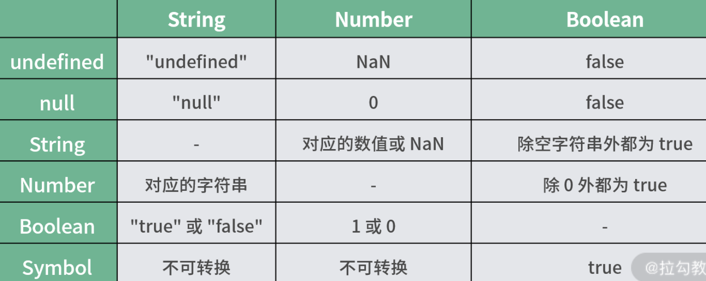

## HTML

### `radio`分组

- `input[type=radio]`设置相同的 name 值，即可实现 radio 的分组

```html
<div id="wrap">
  <label for="f">
    <input id="f" name="gender" type="radio" value="female" />
    <span>女性</span>
  </label>
  <label for="m">
    <input id="m" name="gender" type="radio" value="male" />
    <span>男性</span>
  </label>
</div>
```

## CSS

### `vh`、`vw`的理解

- `vw`: `100vw`为视窗的宽度，即 1vw 是视窗宽度的 1%
- `vh`: `100vh`为视窗的高度，即 1vh 是视窗高度的 1%

## JavaScrip

### 根据`xpath`获取元素

- `document.evaluate()` 根据传入的 XPath (en-US) 表达式以及其他参数，返回一个 XPathResult (en-US) 对象。

## Tips

### `Undefined`

- 引用已声明但未初始化的变量；
- 引用未定义的对象属性；
- 执行无返回值函数；
- 执行 void 表达式； `void 0`
- 全局常量 window.undefined 或 undefined。

#### 判断一个变量的值是否为 `undefined`

- `!x` 不可行， x 的值为 undefined, 空字符串，0， null 时， 都会判断为真
- `x===undefined`, 不可行，x 如果未定义会抛出`ReferenceError: x is no defined`导致程序终止
- 应当使用 `typeof x === 'undefined'`

---

- 十进制转换成其他进制时，可以通过 toString 函数来实现。
  - `(10).toString(2) // "1010"`

---

#### 精度问题

> `Math.pow(Math.pow(5, 1/2), 2) // 5.000000000000001`

- 一种方式是先转换成整数进行计算，然后再转换回小数，这种方式适合在小数位不是很多的时候。比如一些程序的支付功能 API 以“分”为单位，从而避免使用小数进行计算。
- 还有另一种方法就是舍弃末尾的小数位。比如对上面的加法就可以先调用 toPrecision 截取 12 位，然后调用 parseFloat 函数转换回浮点数。

- `parseFloat((0.1 + 0.2).toPrecision(12)) // 0.3`

#### `String`

> 题目： 千位分隔符是指为了方便识别较大数字，每隔三位数会加入 1 个逗号，该逗号就是千位分隔符。如果要编写一个函数来为输入值的数字添加千分位分隔符

- 将数值转换成字符数组

```js
function sep(n) {
  let [i, c] = n.toString().split(/(\.\d+)/);
  return (
    i
      .split('')
      .reverse()
      .map((c, idx) => ((idx + 1) % 3 === 0 ? ',' + c : c))
      .reverse()
      .join('')
      .replace(/^,/, '') + c
  );
}
```

- 另一种方式是通过数组反转，从而变成从左到右操作

```js
function sep2(n) {
  let str = n.toString();
  str.indexOf('.') < 0 ? (str += '.') : void 0;
  return str.replace(/(\d)(?=(\d{3})+\.)/g, '$1,').replace(/\.$/, '');
}
```

---



---

一个深拷贝函数（symbol）

```js
function clone(data) {
  let result = {};
  // 通过 getOwnPropertyNames 和 getOwnPropertySymbols 函数将键名组合成数组，然后进行遍历
  const keys = [...Object.getOwnPropertyNames(data), ...Object.getOwnPropertySymbols(data)];
  if (!keys.length) return data;
  keys.forEach((key) => {
    let item = data[key];
    if (typeof item === 'object' && item) {
      result[key] = clone(item);
    } else {
      result[key] = item;
    }
  });
  return result;
}
```

- 以上方案可能出现无限递归， 即当对象数据嵌套的时候，比如像下面这种情况，对象 a 的键 b 指向对象 b，对象 b 的键 a 指向对象 a，那么执行 clone 函数就会出现死循环，从而耗尽内存

```js
var a = {
var b = {}
a.b = b
b.a = a
```

> 一种简单的方式就是把已添加的对象记录下来，这样下次碰到相同的对象引用时，直接指向记录中的对象即可。要实现这个记录功能，可以借助 ES6 的 WeakMap 对象，该对象是一组键/值对的集合，其中的键是弱引用的。其键必须是对象，而值可以是任意的。

```js
// 改造后的 clone 函数
function clone(obj) {
  let map = new WeakMap();
  function deep(data) {
    let result = {};
    const keys = [...Object.getOwnPropertyNames(data), ...Object.getOwnPropertySymbols(data)];
    if (!keys.length) return data;
    const exist = map.get(data);
    if (exist) return exist;
    map.set(data, result);
    keys.forEach((key) => {
      let item = data[key];
      if (typeof item === 'object' && item) {
        result[key] = deep(item);
      } else {
        result[key] = item;
      }
    });
    return result;
  }
  return deep(obj);
}
```

## Reference

[haizlin/fe-interview](https://github.com/haizlin/fe-interview/blob/master/category/history.md)

[Document.evaluate() - Web API 接口参考 | MDN](https://developer.mozilla.org/zh-CN/docs/Web/API/Document/evaluate)

[void 运算符 - JavaScript | MDN](https://developer.mozilla.org/zh-CN/docs/Web/JavaScript/Reference/Operators/void)

[Number.prototype.toPrecision() - JavaScript | MDN](https://developer.mozilla.org/zh-CN/docs/Web/JavaScript/Reference/Global_Objects/Number/toPrecision)
