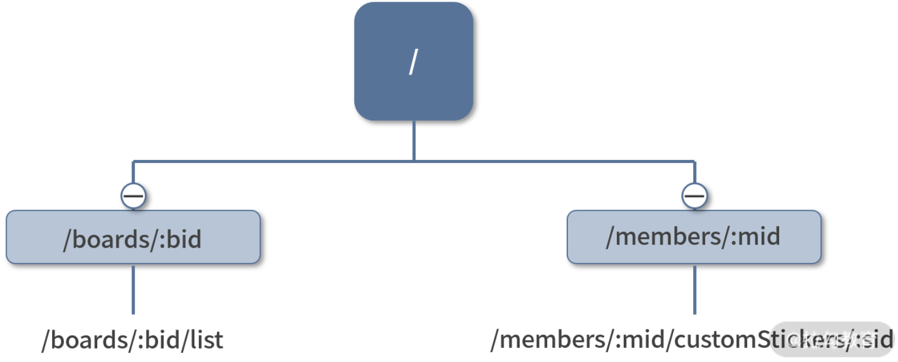
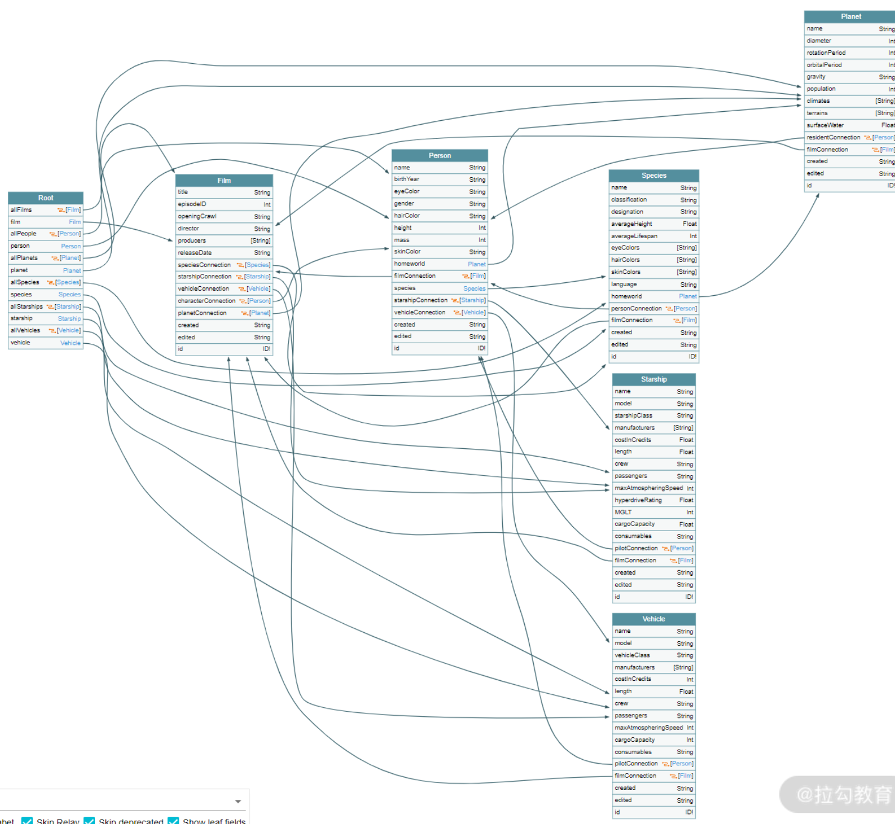

## HTML

### 下拉选项进行分组

```html
<select name="alpha">
  <optgroup label="A">
    <option value="1">AA</option>
    <option value="2">BB</option>
    <option value="3">CC</option>
  </optgroup>
  <optgroup label="a">
    <option value="1">aa</option>
    <option value="2">bb</option>
    <option value="3">cc</option>
  </optgroup>
</select>
```

## CSS

### `translate()` 方法

- `translate()` CSS 函数在水平和/或垂直方向上重新定位元素
  - `transform: translate(x,y,z)` 控制元素往三个轴方向平移
    - x 是屏幕左上角往右的方向
    - y 是屏幕左上角往下的方向
    - z 是屏幕到人眼的方向

## Tips

### 前后端沟通

#### RPC—远程过程调用

- `RPC`（Remote Procedure Call，远程过程调用）常用于后端服务进程之间的通信。
- “远程”指的是不同服务器上的进程，“过程调用”里的“过程”可以理解为“函数”，这种接口设计和函数命名很相似，名称为动宾结构短语

```
GET /getUsers
POST /deleteUser
POST /createUser
```

- RPC 风格和平常编写模块的思路很像，提供了一个函数作为接口，供其他模块调用。是站在后端工程师的视角而设置的：为了像在本地调用一个函数那样调用远程的代码。
  - **紧耦合**：当前端工程师需要获取或修改某个数据时，他有可能需要先调用接口 A ，再调用接口 B，这种调用需要对系统非常熟悉，让前端工程师熟悉后端逻辑和代码显然是难以办到的。
  - **冗余**：把执行动作写在 URL 上实际是冗余的，因为 HTTP 的 Method 头部可以表示不同的动作行为。

#### REST—表现层状态转换

##### 表现层

- 资源指的是一个实体信息，一个文本文件、一段 JSON 数据都可以称为资源。
- 一个资源可以有不同的呈现形式，比如一份数据可以是 XML 格式，也可以是 JSON 格式，这种呈现形式叫作“表现层（`Representation`）

##### 状态转移

- HTTP 本身是无状态的，因此，如果客户端想要操作服务器，则必须通过某种手段让服务器发生“状态转移（State Transfer）”。而这种转移是建立在表现层之上的，即“表现层状态转移”。

---

> REST 的核心要点有两个，那就是**资源**和**方法**。

- REST 的 URL 指向某个或某类资源，所以不再是类似 RPC 的动宾结构，而是**名词**。
  - 通常，当 URL 的路径以 ID 结尾则表示指代某个资源，无 ID 则指向一类资源。
  - 路径分隔符表示资源之间的嵌套关系。

```
/orgs
/orgs/123asdf12d
/orgs/ss1212sdf/users
/orgs/ss1212sdf/users/111asdl234l
```

- 要进行状态转移的时候，使用的是 HTTP 默认的语义化头部 Method 字段

```
GET（SELECT）：获取资源
POST（CREATE）：新建一个资源
PUT（UPDATE）：更新资源
DELETE（DELETE）：从服务器删除资源
```

---

- REST 的低耦合、高度语义化的设计风格比较适合前后端通信，也存在 3 个不足
  - **弱约束**。REST 定义请求路径和方法，但对非常重要的请求体和响应体并没有给出规范和约束。这就意味着需要借助工具来重新定义和校验这些内容，而不同工具之间的定义格式和校验方式都不相同，给工程师带来了一定的学习负担。
  - **接口松散**。 REST 风格的数据粒度一般都非常小，前端要进行复杂查询的时候可能会涉及多个 API 查询，那么会产生多个网络请求，很容易造成性能问题。通常的解决方案是通过类似 API 网关的中转服务器来实现对接口的聚合和缓存。
  - **数据冗余**。前端对网络请求性能是比较敏感的，所以传输的数据量尽可能小，但 REST API 在设计好之后，返回的字段值是固定的。所以很容易出现这样一个场景，对于后端工程师而言，为了减少代码修改，会尽可能地在返回结果中添加更多的字段；对于前端工程师而言，使用数据的场景往往是多变的，即使是调用同一个 API，在不同场景下也只会用到某些特定的字段。所以不可避免地产生数据冗余，从而造成带宽浪费，影响用户体验。

#### GraphQL — 图表查询语言

> 从 API 的提供者，到 API 数据，再到 API 的使用者(GraphQL)

- GraphQL（Graph Query Language） 是图表查询语言，在 REST 规范中，请求路径表示资源之间的嵌套关系，那么很容易形成树型结构



- GraphQL 中不同类型之间的关联关系通过图来表示。下面是一张通过 GraphQL 工具生成的示例图，描述了不同类型之间的关系。



> GraphQL 核心概念其实就两个：**查询语句**和**模式**，分别对应 API 的**调用者**和**提供者**

##### 别名（`Aliases`）

- 使用 GraphQL，只需要修改查询的别名即可。

##### 片段（Fragments）

- 如果在查询中有重复的数据结构，可以通过片段来对它们进行抽象。

##### 内省（Introspection）

- 调用 REST API 非常依赖文档，但 GraphQL 则不需要，因为它提供了一个内省系统来描述后端定义的类型。
  - 可以先通过查询 `_schema` 字段来向 GraphQL 询问哪些类型是可用的。因为每个查询的根类型总是有 `_schema` 字段的
- 后端的模式与 Mongoose 及 JSON-Schema 的模式有些类似，都是通过声明数据类型来定义数据结构的。
  - 数据类型又可以分为默认的标量类型，如 Int、String 及自定义的对象类型。

```graphql
type User {
  id: ID!
  name: String!
  books: [Book!]!
}
```

- 定义了一个 User 类型，包含 3 个字段：ID 类型的 id 字段，String 类型的 name 字段以及 Book 类型列表 的 books 字段。其中 ID 和 String 为标量类型，Book 为对象类型，惊叹号表示字段值不能为 null。

---

- GraphQL 的类型声明和 TypeScript 的类型定义除了在写法上有些类似，在一些高级功能上也有异曲同工之处，比如联合类型和接口定义。

```graphql
union Owner = User | Organization
interface Member {
  id: ID!
  name: String
}
type User implements Member {
  ...
}
type Organization implements Member {
  ...
}
```

- 定义好模式之后，实现数据操作。在 GraphQL 中这一部分逻辑称为解析器（`Resolver`），解析器与类型相对应，下面是类型定义以及对应的解析器

```graphql
const schemaStr = `
type Hero {
  id: String
  name: String
}
# 根类型
type Query {
  hero(id: String, name: String): [Hero]
}
`
const resolver = {
  hero({id='hello', name='world'}) {
    if(id && name) {
      return [...data.hero, {id, name}]
    }
    return data.hero
  }
}
```

---

- **高聚合**。GraphQL 提倡将系统所有请求路径都聚合在一起形成一个统一的地址，并使用 POST 方法来提交查询语句，比如 GitHub 使用的请求地址就是：https://api.github.com/graphql。
- **无冗余**。后端会根据查询语句来返回值，不会出现冗余字段。
- **类型校验**。由于有模式的存在，可以轻松实现对响应结果及查询语句进行校验。
- **代码即文档**。内省功能可以直接查询模式，无须查询文档也可以通过命名及描述信息来进行查询。

---

> GraphQL 提供了一种基于特定语言的查询模式，让前端可以随心所欲地获得想要的数据类型，是相当友好的；而对于后端而言，把数据的查询结果编写成 REST API 还是 GraphQL 的解析器，工作量相差不大，最大的问题是带来的收益可能无法抵消学习和改造成本。这在很大程度上增加了 GraphQL 的推广难度

- GraphQL 的大多数实际使用场景分为两类，一类是前端工程师主导的新项目，后端采用 Node.js 来实现，用 GraphQL 来替代 REST；
- 另一类就是将 Node.js 服务器作为中转服务器，为前端提供一个 GraphQL 查询，但实际上仍然是调用后端的 REST API 来获取数据。

---

> RPC 风格，了解即可；对于 REST API，需要重点理解它通过路径指向资源，以及利用 HTTP 方法来指代动作的特性；对于 GraphQL，应该从 API 调用者和 API 提供者两个角度来分别学习查询语句和模式。

## Reference

[haizlin/fe-interview](https://github.com/haizlin/fe-interview/blob/master/category/history.md)

[hoppscotch/hoppscotch: 👽 Open source API development ecosystem - https://hoppscotch.io](https://github.com/hoppscotch/hoppscotch)

[`<optgroup>` - HTML（超文本标记语言） | MDN](https://developer.mozilla.org/zh-CN/docs/Web/HTML/Element/optgroup)

[transform - CSS（层叠样式表） | MDN](https://developer.mozilla.org/zh-CN/docs/Web/CSS/transform)

[translate() - CSS（层叠样式表） | MDN](https://developer.mozilla.org/zh-CN/docs/Web/CSS/transform-function/translate)
