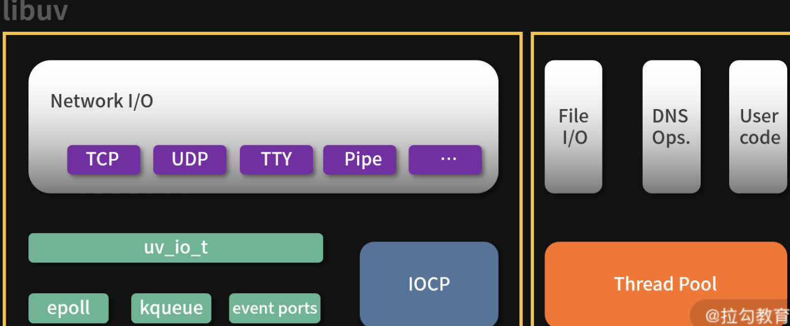

## JavaScript

### 将 html 页面生成为图片

- [niklasvh/html2canvas: Screenshots with JavaScript](https://github.com/niklasvh/html2canvas/)

## Tips

### `X-Frame-Options`

- `X-Frame-Options` HTTP **响应头**是用来给浏览器 指示允许一个页面 可否在 `<frame>`, `<iframe>`, `<embed>` 或者 `<object>` 中展现的标记。

```js
X-Frame-Options: deny
X-Frame-Options: sameorigin
X-Frame-Options: allow-from https://example.com/
```

- `deny`表示该页面不允许在 frame 中展示，即便是在相同域名的页面中嵌套也不允许。
- `sameorigin` 表示该页面可以在相同域名页面的 frame 中展示。
- `allow-from uri` 表示该页面可以在指定来源的 frame 中展示。

### `Referer`

- `Referer` **请求头**包含了当前请求页面的来源页面的地址，即表示当前页面是通过此来源页面里的链接进入的。
- 服务端一般使用 Referer 请求头识别访问来源，可能会以此进行统计分析、日志记录以及缓存优化

### Node.js 实现原理

- Node.js 的依赖模块

  - `acorn`：前面的课程中已经提过，用 JavaScript 编写的轻量级 JavaScript 解析器。
  - `acorn-plugins`：acorn 的扩展模块，让 acorn 支持 ES6 特性解析，比如类声明。
  - `brotli`：C 语言编写的 Brotli 压缩算法。
  - `cares`：应该写为“c-ares”，C 语言编写的用来处理异步 DNS 请求。
  - `histogram`：C 语言编写，实现柱状图生成功能。
  - `icu-small`：C 语言编写，为 Node.js 定制的 ICU（International Components for Unicode）库，包括一些用来操作 Unicode 的函数。
  - `llhttp`：C 语言编写，轻量级的 http 解析器。
  - `nghttp2/nghttp3/ngtcp2`：处理 HTTP/2、HTTP/3、TCP/2 协议。
  - `node-inspect`：让 Node.js 程序支持 CLI debug 调试模式。
  - `npm`：JavaScript 编写的 Node.js 模块管理器。
  - `openssl`：C 语言编写，加密相关的模块，在 tls 和 crypto 模块中都有使用。
  - **`uv`**：C 语言编写，采用非阻塞型的 I/O 操作，为 Node.js 提供了访问系统资源的能力。
  - `uvwasi`：C 语编写，实现 WASI 系统调用 API。
  - **`v8`**：C 语言编写，JavaScript 引擎。
  - `zlib`：用于快速压缩，Node.js 使用 zlib 创建同步、异步和数据流压缩、解压接口。

---

#### libuv

- 浏览器的其他线程实现异步，Node.js 中，异步实现主要依赖于 `libuv`

- `libuv` 是一个用 C 编写的支持多平台的异步 I/O 库，主要解决 I/O 操作容易引起阻塞的问题。最开始是专门为 Node.js 使用而开发的，但后来也被 Luvit、Julia、pyuv 等其他模块使用。下图是 libuv 的结构图。



- 左侧部分为网络 I/O 模块，在不同平台下有不同的实现机制，Linux 系统下通过 `epoll` 实现，OSX 和其他 BSD 系统采用 KQueue，SunOS 系统采用 Event ports，Windows 系统采用的是 IOCP

- 右边部分包括文件 I/O 模块、DNS 模块和用户代码，通过线程池来实现异步操作。文件 I/O 与网络 I/O 不同，libuv 没有依赖于系统底层的 API，而是在全局线程池中执行阻塞的文件 I/O 操作。

#### `process.nextTick` 和 `Promise`

- 虽然 `process.nextTick` 和 `Promise` 都是异步 API，但并不属于事件轮询的一部分，它们都有各自的任务队列，**在事件轮询的每个步骤完成后执行。**

- 当我们使用这两个异步 API 的时候要注意，如果在传入的回调函数中执行长任务或递归，则会导致事件轮询被阻塞，从而“饿死”I/O 操作。
- 下面的代码就是通过递归调用 prcoess.nextTick 而导致 fs.readFile 的回调函数无法执行的例子

```js
fs.readFile('config.json', (err, data) => {
  ...
})
const traverse = () => {
   process.nextTick(traverse)
}
```

- 要解决这个问题，可以使用 `setImmediate` 来替代，因为 `setImmediate` 会**在事件轮询中执行回调函数队列。**

---

- `process.nextTick` 任务队列优先级比 `Promise` 任务队列更高，具体的原因可以参看下面的代码：

```js
// lib/internal/process/task_queues.js
function processTicksAndRejections() {
  let tock;
  do {
    while ((tock = queue.shift())) {
      const asyncId = tock[async_id_symbol];
      emitBefore(asyncId, tock[trigger_async_id_symbol], tock);
      try {
        const callback = tock.callback;
        if (tock.args === undefined) {
          callback();
        } else {
          const args = tock.args;
          switch (args.length) {
            case 1:
              callback(args[0]);
              break;
            case 2:
              callback(args[0], args[1]);
              break;
            case 3:
              callback(args[0], args[1], args[2]);
              break;
            case 4:
              callback(args[0], args[1], args[2], args[3]);
              break;
            default:
              callback(...args);
          }
        }
      } finally {
        if (destroyHooksExist()) emitDestroy(asyncId);
      }

      emitAfter(asyncId);
    }
    runMicrotasks();
  } while (!queue.isEmpty() || processPromiseRejections());
  setHasTickScheduled(false);
  setHasRejectionToWarn(false);
}
```

- 从 `processTicksAndRejections()` 函数中可以看出，首先通过 while 循环取出 queue 队列的回调函数，而这个 queue 队列中的回调函数就是通过 process.nextTick 来添加的。当 while 循环结束后才调用 runMicrotasks() 函数执行 Promise 的回调函数。

## Reference

[haizlin/fe-interview](https://github.com/haizlin/fe-interview/blob/master/category/history.md)

[Referer - HTTP | MDN](https://developer.mozilla.org/zh-CN/docs/Web/HTTP/Headers/Referer)

[BeEF - The Browser Exploitation Framework Project](https://beefproject.com/)

[各种 IO 复用模式之 select，poll，epoll，kqueue，iocp 分析 - 云+社区 - 腾讯云](https://cloud.tencent.com/developer/article/1373483)
