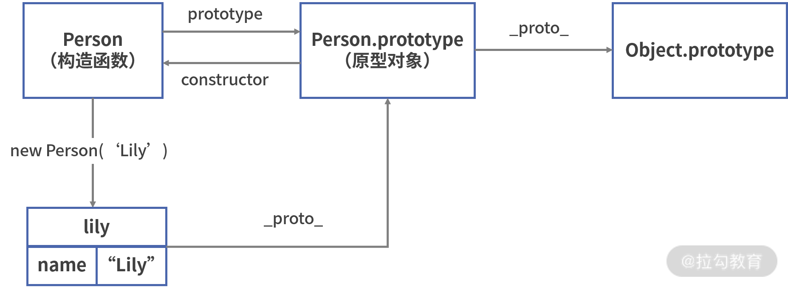
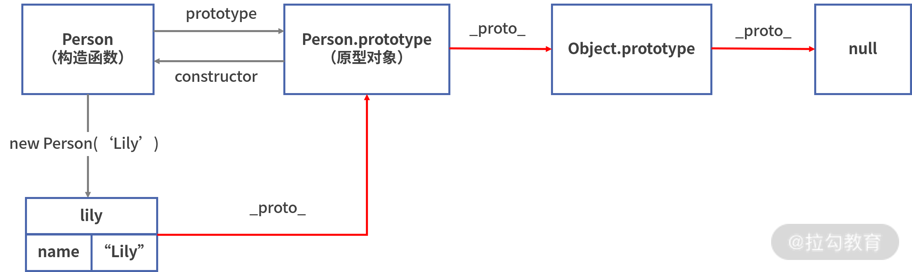

## HTML

### `<a>`标签属性`rel="noopener"`

- 使用`targer=_blank`打开一个新的标签页时, 新页面的 window 对象上有一个属性 opener, 它指向的是前一个页面的 window 对象, 因此, 后一个页面就获得了前一个页面的控制权. 甚至在跨域的情况下也可以生效, 可以使用 `window.opener.location.replace`更改前一个页面的 url
- 使用 `rel=noopener` 可以把 `window.opener` 置为空, 旧浏览器可以使用 `rel=noreferer`

## JavaScript

### 继承

- 基于原型进行继承, 对象。每个对象还都拥有一个原型对象，并可以从中继承方法和属性。
- 不管是对象，还是函数和数组，它们都是 Object 的实例，也就是说在 JavaScript 中，除了原始类型以外，其余都是对象

- JavaScript 的函数是对象

#### `__proto__`(`[[Prototype]]`)和`prototype`

- `__proto__`属性指向**对象的原型对象**，对于函数来说，它的原型对象便是`prototype`。函数的原型对象 prototype 有以下特点：
  - 默认情况下，所有函数的原型对象（prototype）都拥有 constructor 属性，该属性指向与之关联的构造函数；
  - 函数的原型对象（prototype）同样拥有自己的原型对象，用`__proto__`属性表示。前面说过，函数是 Object 的实例，因此 Person.prototype 的原型对象为 Object.prototype (`Person.prototype.__proto__ === Object.prototype` true)


- 在 JavaScript 中，`__proto__`属性指向对象的原型对象；
- 对于函数来说，每个函数都有一个 prototype 属性，该属性为该函数的原型对象。

#### 使用 `prototype` 和 `__proto__` 实现继承

- 对象的属性值可以为任意类型
  - 因此，属性的值同样可以为另外一个对象，这意味着 JavaScript 可以这么做：通过将对象 A 的`__proto__`属性赋值为对象 B，即 A.`__proto__` = B，此时使用 A.`__proto__`便可以访问 B 的属性和方法。

`var lily = new Person("Lily");`

- 上述这段代码在运行时，JavaScript 引擎通过将 Person 的原型对象 prototype 赋值给实例对象 lily 的`__proto__`属性，实现了 lily 对 Person 的继承，即执行了以下代码：

```js
// 实际上 JavaScript 引擎执行了以下代码
var lily = {};
lily.__proto__ = Person.prototype;
Person.call(lily, 'Lily');
```

- lily 作为 Person 的实例对象，它的`__proto__`指向了 Person 的原型对象，即 `Person.prototype`。



- 构造函数和 constructor 属性、原型对象（prototype）和`__proto__`、实例对象之间的关系:

  1. 每个函数的原型对象（Person.prototype）都拥有 constructor 属性，指向该原型对象的构造函数（Person）；
  2. 使用构造函数（new Person()）可以创建对象，创建的对象称为实例对象（lily）；
  3. 实例对象通过将`__proto__`属性指向构造函数的原型对象（Person.prototype），实现了该原型对象的继承。

- `__proto__`和 prototype 的关系
  - 每个对象都有`__proto__`属性来标识自己所继承的原型对象，但只有函数才有 prototype 属性；
  - 对于函数来说，每个函数都有一个 prototype 属性，该属性为该函数的原型对象；
  - 通过将实例对象的`__proto__`属性赋值为其构造函数的原型对象 prototype，JavaScript 可以使用构造函数创建对象的方式，来实现继承。



- 在 JavaScript 中，是通过遍历原型链的方式，来访问对象的方法和属性- 当 JavaScript 试图访问一个对象的属性时，会基于原型链进行查找。查找的过程是这样的：
  - 首先会优先在该对象上搜寻。如果找不到，还会依次层层向上搜索该对象的原型对象、该对象的原型对象的原型对象等（套娃告警）；
  - JavaScript 中的所有对象都来自 Object，`Object.prototype.__proto__ === null`。null 没有原型，并作为这个原型链中的最后一个环节；
  - JavaScript 会遍历访问对象的整个原型链，如果最终依然找不到，此时会认为该对象的属性值为`undefined`

```js
// 让我们假设我们有一个对象 o, 其有自己的属性 a 和 b：
var o = {a: 1, b: 2};
// o 的原型 o.__proto__有属性 b 和 c：
o.__proto__ = {b: 3, c: 4};
// 最后, o.__proto__.__proto__ 是 null.
// 这就是原型链的末尾，即 null，
// 根据定义，null 没有__proto__.
// 综上，整个原型链如下:
{a:1, b:2} ---> {b:3, c:4} ---> null
// 当我们在获取属性值的时候，就会触发原型链的查找：
console.log(o.a); // o.a => 1
console.log(o.b); // o.b => 2
console.log(o.c); // o.c => o.__proto__.c => 4
console.log(o.d); // o.c => o.__proto__.d => o.__proto__.__proto__ == null => undefined
```

- 由于通过原型链进行属性的查找，需要层层遍历各个原型对象，此时可能会带来性能问题：
  - 当试图访问不存在的属性时，会遍历整个原型链；
  - 在原型链上查找属性比较耗时，对性能有副作用，这在性能要求苛刻的情况下很重要。
  - 当原型链过长时，可以选择进行分解，来避免可能带来的性能问题。

---

- **原型链继承**方式中引用类型的属性被所有实例共享，无法做到实例私有；
- **经典继承**方式可以实现实例属性私有，但要求类型只能通过构造函数来定义；
- **组合继承**融合原型链继承和构造函数的优点，它的实现如下：

```js
function Parent(name) {
  // 私有属性，不共享
  this.name = name;
}
// 需要复用、共享的方法定义在父类原型上
Parent.prototype.speak = function () {
  console.log('hello');
};

function Child(name) {
  Parent.call(this, name);
}

// 继承方法
Child.prototype = new Parent();
```

- 以上组合继承模式通过**将共享属性定义在父类原型上**、**将私有属性通过构造函数赋值的方式**，实现了按需共享对象和方法，是 JavaScript 中最常用的继承模式。

## Reference

[haizlin/fe-interview](https://github.com/haizlin/fe-interview/blob/master/category/history.md)

[`<a>` - HTML（超文本标记语言） | MDN](https://developer.mozilla.org/zh-CN/docs/Web/HTML/Element/a)
