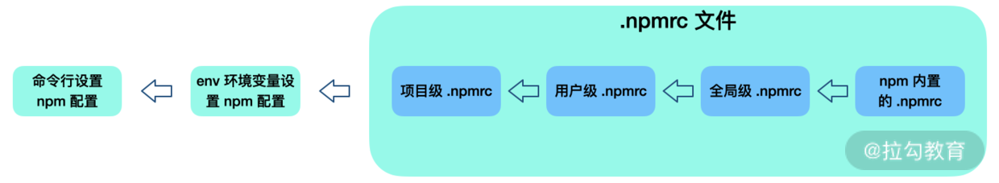

## npm

### npm 内部机制和核心原理

> Bring the best of open source to you, your team and your company.

#### npm 的安装机制

- Ruby 的 Gem、Python 的 pip 都是全局安装，但是 npm 的安装机制秉承了不同的设计哲学：


- `npm install` 执行之后，首先，检查并获取 npm 配置，这里的优先级为：
  - 项目级的 .npmrc 文件 > 用户级的 .npmrc 文件> 全局级的 .npmrc 文件 > npm 内置的 .npmrc 文件
- 然后检查项目中是否有 `package-lock.json` 文件
- 如果有，则检查 `package-lock.json` 和 `package.json` 中声明的依赖是否一致：
  - 一致，直接使用 package-lock.json 中的信息，从缓存或网络资源中加载依赖；
  - 不一致，按照 npm 版本进行处理（不同 npm 版本处理会有不同，具体处理方式如图所示）
- 如果没有，则根据 package.json 递归构建依赖树。然后按照构建好的依赖树下载完整的依赖资源，在下载时就会检查是否存在相关资源缓存：
  - 存在，则将缓存内容解压到 node_modules 中；
  - 否则就先从 npm 远程仓库下载包，校验包的完整性，并添加到缓存，同时解压到 node_modules
- 最后生成 package-lock.json

---

- 构建依赖树时，当前依赖项目不管其是直接依赖还是子依赖的依赖，都应该按照扁平化原则，优先将其放置在 node_modules 根目录（最新版本 npm 规范）
  - 在这个过程中，遇到相同模块就判断已放置在依赖树中的模块版本是否符合新模块的版本范围，如果符合则跳过；
  - 不符合则在当前模块的 node_modules 下放置该模块（最新版本 npm 规范）。
- **同一个项目团队，应该保证 npm 版本的一致**

#### npm 缓存机制

`npm config get cache`

- 当 npm install 执行时，通过[pacote](https://www.npmjs.com/package/pacote)把相应的包解压在对应的 node_modules 下面
- npm 在下载依赖时，先下载到缓存当中，再解压到项目 node_modules 下
- pacote 依赖 [npm-registry-fetch](https://github.com/npm/npm-registry-fetch#npm-registry-fetch)来下载包，npm-registry-fetch 可以通过设置 cache 属性，在给定的路径下根据 [IETF RFC 7234](https://datatracker.ietf.org/doc/rfc7234/) 生成缓存数据。

- 在每次安装资源时，根据 package-lock.json 中存储的 integrity、version、name 信息生成一个唯一的 key，这个 key 能够对应到 index-v5 目录下的缓存记录。如果发现有缓存资源，就会找到 tar 包的 hash，根据 hash 再去找缓存的 tar 包，并再次通过 pacote 把对应的二进制文件解压到相应的项目 node_modules 下面，省去了网络下载资源的开销

> 这里提到的缓存策略是从 npm `v5` 版本开始的

---

#### 常用技巧

##### 1. 自定义 `npm init`

- npm init 命令就是调用 shell 脚本输出一个初始化的 package.json 文件
  - 为了实现更加灵活的自定义功能，可以使用 `prompt()` 方法，获取用户输入并动态产生的内容：

```js
const desc = prompt('请输入项目描述', '项目描述...');
module.exports = {
  key: 'value',
  name: prompt('name?', process.cwd().split('/').pop()),
  version: prompt('version?', '0.0.1'),
  description: desc,
  main: 'index.js',
  repository: prompt('github repository url', '', function (url) {
    if (url) {
      run('touch README.md');
      run('git init');
      run('git add README.md');
      run('git commit -m "first commit"');
      run(`git remote add origin ${url}`);
      run('git push -u origin master');
    }
    return url;
  }),
};
```

- 假设该脚本名为 `.npm-init.js`，执行下述命令来确保 npm init 所对应的脚本指向正确的文件：
  - `npm config set init-module ~\.npm-init.js`

##### 2. `npm config`

```js
npm config set init.author.name "Lucas"
npm config set init.author.email "lucasXXXXXX@gmail.com"
npm config set init.author.url "lucasXXXXX.com"
npm config set init.license "MIT"
```

##### 3. `npm link`

> 高效率在本地调试以验证包的可用性
> 使用`npm link`可以将模块链接到对应的业务项目中运行。

- npm link 能够在工程上解决依赖包在任何一个真实项目中进行调试的问题，并且操作起来更加方便快捷

#### npx 的作用

> npx 由 npm v5.2 版本引入，解决了 npm 的一些使用快速开发、调试，以及项目内使用全局模块

- `npx`可以直接执行 `node_modules/.bin` 文件夹下的文件。在运行命令时，npx 可以自动去 node_modules/.bin 路径和环境变量 $PATH 里面检查命令是否存在，而不需要再在 package.json 中定义相关的 script
- npx 另一个更实用的好处是：**npx 执行模块时会优先安装依赖，但是在安装执行后便删除此依赖，这就避免了全局安装模块带来的问题。**
- npx 会将 create-react-app 下载到一个临时目录，使用以后再删除：`npx create-react-app own-project`

### npm 多源镜像和企业级部署私服原理

- npm 中的源（registry），是一个查询服务
- 以 npmjs.org 为例，它的查询服务网址是 [`https://registry.npmjs.org/`](https://registry.npmjs.org/)。这个网址后跟上模块名，就会得到一个 JSON 对象，里面是该模块所有版本的信息。 [react 模块所有版本的信息](https://registry.npmjs.org/react)

- 可以通过 `npm config set` 命令来设置安装源或者某个 scope 对应的安装源
- 需要使用多个安装源的项目时, 就可以通过 `npm-preinstall` 的钩子，通过 npm 脚本，在安装公共依赖前自动进行源切换：

```json
"scripts": {
    "preinstall": "node ./bin/preinstall.js"
}
```

```js
//  preinstall.js 脚本内容，具体逻辑为通过 node.js 执行npm config set命令
require(' child_process').exec('npm config get registry', function (error, stdout, stderr) {
  if (!stdout.toString().match(/registry\.x\.com/)) {
    exec('npm config set @xscope:registry https://xxx.com/npm/');
  }
});
```

---

- 3 种工具来搭建 npm 私服: nexus、verdaccio 以及 cnpm

---

### npm 配置作用优先级

- 优先级从左到右依次降低



## Reference

[pacote - npm](https://www.npmjs.com/package/pacote)

[npm/npm-registry-fetch: like fetch() but for the npm registry](https://github.com/npm/npm-registry-fetch#npm-registry-fetch)

[RFC 7234 - Hypertext Transfer Protocol (HTTP/1.1): Caching](https://datatracker.ietf.org/doc/rfc7234/)

[npm CLI | npm Docs](https://docs.npmjs.com/cli/v8)

[npm-init | npm Docs](https://docs.npmjs.com/cli/v8/commands/npm-init)

[Process | Node.js v16.14.2 Documentation](https://nodejs.org/dist/latest-v16.x/docs/api/process.html#processcwd)

[npm-config | npm Docs](https://docs.npmjs.com/cli/v8/commands/npm-config)

[npx - npm](https://www.npmjs.com/package/npx)

[nrm - npm](https://www.npmjs.com/package/nrm)
