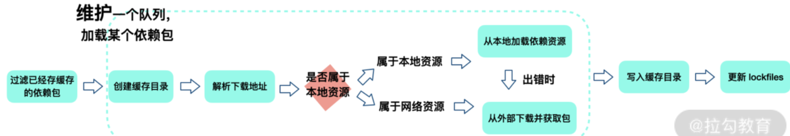
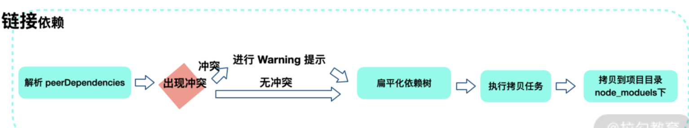
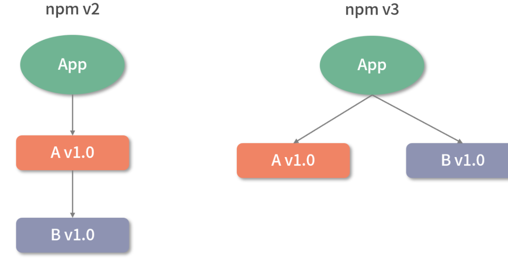
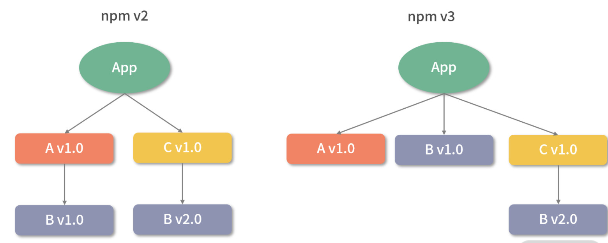

## HTML

### 引用标签

- `<blockquote>`：块级引用元素

  - `<blockquote>` 元素（或者 HTML 块级引用元素），代表其中的文字是引用内容。通常在渲染时，这部分的内容会有一定的缩进（注 中说明了如何更改）
  - 若引文来源于网络，则可以将原内容的出处 URL 地址设置到 cite 特性上，若要以文本的形式告知读者引文的出处时，可以通过 `<cite>` 元素

- `<q>`标签, 短引用
  - 引用标签 (`<q>`) 表示一个封闭的并且是短的行内引用的文本。这个标签是用来引用短的文本，所以不要引入换行符; 对于长的文本的引用使用 `<blockquote>` 替代。
  - `cite`这个属性的值是 URL，意在指出被引用的文本的源文档或者源信息。这个属性重在解释这个引用的参考或者是上下文。
  ```html
  <p>
    Everytime Kenny is killed, Stan will announce
    <q cite="http://en.wikipedia.org/wiki/Kenny_McCormick#Cultural_impact"> Oh my God, </q>.
  </p>
  ```

## Tips - `Yarn`

> Yarn 是一个由 Facebook、Google、Exponent 和 Tilde 构建的新的 JavaScript 包管理器。它的出现是为了解决历史上 npm 的某些不足（比如 npm 对于依赖的完整性和一致性保障，以及 npm 安装速度过慢的问题等），虽然 npm 目前经过版本迭代汲取了 Yarn 一些优势特点（比如一致性安装校验算法等），但依然有必要关注 Yarn 的思想和理念。

- 当 npm 还处在 v3 时期时，一个叫作 Yarn 的包管理方案横空出世。2016 年，npm 还没有 `package-lock.json` 文件，安装速度很慢，稳定性也较差，而 Yarn 的理念很好地解决了以下问题。
  - 确定性：通过 yarn.lock 等机制，保证了确定性。即不管安装顺序如何，相同的依赖关系在任何机器和环境下，都可以以相同的方式被安装。（在 npm v5 之前，没有 package-lock.json 机制，只有默认并不会使用的 npm-shrinkwrap.json。）
  - 采用模块扁平安装模式：将依赖包的不同版本，按照一定策略，归结为单个版本，以避免创建多个副本造成冗余（npm 目前也有相同的优化）。
  - 网络性能更好：Yarn 采用了请求排队的理念，类似并发连接池，能够更好地利用网络资源；同时引入了更好的安装失败时的重试机制。
  - 采用缓存机制，实现了离线模式（npm 目前也有类似实现）。

> [imsnif/synp: Convert yarn.lock to package-lock.json and vice versa](https://github.com/imsnif/synp)

- **Yarn 默认使用 prefer-online 模式，即优先使用网络数据。如果网络数据请求失败，再去请求缓存数据。**

- Yarn 所独有的命令：

```bash
yarn import
yarn licenses
yarn pack
yarn why
yarn autoclean
```

- npm 独有的命令是：`npm rebuild`

### Yarn 安装机制和背后思想

- Yarn 的安装过程主要有以下 5 大步骤：
  - 检测（checking）→ 解析包（Resolving Packages） → 获取包（Fetching Packages）→ 链接包（Linking Packages）→ 构建包（Building Packages）

#### 检测包（checking）

- 这一步主要是检测项目中是否存在一些 npm 相关文件，比如 package-lock.json 等。如果有，会提示用户注意：这些文件的存在可能会导致冲突。在这一步骤中，也会检查系统 OS、CPU 等信息。

#### 解析包（Resolving Packages）

- 这一步会解析依赖树中每一个包的版本信息。
- 首先获取当前项目中 package.json 定义的 dependencies、devDependencies、optionalDependencies 的内容，这属于**首层依赖**。
- 接着采用**遍历首层依赖**的方式获取依赖包的版本信息，以及递归查找每个依赖下嵌套依赖的版本信息，并将解析过和正在解析的包用一个 `Set` 数据结构来存储，这样就能保证同一个版本范围内的包不会被重复解析。
  - 对于没有解析过的包 A，首次尝试从 yarn.lock 中获取到版本信息，并标记为已解析；
  - 如果在 yarn.lock 中没有找到包 A，则向 Registry 发起请求获取满足版本范围的已知最高版本的包信息，获取后将当前包标记为已解析。
- 在经过解析包这一步之后，我们就确定了所有依赖的具体版本信息以及下载地址。

#### 获取包（Fetching Packages）

- 这一步首先需要检查缓存中是否存在当前的依赖包，同时将缓存中不存在的依赖包下载到缓存目录：

- 如何判断缓存中是否存在当前的依赖包？
  - Yarn 会根据 `cacheFolder+slug+node_modules+pkg.name` 生成一个 path，判断系统中是否存在该 path，如果存在证明已经有缓存，不用重新下载。这个 path 也就是依赖包缓存的具体路径。
  - 对于没有命中缓存的包，Yarn 会维护一个 fetch 队列，按照规则进行网络请求。
  - 如果下载包地址是一个 file 协议，或者是相对路径，就说明其指向一个本地目录，此时调用 Fetch From Local 从离线缓存中获取包；
  - 否则调用 Fetch From External 获取包。最终获取结果使用 fs.createWriteStream 写入到缓存目录下。



#### 链接包（Linking Packages）

- 上一步是将依赖下载到缓存目录，这一步是将项目中的依赖复制到项目 node_modules 下，同时遵循扁平化原则。
- 在复制依赖前，Yarn 会先解析 peerDependencies，如果找不到符合 peerDependencies 的包，则进行 warning 提示，并最终拷贝依赖到项目中。



#### 构建包（Building Packages）

- 如果依赖包中存在二进制包需要进行编译，会在这一步进行。

---

### 依赖管理困境

- 项目依赖树的层级非常深，不利于调试和排查问题；
- 依赖树的不同分支里，可能存在同样版本的相同依赖。比如直接依赖 A 和 B，但 A 和 B 都依赖相同版本的模块 C，那么 C 会重复出现在 A 和 B 依赖的 node_modules 中

> 这种重复问题使得安装结果浪费了较大的空间资源，也使得安装过程过慢，甚至会因为目录层级太深导致文件路径太长，最终在 Windows 系统下删除 node_modules 文件夹出现失败情况。

- npm v3 之后，node_modules 的结构改成了扁平结构



- 当项目新添加了 C 依赖，而它依赖另一个版本的 B v2.0。这时候版本要求不一致导致冲突，B v2.0 没办法放在项目平铺目录下的 node_moduls 文件当中，npm v3 会把 C 依赖的 B v2.0 安装在 C 的 node_modules 下：



- B v1.0 出现在项目顶层 node_modules，而不是 B v2.0 出现在 node_modules 顶层
  - 这取决于模块 A 和 C 的安装顺序。因为 A 先安装，所以 A 的依赖 B v1.0 率先被安装在顶层 node_modules 中，接着 C 和 D 依次被安装，C 和 D 的依赖 B v2.0 就不得不安装在 C 和 D 的 node_modules 当中了。因此，**模块的安装顺序可能影响 node_modules 内的文件结构**。

......

---

- **明显看到出现了较多重复的依赖模块 B v2.0。我们可以删除 node_modules，重新安装，利用 npm 的依赖分析能力，得到一个更清爽的结构**

- **更优雅的方式是使用 npm dedupe 命令**

- 实际上，Yarn 在安装依赖时会自动执行 `dedupe` 命令(删除重复)。整个优化的安装过程，就是上一讲提到的扁平化安装模式，也是需要掌握的**关键内容**。

## Reference

[haizlin/fe-interview](https://github.com/haizlin/fe-interview/blob/master/category/history.md)

[`<blockquote>`：块级引用元素 - HTML（超文本标记语言） | MDN](https://developer.mozilla.org/zh-CN/docs/Web/HTML/Element/blockquote)

[`<cite>` - HTML（超文本标记语言） | MDN](https://developer.mozilla.org/zh-CN/docs/Web/HTML/Element/cite)

[`<q>` - HTML（超文本标记语言） | MDN](https://developer.mozilla.org/zh-CN/docs/Web/HTML/Element/q)

[全局属性 - HTML（超文本标记语言） | MDN](https://developer.mozilla.org/zh-CN/docs/Web/HTML/Global_attributes)
