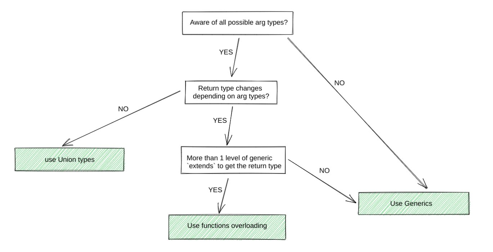

## Tips

### TypeScript

- dynamic elements

```ts
interface Animal {
  name: string;
}

interface Human {
  firstName: string;
  lastName: string;
}

export const getDisplayName = (item: Animal): { displayName: string } => {
  return { displayName: item.name };
};

const result = getDisplayName({ name: 'PATCH' });
```

- Generic Solution
- 当函数在调用的时候前不能确定传入的数据的类型，可用泛型
- 尤其如此例中，需要跟据不同参数类型返回不同的类型

```ts
interface Animal {
  name: string;
}

interface Human {
  firstName: string;
  lastName: string;
}

export const getDisplayName = <TItem extends Animal | Human>(
  item: TItem
): TItem extends Human ? { humanName: string } : { animalName: string } => {
  if ('name' in item) {
    return {
      animalName: item.name,
    };
  }
  return {
    humanName: item.firstName,
  };
};

const result1 = getDisplayName({ name: 'Pathc' });

const result2 = getDisplayName({ firtName: 'Ricky', lastName: 'Potter' });
```



## Reference

- [Navigator.onLine - Web APIs | MDN](https://developer.mozilla.org/en-US/docs/Web/API/Navigator/onLine)
