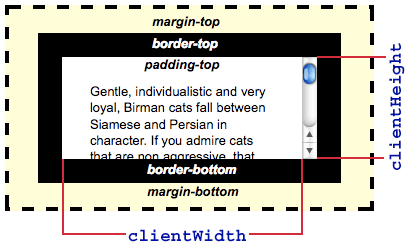
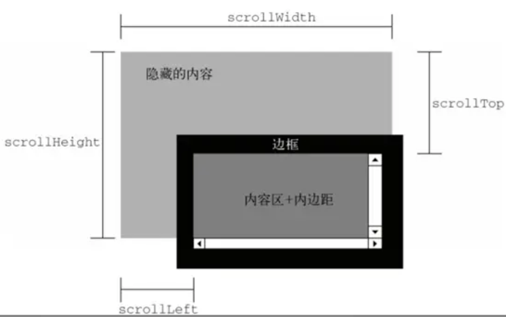

## Tips

### `offsetWidth`、`clientWidth`、`scrollWidth` 三者的区别

- `offsetWidth`: 对象整体的实际宽度，包滚动条等边线，会随对象显示大小的变化而改变

- `offsetWidth = contentWidth + padding * 2 + border * 2 + scrollbar`

- `clientWidth`: 对象内容的可视区的宽度，不包滚动条等边线，会随对象显示大小的变化而改变

- `clientWidth = contentWidth + padding * 2`

- `scrollWidth`：对象的实际内容的宽度，不包边线宽度，会随对象中内容超过可视区后而变大

- `scrollWidth = contentWidth + padding * 2`

## Reference

- [haizlin/fe-interview](https://github.com/haizlin/fe-interview/blob/master/category/history.md)

- [HTMLElement.offsetWidth - Web API 接口参考 | MDN](https://developer.mozilla.org/zh-CN/docs/Web/API/HTMLElement/offsetWidth)

- [Element.clientWidth - Web API 接口参考 | MDN](https://developer.mozilla.org/zh-CN/docs/Web/API/Element/clientWidth)

- [Element.scrollWidth - Web API 接口参考 | MDN](https://developer.mozilla.org/zh-CN/docs/Web/API/element/scrollWidth)
