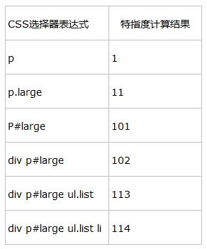

# 第二十三日

## HTML

### **#Question:** 关于`<form>`标签的 `enctype` 属性你有哪些了解

`form` 标签的 `enctype`(是表单提交属性之一) 属性指定将数据回发到服务器时浏览器如果对表单数据进行编码，其有三种编码形式

当 `method` 属性值为 `post` 时，`enctype` 就是将表单的内容提交给服务器的 `MIME`[^1] 类型 。可能的取值有：

1. `application/x-www-form-urlencoded`：未指定属性时的默认值

   - `application/x-www-form-urlencoded` 编码类型会将表单中发送到服务器之前都会进行编码(空格转换为 "`+`" 加号，特殊符号转换为 `ASCII HEX` 值)，数据编码成键值对的形式，当表单的 `action` 为 `post` 时，它会把 `form` 数据封装到 `http body` 中，然后发送到服务器；
   - 当表单的 `action` 为 `get` 时，它会把表单中发送的数据转换成一个字符串(如：`a=1&b=2&c=3`)并使用?连接到 `url` 后面。在不指定 `enctype` 属性时 `application/x-www-form-urlencoded` 是默认属性

2. `multipart/form-data`: **不对字符进行编码**，在使用包含文件(如图片、mp4 等文件)上传控件的表单时必须使用该值

3. `text/plain`: **数据以纯文本格式进行编码**，空格转换为 "`+`" 加号，但不对特殊字符编码

Example:

```html
<body>
  <form action="" enctype="application/x-www-form-urlencoded">
    First name: <input type="text" name="fname" /> Last name:
    <input type="text" name="lname" />
    <input type="submit" value="提交" />
  </form>
</body>
```

以上代码说明如下：

1. `form` 的提交行为需要通过 `type=submit` 实现
2. `form` 中的 `method` 属性不指定时，默认的提交方式为 `get` 请求，那么也就是说如果不指定 `method` 为 `post`，那么是不会使用 `enctype` 属性的。
3. `form` 表单的 `enctype` 属性是 `application/x-www-form-urlencoded`

[^1]: [Media type - Wikipedia](https://en.wikipedia.org/wiki/Media_type)

## CSS

### **#Question:** 说说 CSS 的优先级是如何计算的

#### 选择器种类

严格来讲，选择器的种类可以分为三种：**标签名选择器**、**类选择器** 和 **ID 选择器**。而所谓的后代选择器和群组选择器只不过是对前三种选择器的扩展应用。而 在标签内写入 **style=""** 的方式，应该是**CSS**的一种引入方式，而不是选择器，因为根本就没有用到选择器。而一般人们将上面这几种方式结合在一起，所 以就有了 5 种或 6 种选择器了。

三种基本的选择器类型

- 标签名选择器，如：`p{}`，即直接使用 `HTML` 标签作为选择器
- 类选择器，如 `.polaris{}`
- `ID` 选择器，如 `#polaris{}`

---

- _伪类，属性选择器特指度等同于类_
- _伪元素特指度等同于标签名选择器_

---

扩展选择器

- 后代选择器，如 `.polaris span img{}`，后代选择器实际上是使用多个选择器加上**中间的空格**来找到具体的要控制标签。
- 群组选择器，如 `div,span,img{}`，群组选择器实际上是对 CSS 的**一种简化写法**，只不过把有相同定义的不同选择器放在一起，省了很多代码

#### 特指度-优先级计算

特指度（`specificity`）。特指度表示一个 css 选择器表达式的重要程度，可以通过一个公式来计算出一个数值，数越大，越重要。这个计算叫做“I-C-E”计算公式，

```
I——Id; 100
C——Class; 10
E——Element; 1
```

即，针对一个 css 选择器表达式，遇到一个**id**就往特指度数值中加**100**，遇到一个**class**就往特指度数值中加**10**，遇到一个**element**就往特指度数值中加**1**



**`!important` 优先级最高，高于上面一切。`*` 选择器最低，低于一切。**

#### 后代选择器的定位原则

浏览器 CSS 匹配不是从左到右进行查找，而是**从右到左进行查找**。比如 `div #div Box p span.red{color:red;}`，浏览器的查找顺序如下：

1. 先查找 html 中所有 class='red' 的 span 元素
2. 找到后，再查找其父辈元素中是否有 p 元素，再判断 p 的父元素中是否有 id 为 divBox 的 div 元素，如果都存在则匹配上。

浏览器**从右到左进行查找的好处**是为了尽早过滤掉一些无关的样式规则和元素。

#### 简洁、高效的 CSS

所谓高效的 CSS 就是让浏览器在查找 style 匹配的元素的时候尽量进行少的查找

下面列出一些常见问题：

1. 不要在`ID选择器`前使用标签名

   - 一般写法：`div #div Box`
   - 更好写法：`#div Box`
   - 解释： 因为`ID`选择器是唯一的，加上 `div` 反而增加不必要的匹配。

2. 不要在 `class选择器` 前使用标签名

   - 一般写法：`span.red`
   - 更好写法：`.red`
   - 解释：同第一条，但如果你定义了多个`.red`，而且在不同的元素下是样式不一样，则不能去掉，比如你 css 文件中定义如下：

     - `p.red{color:red;}`
     - `span.red{color:#ff00ff}`
     - 如果是这样定义的就不要去掉，去掉后就会混淆，不过建议最好不要这样写。

3. 尽量少使用层级关系

   - 一般写法：`#divBox p .red{color:red;}`
   - 更好写法：`.red{..}`

4. 使用 `class` 代替层级关系
   - 一般写法：`#divBox ul li a{display:block;}`
   - 更好写法：`.block{display:block;}`

> `!important>id>class>tag>*`

## JavaScript

### **#Question:** `0.1 + 0.2`、`0.1 + 0.3` 和 `0.1 \* 0.2` 分别等于多少？并解释下为什么

`EcmaScrpt`规范定义 Number 的类型遵循了 IEEE754-2008 中的 64 位浮点数规则定义的小数后的有效位数至多为 52 位导致计算出现精度丢失问题

```js
0.1 + 0.2 != 0.3;
```

解决这个问题；使用原生最简单的方法:

```js
parseFloat((0.1 + 0.2).toFixed(10)) === 0.3; //true
```

1. `parseFloat(string)` function parses an argument(converting it to a string first if needed) and returns a floating point number or `NaN` when the first non-whitespace character cannot be converted to a number.

2. The `numObj.toFixed(digits)` method formats a number using fixed-point notation.

   - **Parameter**:`digits (Optional)` :The number of digits to appear after the decimal point; this may be a value between 0 and 20, inclusive, and implementations may optionally support a larger range of values. If this argument is omitted, it is treated as 0.
   - **RETURN VALUE**:A string representing the given number using fixed-point notation.

## Reference

[前端面试每日 3+1-以前端面试题来驱动学习，提倡每日学习与思考，每天进步一点！](http://www.h-camel.com/index.html)
