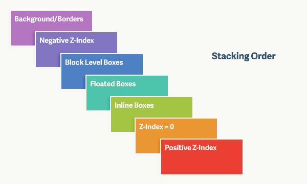

# 第二十六日

## HTML

### **#Question:** 解释下你对 GBK 和 UTF-8 的理解？并说说页面上产生乱码的可能原因

GBK 与 UTF-8 之区别

- GBK 编码：是指中国的中文字符，其它它包含了简体中文与繁体中文字符
- UTF-8 编码：它是一种全国家通过的一种编码，如果你的网站涉及到多个国家的语言

`<meta http-equiv="Content-Type" content="text/html; charset=utf-8" />`

## CSS

### **#Question:** 说说对 z-index 的理解

帧元素（`frameset`) 优先级最高 >>> 表单元素 > 非表单元素，即 `input type="radio"` 之类的表单控件 > 普通的如 `a`,`div` 等元素。

从有窗口和无窗口元素来分，有窗口元素 > 无窗口元素。有窗口元素如 Select 元素、Object 元素。

`z-index` 属性也可以改变显示优先级，但只对同种类型的元素才有效。

#### z-index

`z` 表示三维坐标的 Z 轴。

`CSS`允许我们对`z-index`属性设置三种值(**绝对定位方案将一个元素从常规流中移除的情况下**)

1. auto (自动，默认值)
2. 整数: 数值越大，元素也就越靠近观察者。 数值越小，元素看起来也就越远
   - 如果有两个元素放在了一起，占据了二维平面上一块共同的区域，那么有着较大 `z-index` 值的元素就会掩盖或者阻隔有着较低 `z-index` 值的元素在共同区域的那一部分
3. inherit

#### Problem

- 当一个设置了 `z-index` 值的定位元素与常规文档流中的元素相互重叠的时候，谁会被置于上方？
- 当定位元素与浮动元素相互重叠的时候，谁会被置于上方？
- 当定位元素被嵌套在其他定位元素中时会发生什么？

#### Explanation



在一个层叠上下文中一共可以有 7 种层叠等级，列举如下：

1. 背景和边框 —— 形成层叠上下文的元素的背景和边框。 层叠上下文中的最低等级
2. 负 `z-index` 值 —— 层叠上下文内有着负 `z-index` 值的子元素
3. 块级盒 —— 文档流中非行内非定位子元素
4. 浮动盒 —— 非定位浮动元素
5. 行内盒 —— 文档流中行内级别非定位子元素
6. `z-index: 0` —— 定位元素。 这些元素形成了新的层叠上下文
7. 正 `z-index` 值 —— 定位元素。 层叠上下文中的最高等级

这七个层叠等级构成了层叠次序的规则。 在层叠等级七上的元素会比在等级一至六上的元素显示地更上方（更靠近观察者）

**事实上，大多数的一切都比 z-index 为 0 的层叠等级低**

#### Summary

当将除了`auto`以外的`z-index`值赋给一个元素，你就创建了一个**新的层叠上下文，它独立于其他的层叠上下文**

层叠上下文、层叠层和确定哪个元素在上哪个元素在下的层叠次序规则。

定位元素(**绝对定位方案将一个元素从常规流中移除的情况下**)还会产生新的层叠上下文，而这整一个层叠层会显示在另一个层叠上下文中的所有层叠层的上面或者下面

## JavaScript

### **#Question:** 说说 bind、call、apply 的区别？并手写实现一个 bind 的方法

Basic rules worth remembering:

- `this` always refers to an object.
- `this` refers to an object which calls the function it contains.
- In the global context `this` refers to either window object or is undefined if the `strict mode` is used.

`call` 和 `apply` 都是为了解决改变 `this` 的指向, 同时执行函数。作用都是相同的，只是传参的方式不同。

除了第一个参数外，call 可以接收一个参数列表，apply 只接受一个参数数组。
`bind`绑定完之后返回一个新的函数，不执行。

js 函数是一个 `Function` 的对象，因此存在`Function`的构造函数, 和原型对象:

#### custom call

The basic principle of a call function:

1. Calling the prototype function call changes the pointing of this.
2. Whatever arguments we have passed to `func.call` should be passed to orginal `func` as `arg1, arg2, ...`
3. Does not cause side effect to `obj`(original object) and `func`

```js
// Our custom newCall will be also be attached to the Function prototype
// null or undefined should be replaced with the global object(or window)
Function.prototype.newCall = function (context = window) {
  // this "this" is the function we want to use (on the chain of Function.prototype)
  context.fn = this;

  // got the func's arguments by delete the first argument, context(the context we want to refer), it is a array right now
  let args = [...arguments].slice(1);

  // This 'context' is the obj our want to refer
  let result = context.fn(...args);
  // 执行完后,删除 should delete this property after execution
  delete context.fn;
  // 返回函数执行后的结果
  return result;
};
```

#### custom apply

```js
Function.prototype.newApply = function (context = window) {
  context.fn = this;

  var result
  // 判断 arguments[1] 是不是 undefined
  if (arguments[1]) {
    result = context.fn(...arguments[1])
  } else {
    result = context.fn()
  }

  delete context.fn
  return result;

```

#### custom bind

The bind method creates and returns a `new function`, called a bound function. This bound function wraps the original function object.

```js
Function.prototype.newBind = function (context) {
  if (typeof this !== 'function') {
    throw new TypeError('Error');
  }
  var _this = this;
  var args = [...arguments].slice(1);
  // 返回一个函数
  return function F() {
    // 因为返回了一个函数，我们可以 new F()，所以需要判断
    if (this instanceof F) {
      return new _this(...args, ...arguments);
    }
    return _this.apply(context, args.concat(...arguments));
  };
};
```

## Reference

[关于 z-index 那些你不知道的事](https://webdesign.tutsplus.com/zh-hans/articles/what-you-may-not-know-about-the-z-index-property--webdesign-16892)

[Implement your own — call(), apply() and bind() method in JavaScript | by Ankur Anand | Medium](https://medium.com/@ankur_anand/implement-your-own-call-apply-and-bind-method-in-javascript-42cc85dba1b)

:point_up: [For everyone reading this article — authors code is bad in terms of readability and performance. | by Андрей Виноградов | Medium](https://medium.com/@vinodron/for-everyone-reading-this-article-authors-code-is-bad-in-terms-of-readability-and-performance-9fb74faa26d9)
