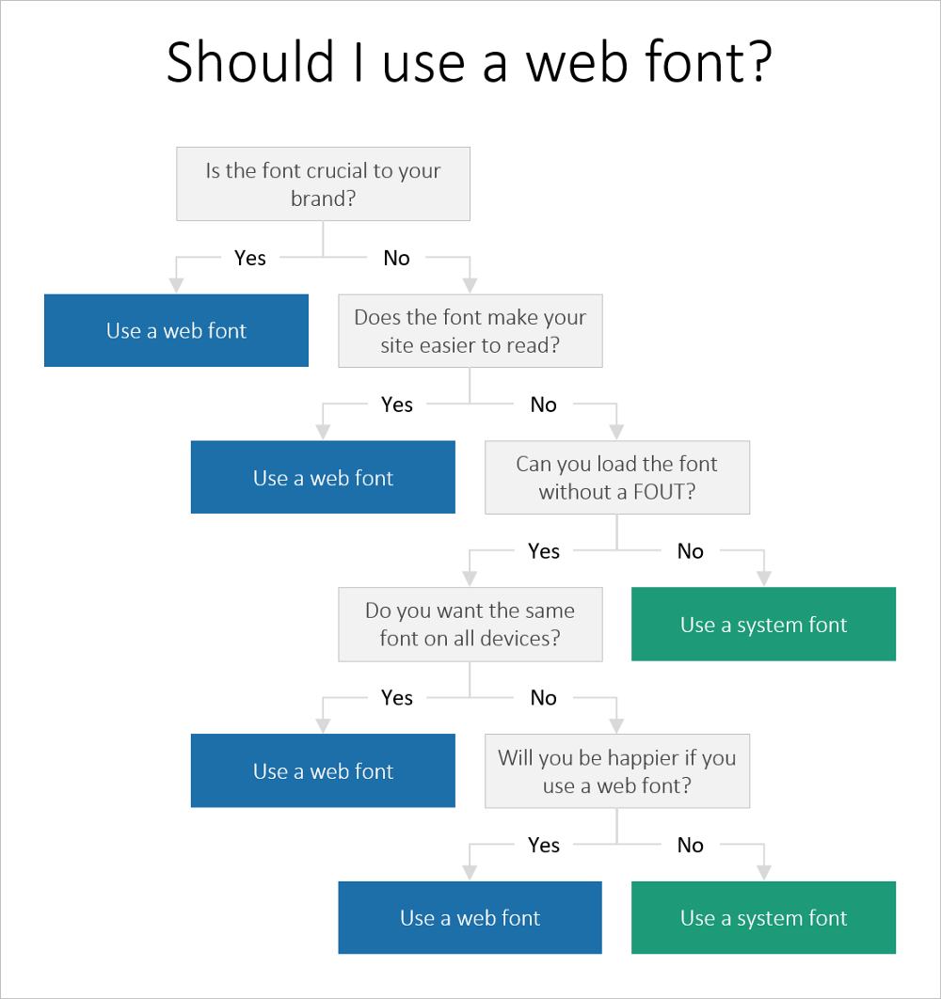

## HTML

### 选择合适的元素来编写代码可保证代码的易读性

- 使用`<h1><h2><h3>`表示标题，`<ul>`或`<ol>`实现列表
- 注意使用`<article>`标签之前应添加`<h1>`标签
- 选择合适的 HTML5 语义元素如`<header>`，`<footer>`, `<nav>`, `<aside>`
- 使用`
`描述 Body 文本，HTML5 语义元素可以形成内容，反之不成立
- 使用`<em>`和`<strong>`标签替代 i 和 b 标签。
- 使用`<label>`元素，输入类型，占位符及其他属性来强制验证。
- 使用`
`元素修饰文本，而不是布局；默认`
`是自动提供边缘，而且其他样式也是浏览器默认提供的
- 避免使用` `分行，可以使用 block 元素或 CSS 显示属性来代替
- 避免使用`
`来添加水平线，可使用 CSS 的 `border-bottom` 来代替
- 不到关键时刻不要使用 `div` 标签
- 尽量少用 `Table` 来布局
- 可以多使用 `FlexBox`
- 使用 CSS 来调整边距等

## JavaScript

### 判断一个数是否为整数

- `let isInteger=n=> typeof(n)!='NAN'&&n%1===0`

## Tips

### Web fonts

- Web Font 最大的弊端在于它是异步加载的，没有办法避免下载它所用的时间
- 预加载，对于字体，浏览器是能够有效缓存的，如果能够做好预加载，不会太影响用户体验 link 的 `rel=preload` 来做预加载
  - JS 有一些库在支持这方面功能，例如 bramstein/fontfaceobserver
  - 通常加载字体是在 CSS 中的`@font-face` 被读到的时候才去加载的，那么就会出现先加载 CSS，后加载字体的情况
  - 如果利用 link 预加载，那么在 CSS 中的`@font-face` 被读到前就已经开始加载了，那么字体加载和 CSS 加载就可以同时加载，提升速度

## Reference

- [fe-interview/history.md](https://github.com/haizlin/fe-interview/blob/master/category/history.md)

- [@font-face - CSS（层叠样式表） | MDN](https://developer.mozilla.org/zh-CN/docs/Web/CSS/@font-face)

- [weekly/21.精读《Web fonts: when you need them, when you don’t》.md at master · ascoders/weekly](https://github.com/ascoders/weekly/blob/master/%E5%89%8D%E6%B2%BF%E6%8A%80%E6%9C%AF/21.%E7%B2%BE%E8%AF%BB%E3%80%8AWeb%20fonts%3A%20when%20you%20need%20them%2C%20when%20you%20don%E2%80%99t%E3%80%8B.md)
