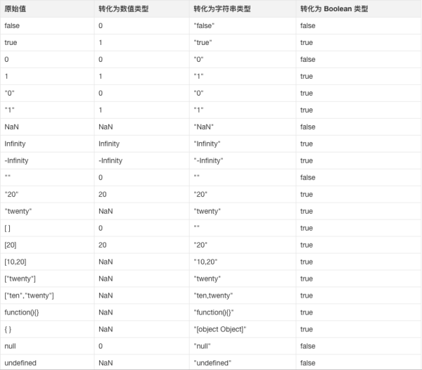

## Tips

### `postMessage`

- `window.postMessage()` 方法可以安全地实现跨源通信。
  - 通常，对于两个不同页面的脚本，只有当执行它们的页面位于具有相同的协议（通常为 https），端口号（443 为 https 的默认值），以及主机 (两个页面的模数 Document.domain 设置为相同的值) 时，这两个脚本才能相互通信。
  - `window.postMessage()` 方法提供了一种受控机制来规避此限制，只要正确的使用，这种方法就很安全。

### `Expires` `Cache-Control` `ETag`

#### `Expires`

- 响应头包含日期/时间， 即在此时候之后，响应过期。
- 无效的日期，比如 0, 代表着过去的日期，即该资源已经过期。
- 如果在 Cache-Control 响应头设置了 "max-age" 或者 "s-max-age" 指令，那么 Expires 头会被忽略。

#### `Cache-Control`

- Cache-Control 通用消息头字段，被用于在 http 请求和响应中，通过指定指令来实现缓存机制。缓存指令是单向的，这意味着在请求中设置的指令，不一定被包含在响应中。
  - 不区分大小写，但建议使用小写。
  - 多个指令以逗号分隔。
  - 具有可选参数，可以用令牌或者带引号的字符串语法。

#### `ETag`

- ETagHTTP 响应头是资源的特定版本的标识符。这可以让缓存更高效，并节省带宽，因为如果内容没有改变，Web 服务器不需要发送完整的响应。而如果内容发生了变化，使用 ETag 有助于防止资源的同时更新相互覆盖（“空中碰撞”）。

- 如果给定 URL 中的资源更改，则一定要生成新的 Etag 值。 因此 Etags 类似于指纹，也可能被某些服务器用于跟踪。 比较 etags 能快速确定此资源是否变化，但也可能被跟踪服务器永久存留。

### `null >= 0`

#### 大于判断

##### `a > b`

1. 调用 b 的 ToPrimitive(hit Number) 方法.
2. 调用 a 的 ToPrimitive(hit Number) 方法.
3. 如果此时 Result(1) 与 Result(2) 都是字符串，跳到步骤 16.
4. 调用 ToNumber(Result(1)).
5. 调用 ToNumber(Result(2)).
6. 如果 Result(4) 为 NaN, return undefined.
7. 如果 Result(5) 为 NaN, return undefined.
8. 如果 Result(4) 和 Result(5) 是相同的数字，return false.
9. 如果 Result(4) 为 +0， Result(5) 为 -0, return false.
10. 如果 Result(4) 为 -0， Result(5) 为 +0, return false.
11. 如果 Result(4) 为 +∞, return false.
12. 如果 Result(5) 为 +∞, return true.
13. 如果 Result(5) 为 -∞, return false.
14. 如果 Result(4) 为 -∞, return true.
15. 如果 Result(4) 的数值大小小于 Result(5)，return true，否则 return false.
16. 如果 Result(2) 是 Result(1) 的前缀 return false. （比如 "ab" 是 "abc" 的前缀）
17. 如果 Result(1) 是 Result(2) 的前缀, return true.
18. 找到一个位置 k，使得 a[k] 与 b[k] 不相等.
19. 取 m 为 a[k] 字符的数值.
20. 取 n 为 b[k] 字符的数值.
21. 如果 m < n, return true，否则 return false.

> ToPrimitive 会按照顺序优先使用存在的值：valueOf()、toString()，如果都没有，会抛出异常。 ToPrimitive(hit Number) 表示隐转数值类型

- null > 0 结果为 false

#### 等于判断

##### `a == b`

1. 如果 a 与 b 的类型相同：
   - 如果 Type(b) 为 undefined，return true.
   - 如果 Type(b) 为 null，return true.
   - 如果 Type(b) 为 number，则：
     - 如果 b 为 NaN，return false.
     - 如果 a 为 NaN，return false.
     - 如果 a 与 b 数值相同，return true.
     - 如果 a 为 +0，b 为 -0，return true.
     - 如果 a 为 -0，b 为 +0，return true.
     - 否则 return false.
   - 如果 Type(b) 为 string，且 a 与 b 是完全相同的字符串，return true，否则 return false.
   - 如果 Type(b) 是 boolean，如果都是 true 或 false，return true，否则 return false.
   - 如果 a 与 b 是同一个对象引用，return true，否则 return false.
2. 如果 a 为 null，b 为 undefined，return true.
3. 如果 a 为 undefined，b 为 null，return true.
4. 如果 Type(a) 为 number，Type(b) 为 string，返回 a == ToNumber(b) 的结果.
5. 如果 Type(a) 为 string，Type(b) 为 number，返回 ToNumber(a) == b 的结果.
6. 如果 Type(a) 为 boolean，返回 ToNumber(a) == b 的结果.
7. 如果 Type(b) 为 boolean，返回 a == ToNumber(b) 的结果.
8. 如果 Type(a) 是 string 或 number，且 Type(b) 是对象类型，返回 a == ToPrimitive(b) 的结果.
9. 如果 Type(a) 是对象类型，且 Type(b) 是 string 或 number，返回 ToPrimitive(a) == b 的结果.
10. 否则 return false.

- **null == 0 走到了第 10 步，返回了默认的 false**

#### 大于等于判断

> 如果 a < b 为 false，则 a >= b 为 true

- **null >= 0 为 true，因为 null < 0 是 false.**

- `{} >= {} // true`
- `null >= {} // false`

## Reference

- [fe-interview/history.md](https://github.com/haizlin/fe-interview/blob/master/category/history.md)

- [window.postMessage - Web API 接口参考 | MDN](https://developer.mozilla.org/zh-CN/docs/Web/API/Window/postMessage)

- [Expires - HTTP | MDN](https://developer.mozilla.org/zh-CN/docs/Web/HTTP/Headers/Expires)

- [Cache-Control - HTTP | MDN](https://developer.mozilla.org/zh-CN/docs/Web/HTTP/Headers/Cache-Control)

- [ETag - HTTP | MDN](https://developer.mozilla.org/zh-CN/docs/Web/HTTP/Headers/ETag)

- [Symbol.toPrimitive - JavaScript | MDN](https://developer.mozilla.org/zh-CN/docs/Web/JavaScript/Reference/Global_Objects/Symbol/toPrimitive)
