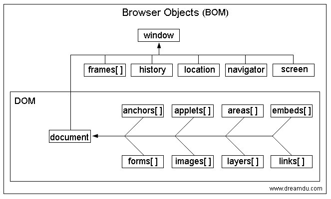

# 第三十一日

## HTML

### **Question:**　 `DOM` 和 `BOM` 有什么区别

> `BOM` 是 `Browser Object Model` 的缩写，即浏览器对象模型。`DOM` 是 `Document Object Model` 的缩写，即文档对象模型。都是浏览器提供给 JavaScript 的 API 接口



#### BOM 指 浏览器对象模型

提供了独立于内容而与浏览器窗口进行交互的对象。描述了与浏览器进行交互的方法和接口，可以对浏览器窗口进行访问和操作，譬如可以弹出新的窗口，改变状态栏中的文本。


#### DOM 指 文档对象模型

DOM 是针对 HTML 的基于树的 API。描述了处理网页内容的方法和接口，是 HTML 的 API，DOM 把整个页面规划成由节点层级构成的文档。


**只有 JS 的宿主环境是浏览器的时候才有 DOM 和 BOM ，在 Node 中是没有这两个对象的**

## CSS

### **Question:**　让网页的字体变得清晰，变细用 CSS 怎么做

- `font-weight` + `font-family`

  - `font-weight` 来控制粗细还需要对应的字体有没有对应的变种字体。因此这就和 font-family 相关。

- `-webkit-font-smoothing: antialiased;`
  - 这个属性是 Chrome 的抗锯齿属性。加上后会显得细一些，但是只针对 webkit 内核的浏览器才有效。

## JavaScript

### **Question:**　写一个方法把 0 和 1 互转（0 置 1，1 置 0）

```js
function change(val) {
  if (typeof val === 'number') {
    val += '';
    let newStrArr = val.split('').map((item, index) => {
      return item == '1' ? '0' : '1';
    });
    let newStr = newStrArr.join('');
    return parseInt(newStr);
  }
  return val
    .split('')
    .map((item, index) => (item == '1' ? '0' : '1'))
    .join('');
}

let str = '10101';
console.log(change(str)); //01010
let num = 10101;
console.log(change(num)); //1010
```

## Reference

[JavaScript Browser Object Model (BOM)](https://www.javascripttutorial.net/javascript-bom/)

[JavaScript DOM Tutorial](https://www.javascripttutorial.net/javascript-dom/)

[fe-interview/history.md haizlin/fe-interview](https://github.com/haizlin/fe-interview/blob/master/category/history.md)
