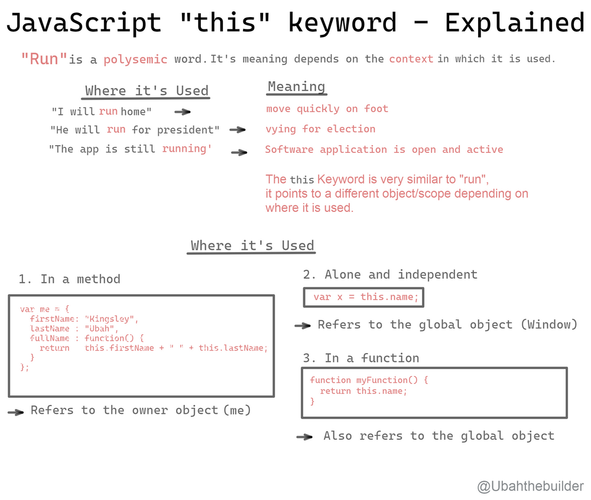
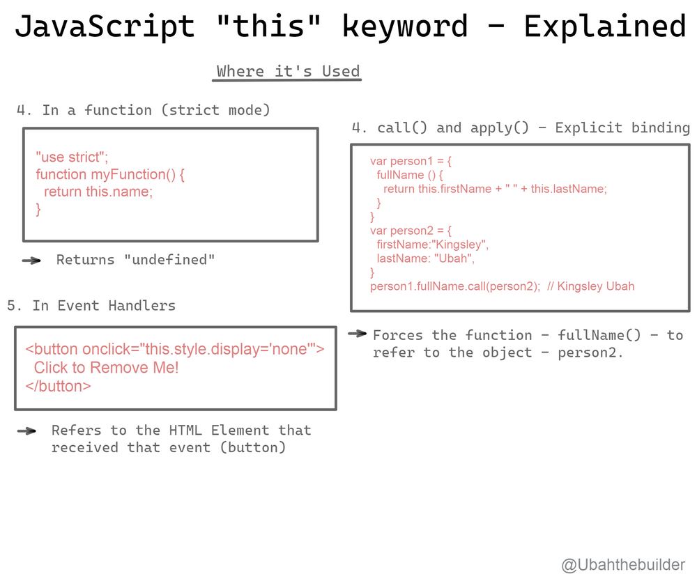

# 第三十三日

## HTML

### **Question:** html 和 html5 有什么区别呢

#### 文档声明区别

1. HTML 文档的类型声明为：

```html
<!DOCTYPE html PUBLIC "-//W3C//DTD HTML 4.01//EN" "http://www.w3.org/TR/html4/strict.dtd">
//或
<!DOCTYPE html PUBLIC "-//W3C//DTD XHTML 1.0 Strict//EN" "http://www.w3.org/TR/xhtml1/DTD/xhtml1-strict.dtd">
```

2. HTML5 文档的类型声明为：

`<!DOCTYPE html>`

#### 结构语义区别

`HTML`：没有体现结构语义的标签，如`<div id='nav'></div>`

`HTML5`：添加了许多具有语义化的标签，如：`<article>`、`<aside>`、`<audio>`，更利于 **SEO**

相对于 HTML，HTML5 中新增和修改了一些元素

#### 绘图区别

HTML5：HTML5 的 `canvas` 使用脚本（通常使用 JavaScript）在网页是绘制图像，可以控制画布上每个像素

#### 音频的视频的支持

HTML：如果不使用 Flash 播放器支持，它不支持音频和视频

HTML5：使用`<audio>`和`<vedio>`标签来支持音频和视频控制。

## CSS

### **Question:** 用 CSS 绘制一个三角形[^1]

[^1]: [毎日のフロントエンド　 6 - CSS](https://youkoucoding.github.io/p/%E6%AF%8E%E6%97%A5%E3%81%AE%E3%83%95%E3%83%AD%E3%83%B3%E3%83%88%E3%82%A8%E3%83%B3%E3%83%89-6/#css)

用伪元素来实现这种装饰性的效果，`content` 为空，就不需要 `width`

```css
.triangle:after {
  content: '';
  border: 35px solid transparent;
  border-bottom-color: lightgreen;
}
```

## JavaScript

### **Question:** 说说对 `this` 的理解

#### 一，一般函数

函数中的 this 永远指向函数的调用者（在代码执行时才能确定），谁最终调用这个函数，this 就指向谁:

- 在全局环境中，`this` 指向 `window`（如果开启严格模式，this 将指向`undefined`)
- 如果函数是通过对象调用的，那么 this 就指向这个**对象**（但要小心 this 绑定丢失[^2]，尤其要注意将函数作为值向函数中传入赋值时发生隐式丢失）
- 如果函数是通过 `call`、`apply`、`bind` 进行绑定，那么 this 就指向被绑定的对象
- 如果函数是通过`new`绑定的（**构造函数**），那么`this`就指向`new`出来的对象:
  - 使用 new 来调用函数的时候会自动执行下面的操作：
    1. 创建（或这说构造）一个全新的对象
    2. 这个新的对象会被执行`[[Prototype]]`连接
    3. 这个新对象会绑定到函数调用的`this`
    4. 如果函数没有返回其他对象，那么 new 表达式中的函数调用会**自动返回这个新对象**

> 显示绑定：使用`call，apply`的话，在使用回调函数的情况中会出现违背预期的结果。因为 call，apply 都会**立即执行。** 而硬绑定 bind 则**不会立即执行**。符合我们对回调函数执行的要求

[^2]: ["this & object prototypes": Chapter 2 'Explicit Binding' - question about explicit binding losing the "this" binding · Issue #1031 · getify/You-Dont-Know-JS](https://github.com/getify/You-Dont-Know-JS/issues/1031)

#### 二，箭头函数

**箭头函数**中的`this`例外，它指向定义时所在的位置。或者可以说**箭头函数**的`this`继承自外层作用域，只要确定了外层作用域的 this，就知道箭头函数中的 this 指向谁了。

#### Types of Binding in JS

- Default Binding
- Implicit Binding
- Explicit Binding
- Constructor call Binding

**_Default Binding in JavaScript_**

One of the first rule to remember is that:
**If the function housing a this reference is a standalone function, then that function is bound to the global object.**

```js
function alert() {
  console.log(this.name + ' is calling');
}

const name = 'Kingsley';
alert(); // Kingsley is calling
//  TypeError: `this` is `undefined` when in 'use strict'
```

**_Implicit Binding in JavaScript_**

Another scenario to look out for is whether the function is attached to an object (its context) **at the call site**.

**A function can use an object as its context only if that object is bound to it at the call site.** This form of binding is known as implicit binding.

An easy way to figure out which object `this` is **implicitly bound to** is to look at which object is to the left of the dot `(.)`

```js
function alert() {
  console.log(this.age + ' years old');
}

const myObj = {
  age: 22,
  alert: alert,
  nestedObj: {
    age: 26,
    alert: alert,
  },
};

myObj.alert(); // `this` is bound to `myObj` -- 22 years old
myObj.nestedObj.alert(); // `this` is bound to `nestedObj` -- 26 years old
```

**_Explicit binding in JavaScript_**

`call()` and `apply()`.

Along with a couple other set of utility functions, these two utilities are available to all functions in JavaScript via the `[[Prototype]]` mechanism.

> Hard binding is a perfect way to lock a context into a function call and truly make that function into a method.

```js
// Hard binding
function alert() {
  console.log(this.age);
}

const myObj = {
  age: 22,
};

const bar = function () {
  alert.call(myObj);
};

bar(); // 22
setTimeout(bar, 100); // 22
// a hard-bound `bar` can no longer have its `this` context overridden
bar.call(window); // still 22
```

**_Constructor Call Binding in JavaScript_**

When a function is invoked with the `new` keyword in front of it, otherwise known as a constructor call, the following things occur:

1. A brand new object is created (or constructed)
2. The newly constructed object is `[[Prototype]]`-linked to the function that constructed it
3. The newly constructed object is set as the `this` binding for that function call.





## Reference

[What Does 'this' Mean in JavaScript? The this Keyword Explained with Examples](https://www.freecodecamp.org/news/what-is-this-in-javascript/)

[前端面试每日 3+1-以前端面试题来驱动学习，提倡每日学习与思考，每天进步一点！](http://www.h-camel.com/index.html)
