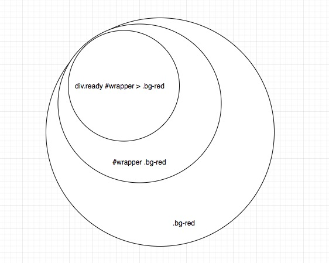

# 第三十四日

## HTML

### **Question:** Standards 模式和 Quirks 模式有什么区别

在 quirks 模式和标准模式之间一个突出的不同是对 CSS IE 盒模型缺陷的处理，怪异模式和标准模式最早是为了对旧版本网页进行兼容而设计的，可以通过 <!DOCTYPE> 来进行区分。

`standards`盒模型： `width` = `content`
`quirks`盒模型： `width` = `content` + `border` + `padding`

## CSS

### **Question:** 浏览器是怎样判断元素是否和某个 CSS 选择器匹配

#### 从右往左匹配

浏览器先产生一个元素集合，这个集合往往由最后一个部分的索引产生（如果没有索引就是所有元素的集合）。然后向上匹配，如果不符合上一个部分，就把元素从集合中删除，直到真个选择器都匹配完，还在集合中的元素就匹配这个选择器了。

即，从最开始匹配的元素集合，根据增加的选择器来剔除，得到最终匹配

## Reference

[前端面试每日 3+1-以前端面试题来驱动学习，提倡每日学习与思考，每天进步一点！](http://www.h-camel.com/index.html)
