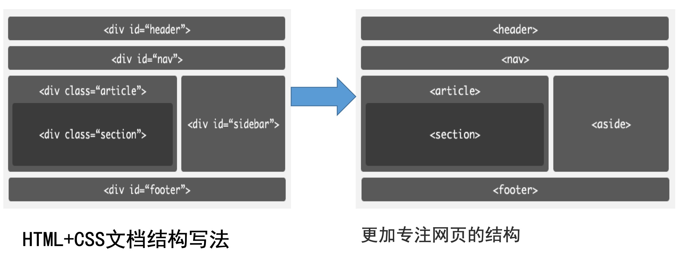

# 第三十七日

## HTML

### **Question:** `html5` 哪些标签可以优化 `SEO`

通过标签语义化优化 SEO

- `<h1>`是最高的等级，所以你需要准确确定每个页面最重要的内容是什么，要优化的关键词在哪里。以我们最常见的博客为例，博客首页罗列最多的通常就是最新博文，而最重要的应该就是博客的名称了，而后面最新文章的链接标题则可以使用`<h2>`或者`<h3>`，一般都使用`<h2>`，表示次级标题。

- `strong`标签的使用, `title`网站 SEO 标题
- `meta name="title" content="网站标题"`
- `meta name="description" content="网站描述"`
- `meta name="keywords" content="网站关键词"`
- `a href="链接地址" title="链接说明"`
- `img src="图片链接地址" alt="图片说明"`
- `div id="copyright"` 版权部分加上网站名称和链接



- `nav`: 可以帮助 UA 迅速获得导航内容，例如读屏器可以省去很多渲染直接跳到导航位置。

- `aside`: 可以表示与周围内容关系不太密切的内容 (广告)，通常表现为侧边栏内容 (相关背景内容)、引述内容

- `header`: 通常是一组介绍性描述 (搜索框 / logo / …)，网络爬虫知道诸如与之类的部分后可以非常简单的跳过它们，更好的定位网页内容

- `article`: 独立的文档、页面、应用、站点，可以单独发布、重用；可以是一篇帖子、一篇文章、一则用户评论、一个可交互的 widget

- `section`: 按主题将内容分组，通常会有标题 (heading): 内容体现在文档的提纲 (outline) 中时，用 section 是合适

## CSS

### **Question:** 不使用 border 画出 1px 高的线，在不同浏览器的标准和怪异模式下都能保持效果一样

```html
<div style="width: 100%;height: 1px;"></div>
<hr size="1" />
```

## JavaScript

### **Question:** 找到字符串中最长的单词，并返回它的长度

```js
function findLongestWord(str) {
  var stringArr = str.split(' ');

  return stringArr.reduce(function (prev, next) {
    // 返回值为参数与当前字符串中较大的数
    // 返回值会作为下次计算的 prev 传入
    return Math.max(prev, next.length);
  }, 0);
}
```

### **Question:** 实现斐波那契数列

递归

递归的方法定义

```
F(0) = 0;
F(1) = 1;
F(n) = F(n - 1) + F(n - 2);
```

1. 正常递归版本, 这个版本有个问题就是存在大量重复计算。如：当 n 为 5 的时候要计算 fib(4) + fib(3)当 n 为 4 的要计算 fib(3) + fib(2) ，这时 fib(3)就是重复计算了。

```js
function fib(n) {
  if (n < 0) throw new Error('输入的数字不能小于0');
  if (n < 2) {
    return n;
  }
  return fib(n - 1) + fib(n - 2);
}
```

2. `for` 循环: 这个版本没有重复计算问题。循环的问题在于状态变量太多，为了实现 fib 这里使用了 4 个状态变量(f0,f1,curFib,i) 而状态变量 在写、修改、删除的过程中需要格外小心。状态变量多,增加阅读难度。

```js
function fib(n) {
  if (n < 0) throw new Error('输入的数字不能小于0');
  let f_0 = 0;
  let f_1 = 1;
  let curFib = f0;
  if (n < 2) {
    return n;
  }
  for (let i = 1; i < n; i++) {
    curFib = f_0 + f_1;
    f_0 = f_1;
    f_1 = curFib;
  }
  return curFib;
}
```

3. 去除重复计算的递归版本:把前两位数字做成参数巧妙的避免了重复计算，性能也有明显的提升。n 做递减运算，前两位数字做递增（斐波那契数列的递增）,这段代码一个减，一个增。

```js
function fib(n) {
  if (n < 0) throw new Error('输入的数字不能小于0');
  if (n < 2) return n;
  function _fib(n, a, b) {
    if (n === 0) return a;
    return _fib(n - 1, b, a + b);
  }
  return _fib(n, 0, 1);
}
```

4. 基于 `ES6 Generator` 实现

```js
function* fib(n) {
  if (n < 0) throw new Error('输入的数字不能小于0');
  let f0 = 1,
    f1 = 1,
    count = 0;
  while (count < n) {
    yield f0;
    [f0, f1] = [f1, f0 + f1];
    count++;
  }
}
```

5. Array

```js
function fib(n) {
  if (n < 0) throw new Error('输入的数字不能小于0');
  if (n < 2) {
    return n;
  }
  let list = [];
  list[0] = 0;
  list[1] = 1;
  for (let i = 1; i < n; i++) {
    list[i + 1] = list[i] + list[i - 1];
  }
  return list[n];
}
```

## Reference

[HTML 标签语义化与 SEO - 掘金](https://juejin.cn/post/6876826035946684424)

[前端题](https://lgwebdream.github.io/FE-Interview/)
