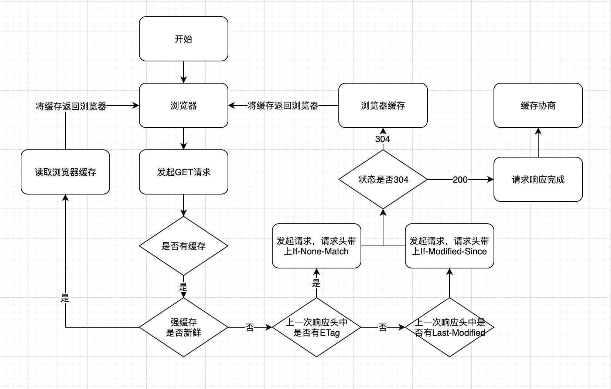

# 第四十日

## HTML

### **Question:** `html5` 都有哪些新的特性？移除了哪些元素

新增特性:

- `canvas`
- `svg`
- `video`
- `drag & drop`
- `localStorage/sessionStorage`
- 语义化标签: `header/nav/section/article/footer`
- `input` 类型: `date/datetime/email/range`

移除元素:

- `applet`
- `big`
- `font`
- `frame/frameset`

## CSS

### **Question:** 怎么才能让图文不可复制？

```js
// 禁止右键菜单
document.body.oncontextmenu = (e) => {
  return false;
  // e.preventDefault();
};
// 禁止文字选择
document.body.onselectstart = (e) => {
  return false;
  // e.preventDefault();
};
// 禁止复制
document.body.oncopy = (e) => {
  return false;
  // e.preventDefault();
};
// 禁止粘贴
document.body.onpaste = (e) => {
  return false;
  // e.preventDefault();
};
```

---

```css
/* CSS禁止文本选择，这样不会触发js */
body {
  user-select: none;
  -webkit-user-select: none;
  -moz-user-select: none;
  -ms-user-select: none;
  -o-user-select: none;
}
```

## JavaScript

### **Question:** 为什么会有跨域问题？怎么解决跨域？

浏览器为了安全，产生了同源策略，协议、域名、端口有一个不同，产生跨域问题。不同协议、不同域名、不同端口,即为不同源。

常用的跨域方式有：

1. JSONP： 优点是可以兼容老浏览器，缺点是只能发送 GET 请求
2. CORS：优点简单方便，支持 post 请求，缺点是需要后端的配合,不支持老版浏览器
3. Server Proxy：优点是前端正常发送 ajax 请求，缺点是后端会二次请求

## One more question

### **Question:** 说一下 Http 缓存策略，有什么区别，分别解决了什么问题

#### 浏览器缓存策略

浏览器每次发起请求时，先在本地缓存中查找结果以及缓存标识，根据缓存标识来判断是否使用本地缓存。如果缓存有效，则使用本地缓存；否则，则向服务器发起请求并携带缓存标识。根据是否需向服务器发起 HTTP 请求，将缓存过程划分为两个部分：**强制缓存**和**协商缓存**，强缓存优先于协商缓存。

- 强缓存，服务器通知浏览器一个缓存时间，在缓存时间内，下次请求，直接用缓存，不在时间内，执行比较缓存策略。
- 协商缓存，让客户端与服务器之间能实现缓存文件是否更新的验证、提升缓存的复用率，将缓存信息中的 Etag 和 Last-Modified 通过请求发送给服务器，由服务器校验，返回 **304** 状态码时，浏览器直接使用缓存。

HTTP 缓存都是从第二次请求开始的：

1. 第一次请求资源时，服务器返回资源，并在 response header 中回传资源的缓存策略
2. 第二次请求时，浏览器判断这些请求参数，击中强缓存就直接 返回状态码 200，否则就把请求参数加到 request header 头中传给服务器，看是否击中协商缓存，击中则返回 304，否则服务器会返回新的资源。



#### 强缓存

- 强缓存命中则直接读取浏览器本地的资源，在 network 中显示的是 from memory 或者 from disk
- 控制强制缓存的字段有：`Cache-Control`（http1.1）和 `Expires`（http1.0）
- `Cache-control` 是一个相对时间，用以表达自上次请求正确的资源之后的多少秒的时间段内缓存有效。
- `Expires` 是一个绝对时间。用以表达在这个时间点之前发起请求可以直接从浏览器中读取数据，而无需发起请求
- `Cache-Control` 的优先级比 Expires 的优先级高。前者的出现是为了解决 Expires 在浏览器时间被手动更改导致缓存判断错误的问题
- 如果同时存在则使用`Cache-control`

##### 强缓存 `expires`

- 该字段是**服务器**响应消息头字段，告诉浏览器在过期时间之前可以直接从浏览器缓存中存取数据

- `Expires` 是 `HTTP 1.0` 的字段，表示缓存到期时间，是一个绝对的时间 (当前时间+缓存时间)。在响应消息头中，设置这个字段之后，就可以告诉浏览器，在未过期之前不需要再次请求。

- 由于是绝对时间，用户可能会将客户端本地的时间进行修改，而导致浏览器判断缓存失效，重新请求该资源。此外，即使不考虑修改，时差或者误差等因素也可能造成客户端与服务端的时间不一致，致使缓存失效。

优点:

1.  `HTTP 1.0` 产物，可以在 `HTTP 1.0` 和 `1.1` 中使用，简单易用。
2.  以时刻标识失效时间。
    缺点：
3.  时间是由服务器发送的`(UTC)`，如果服务器时间和客户端时间存在不一致，可能会出现问题。
4.  存在版本问题，到期之前的修改客户端是不可知的。

##### 强缓存 `cache-control`

- 已知`Expires`的缺点之后，在`HTTP/1.1`中，增加了一个字段 `Cache-control`，该字段表示资源缓存的最大有效时间，在该时间内，客户端不需要向服务器发送请求。

- 这两者的区别就是前者是绝对时间，而后者是相对时间。下面是一些 `Cache-control` 字段*常用*的值：

  - `max-age`: 即最大有效时间
  - `must-revalidate`: 如果超过了 `max-age` 的时间，浏览器必须向服务器发送请求，验证资源是否还有效
  - `no-cache`: 不使用强缓存，需要与服务器验证缓存是否新鲜
  - `no-store`: 真正意义上的“不要缓存”。所有内容都不走缓存，包括强制和对比
  - `public`: 所有的内容都可以被缓存, 包括客户端和代理服务器， 如 `CDN`
  - `private`: 所有的内容只有客户端才可以缓存, 代理服务器不能缓存, _默认值_

- `Cache-control` 的优先级高于 `Expires`，为了兼容 `HTTP/1.0` 和 `HTTP/1.1`，实际项目中两个字段都可以设置

- 该字段可以在请求头或者响应头设置，可组合使用多种指令

优点：

1. `HTTP 1.1` 产物，以时间间隔标识失效时间，解决了 `Expires` 服务器和客户端相对时间的问题
2. 比`Expires` 多了很多选项设置

缺点：存在版本问题，到期之前的修改客户端是不可知的

#### 协商缓存

- 协商缓存的状态码由服务器决策返回`200`或者`304`
- 当浏览器的强缓存失效的时候或者请求头中设置了不走强缓存，并且在请求头中设置了`If-Modified-Since` 或者 `If-None-Match` 的时候，会将这两个属性值到服务端去验证是否命中协商缓存，如果命中了协商缓存，会返回 304 状态，加载浏览器缓存，并且响应头会设置 `Last-Modified` 或者 `ETag` 属性。
- 对比缓存在请求数上和没有缓存是一致的，但如果是 `304` 的话，返回的仅仅是一个状态码而已，并没有实际的文件内容，因此 在响应体体积上的节省是它的优化点。
- 协商缓存有 2 组字段(不是两个)，控制协商缓存的字段有：`Last-Modified/If-Modified-since（http1.0）` 和 `Etag/If-None-match（http1.1）`
- `Last-Modified/If-Modified-since` 表示的是服务器的资源最后一次修改的时间；`Etag/If-None-match` 表示的是服务器资源的唯一标
  识，只要资源变化，Etag 就会重新生成。
- `Etag/If-None-match` 的优先级比 `Last-Modified/If-Modified-since` 高。

## Reference

[Javascript 中的复制粘贴功能 ](http://blog.poetries.top/2018/12/23/js-copy/#2-2-%E9%98%B2%E5%A4%8D%E5%88%B6%E5%8A%9F%E8%83%BD)

[前端常见跨域解决方案（全） - SegmentFault 思否](https://segmentfault.com/a/1190000011145364)

[跨域资源共享 CORS 详解 - 阮一峰的网络日志](http://www.ruanyifeng.com/blog/2016/04/cors.html)

[彻底弄懂浏览器缓存策略 | 机器之心](https://www.jiqizhixin.com/articles/2020-07-24-12)
