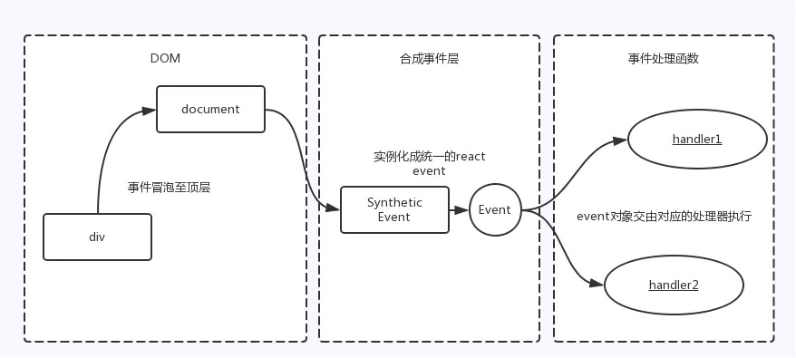

# 第四十七日

## HTML

### **Question:** `HTML5` 如何使用音频和视频

`<video>`[^1]

[^1]: [`<video>` - HTML（超文本标记语言） | MDN](https://developer.mozilla.org/zh-CN/docs/Web/HTML/Element/video)

`<audio>`[^2]

[^2]: [`<audio>` - HTML（超文本标记语言） | MDN](https://developer.mozilla.org/zh-CN/docs/Web/HTML/Element/audio)

## CSS

### **Question:** 怎样抽离样式模块的

通用的和业务相关的分离出来，通用的做成样式模块儿共享，业务相关的，放进业务相关的库里面做成对应功能的模块儿。[^3]

[^3]: [分类方法 - CSS 规范 - 规范 - NEC : 更好的 CSS 样式解决方案](http://nec.netease.com/standard/css-sort.html)

## JavaScript

### **Question:** 请说说对事件冒泡机制的理解

按照 W3C 事件模型，事件流按照次序依次为**捕获阶段**， **目标阶段**，**冒泡阶段**。如果事件绑定时候，禁止了冒泡，则事件流会停止在目标阶段。

先说两个有关 DOM 事件流的概念事件冒泡和事件捕获。

- 事件冒泡： 事件沿着 DOM 树向上通知
- 事件捕获：和事件冒泡相反，事件沿着 DOM 数向下通知

开发者可以自己决定事件处理注册到捕获阶段，或者是冒泡阶段。
`element1.addEventListener('click',doSomething2,true)` 如果最后一个参数为 true，则注册到捕获阶段。

### **Question:** React 事件绑定原理[^4]

React 并不是将 click 事件绑在该 div 的真实 DOM 上，而是在 document 处监听所有支持的事件，当事件发生并冒泡至 document 处时，React 将事件内容封装并交由真正的处理函数运行。这样的方式不仅减少了内存消耗，还能在组件挂载销毁时统一订阅和移除事件。
另外冒泡到 document 上的事件也不是原生浏览器事件，而是 React 自己实现的合成事件（SyntheticEvent）。因此我们如果不想要事件冒泡的话，调用 `event.stopPropagation` 是无效的，而应该调用 `event.preventDefault`。

[^4]: [React 事件绑定原理 · Issue #23 · lgwebdream/FE-Interview](https://github.com/lgwebdream/FE-Interview/issues/23)

## Reference

[haizlin/fe-interview: HTML/CSS/JavaScript/Vue/React/Nodejs/TypeScript/ECMAScritpt/Webpack/Jquery/小程序/软技能……](https://github.com/haizlin/fe-interview)

[lgwebdream/FE-Interview ](https://github.com/lgwebdream/FE-Interview)
