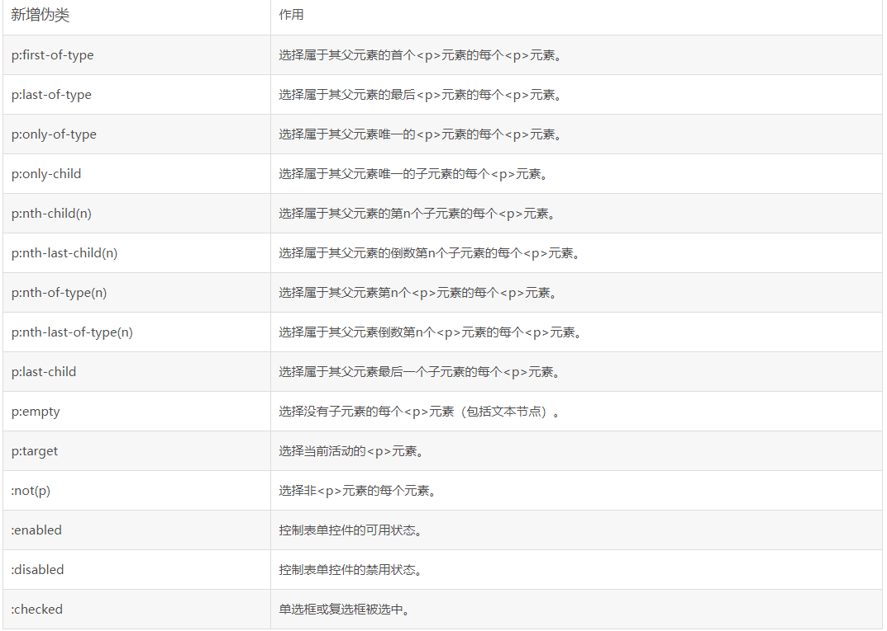

# 第五日

## HTML

**#Question:** 简述超链接 target 属性的取值和作用

`target` Where to display the linked URL. The following keywords have special meanings for where load the URL

| value    | 描述                                            | description                                                                       |
| -------- | ----------------------------------------------- | --------------------------------------------------------------------------------- |
| \_self   | （默认）在相同的框架中打开被链接文档            | the current browsing context(**_default_**)                                       |
| \_blank  | 在新窗口中打开被链接文档                        | usually a new tab, but users can configure browers to open a new window instead   |
| \_parent | 在父框架集中打开被链接文档                      | the parent browsing context of the current one. If no parent , behaves as `_self` |
| \_top    | 在整个窗口中打开被链接文档,忽略掉所有的框架结构 | the topmost browsing context. If no ancestors, behaves as `_self`                 |

## CSS

**#Question:** `CSS3` 新增伪类有哪些并简要描述



## JavaScript

**#Question:** 写一个把字符串大小写切换的方法

```js
function caseConvert(str) {
  return str.replace(/([a-z]*)([A-Z]*)/g, (m, s1, s2) => {
    return `${s1.toUpperCase()}${s2.toLowerCase()}`;
  });
}
caseConvert('AsA33322A2aa'); //aSa33322a2AA
```

---

```js
function caseConvert(str) {
  return str
    .split('')
    .map((s) => {
      const code = s.charCodeAt();
      if (code < 65 || code > 122 || (code > 90 && code < 97)) return s;

      if (code <= 90) {
        return String.fromCharCode(code + 32);
      } else {
        return String.fromCharCode(code - 32);
      }
    })
    .join('');
}

console.log(caseConvert('AbCdE')); // aBcDe

function caseConvertEasy(str) {
  return str
    .split('')
    .map((s) => {
      if (s.charCodeAt() <= 90) {
        return s.toLowerCase();
      }
      return s.toUpperCase();
    })
    .join('');
}

console.log(caseConvertEasy('AbCxYz')); // aBcXyZ
```

---

```js
function reverseCharCase(str) {
  if (!(typeof str === 'string')) {
    throw new Error('str must be string');
  }
  // 如果是空字符串，直接返回
  if (!str.length) {
    return str;
  }
  const lowerCaseReg = /[a-z]/;
  const upperCaseReg = /[A-Z]/;
  const len = str.length;
  let i = 0;
  let result = '';
  while (i < len) {
    if (lowerCaseReg.test(str.charAt(i))) {
      result += str.charAt(i).toLocaleUpperCase();
    } else if (upperCaseReg.test(str.charAt(i))) {
      result += str.charAt(i).toLocaleLowerCase();
    } else {
      result += str.charAt(i);
    }
    i++;
  }
  return result;
}
const testStringArray = [
  '',
  '1a1',
  'aABz',
  'aC R + 6788978e892*&&*(^%&*%^&%^&e',
];
testStringArray.forEach((str) => {
  console.log(reverseCharCase(str));
});
```

## Reference

[前端面试每日 3+1-以前端面试题来驱动学习，提倡每日学习与思考，每天进步一点！](http://www.h-camel.com/index.html)
