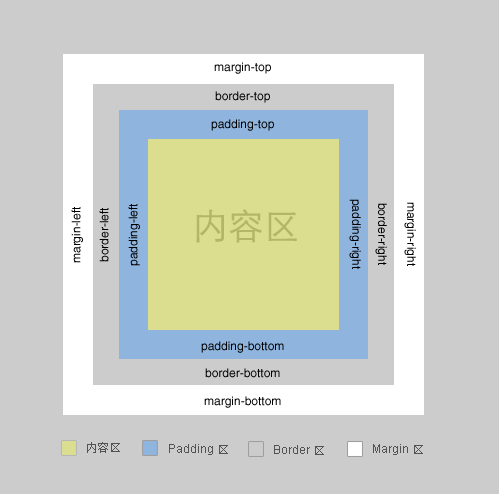

# 第六日

## HTML

**#Question:** label 都有哪些作用？并举相应的例子说明

The `<label>` HTML element represents a caption for an item in a user interface.

表示用户界面中某个元素的说明。

Associating a `<label>` with an `<input>` element offers some major advantages:

- A screen reader will read out the label when the user is focused on the form `<input>`, making it easier for an assistive technology user to understand what data should be entered.

- When a user clicks or touches a label, the browser passes the focus to its associated input.

_**Attribute**_

- `for`: The value of the for attritue must be a single `id` for a `labelable` form-related element in the same document as the `<label>` element.

[focus 锚点定位和 overflow 的选项卡切换效果 » CSS 世界 demo 演示](https://demo.cssworld.cn/6/4-3.php)

[100dayscss-051](https://codepen.io/mts123/pen/EzqdbM)

## CSS

**#Question:** 用 css 创建一个三角形，并简述原理



- 一个盒子包括: margin+border+padding+content
- 上下左右边框交界处出呈现平滑的斜线. 利用这个特点, 通过设置不同的上下左右边框宽度或者颜色可以得到小三角, 小梯形等
- 调整宽度大小可以调节三角形形状

1. 设置盒子的宽高度, 及上下左右边框, 会如下图：
   

```css
#test1 {
  height: 20px;
  width: 20px;
  border-color: #ff9600 #3366ff #12ad2a #f0eb7a;
  /* border-style: solid; */
  /* border-width: 20px; */
  border: 20px solid;
}
```

2. 在上面基础上, 我们把宽高度都设为 0 时, 会呈现上述的边界斜线
   

```css
#test2 {
  height: 0;
  width: 0;
  overflow: hidden; /* 这里设置overflow, font-size, line-height */
  font-size: 0; /*是因为, 虽然宽高度为0, 但在IE6下会具有默认的 */
  line-height: 0; /* 字体大小和行高, 导致盒子呈现被撑开的长矩形 */
  border-color: #ff9600 #3366ff #12ad2a #f0eb7a;
  /* border-style: solid; */
  /* border-width: 20px; */
  border: 20px solid;
}
```

3. 只保留上面的橙色
   

```css
#test3 {
  height: 0;
  width: 0;
  /* overflow: hidden; */
  /* font-size: 0; */
  /* line-height: 0; */
  border-color: #ff9600 transparent transparent transparent;
  /* border-style: solid; */
  /* border-width: 20px; */
  border: 20px solid;
}
```

## JavaScript

**#Question:** 写一个去除制表符和换行符的方法

```js
/**
 * \f  匹配 换页字符。
 * \n  匹配 换行字符。
 * \r  匹配 回车符字符。
 * \t  匹配 制表字符。
 * \v  匹配 垂直制表符。
 * @param str
 * @returns {void | string}
 */
const removeEmpty = (str) => str.replace(/[\t\n\v\r\f]/g, '');

console.log(
  removeEmpty(`|
     
|`)
);
```

## Reference

[CSS 三角形的实现原理及运用-前端开发博客](http://caibaojian.com/css-border-triangle.html)

[CSS 绘制三角形—border 法 - 简书](https://www.jianshu.com/p/9a463d50e441)

[前端面试每日 3+1-以前端面试题来驱动学习，提倡每日学习与思考，每天进步一点！](http://www.h-camel.com/index.html)
