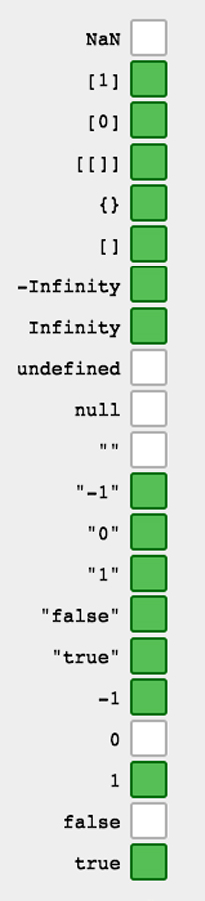

# 第六十五日

## HTML

### **Question:** `HTML`直接输入多个空格为什么只能显示一个空格

该行为由 CSS `white-space` 控制，其默认值 `normal` 的表现即为**多个空格压缩成一个**

## JavaScript

### **Question:** 数据类型转换的方法有哪些

1. 数据等于判断时的类型转换

2. `if` 等判断只做 `Boolean()` 转换

包含： `if` `?:` `&&` `||`



3. `Number` 与 `parse` 函数

`Number` 比 `parseInt` 能转化更多，比如 `""` `Infinity` `[]` `true` 都会被 `parseInt` 返回 `NaN`，而 `Number` 有值。

```js
Number(''); // 0
parseInt(''); // NaN

Number([1, 2]); // NaN
parseInt([1, 2]); // 1

Number(null); // 0
Number(undefined); // NaN
parseInt(null); // NaN
parseInt(undefined); // NaN

((Number('1.') == parseInt('1.')) == parseInt('1,')) == 1;

Number('1x') == NaN;
```

4. 计算时的类型转换

```js
+' 014'   // 14
+'0x12'   // 18

1 + '14'    // '114'
1 + '0x12'  // '10x12'
1 + +'14'   // 15
'14' + 1    // '141'

1 + [1, 1];     // '11,1'
1 + {};         // '1[object Object]'

1 + null;       // 1
1  +undefined;  // NaN

++'14'    // ReferenceError

Infinity+Infinity;      // Infinity
-Infinity+(-Infinity);  // -Infinity
Infinity+(-Infinity);   // NaN

+0+(+0);     // 0
(-0)+(-0);   // -0
(+0)+(-0);   // 0

```

5. `toString`

```js
String(null); // 'null'
null.toString(); // Uncaught TypeError
undefined.toString(); // Uncaught TypeError

(30).toString(16); // "1e"
'30'.toString(16); // "30"

[1, [2, 'abc', '', 0, null, undefined, false, NaN], 3].toString();
// "1,2,abc,,0,,,false,NaN,3"

null.toString(); // Uncaught TypeError
// 在使用 toString 时最好加个判断，或用 [] 再 toString
[null].toString(); // ''
```

6. `JSON.stringify`

```js
JSON.stringify(Infinity); // 'null'
JSON.stringify(NaN); // 'null'
JSON.stringify(undefined); // undefined （注：非字符串）
JSON.stringify([undefined]); // '[null]'
JSON.stringify({ a: undefined }); // '{}'
JSON.stringify({ a: null }); // '{"a":null}'
JSON.stringify(() => {}); // 'undefined'
```

## Reference

[haizlin/fe-interview](https://github.com/haizlin/fe-interview)

[lgwebdream/FE-Interview ](https://github.com/lgwebdream/FE-Interview)
