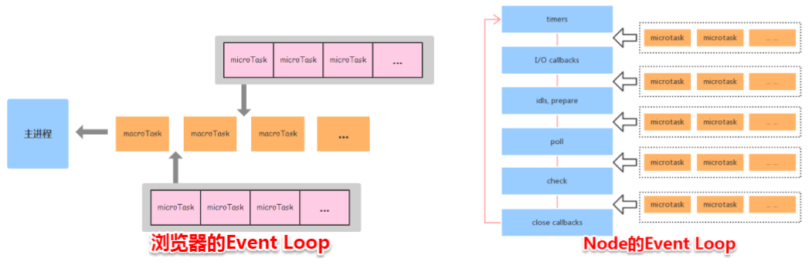

# 第六十六日

## HTML

### **Question:** `HTML5`如果不写`<! DOCTYPE html>`, 页面还会正常工作么

页面添加了`<! DOCTYPE html>`说明该页面采用了`W3C`标准，如果不加则页面会根据浏览器自身的解析标准来解析，这可能会导致页面在不同的浏览器呈现出不同的效果。

## CSS

### **Question:** 元素竖向的百分比设置是相对容器的高度吗

当按百分比设定一个元素的**宽度**时，它是相对于父容器的宽度计算的

**对于一些表示竖向距离的属性**，例如`padding-top`, `padding-bottom`, `margin-top`, `margin-bottom`等，当按百分比设定它们时，依据的也是**父容器的宽度，而不是高度**。

## JavaScript

### **Question:** 事件循环机制(node、浏览器)

#### 为什么会有`Event Loop`

`JavaScript`的任务分为两种**同步**和**异步**，它们的处理方式也各自不同，同步任务是直接放在主线程上排队依次执行，异步任务会放在任务队列中，若有多个异步任务则需要在任务队列中排队等待，任务队列类似于缓冲区，任务下一步会被移到调用栈然后主线程执行调用栈的任务。

> 调用栈：调用栈是一个栈结构，函数调用会形成一个栈帧，帧中包含了当前执行函数的参数和局部变量等上下文信息，函数执行完后，它的执行上下文会从栈中弹出。

`JavaScript`是单线程的，单线程是指 js 引擎中解析和执行 js 代码的**线程只有一个（主线程）**，每次只能做一件事情，然而`ajax`请求中，主线程在等待响应的过程中会去做其他事情，浏览器先在事件表注册`ajax`的回调函数，响应回来后， 回调函数被添加到任务队列中等待执行，不会造成线程阻塞，所以说 js 处理 ajax 请求的方式是异步的。

综上所述，检查调用栈是否为空以及讲某个任务添加到调用栈中的个过程就是 event loop，这就是 JavaScript 实现异步的核心。

#### 浏览器中的 `Event Loop`

`Micro-Task` 与 `Macro-Task`

**浏览器端事件循环**中的异步队列有两种：`macro`（宏任务）队列和 `micro`（微任务）队列。

常见的 `macro-task`：

1. `setTimeout`
2. `setInterval`
3. `<script></script>`
4. `I/O`
5. `UI`渲染

常见的 `micro-task`:

1. `Promise`
2. `MutationObserver` : 触发指定 DOM 事件时，调用指定的回调函数。`MutationObserver` 对 `DOM` 的观察不会立即启动；而必须先调用 `observe()` 方法来确定，要监听哪一部分的 `DOM` 以及要响应哪些更改。

Note:

`requestAnimationFrame`: 属于异步执行的方法，但该方法既不属于宏任务，也不属于微任务。`requestAnimationFrame`是 GUI 渲染之前执行，但在`Micro-Task`之后，不过 requestAnimationFrame 不一定会在当前帧必须执行，由浏览器根据当前的策略自行决定在哪一帧执行。


1. 检查 `macrotask` 队列是否为空，非空则到 2，为空则到 3
2. 执行 `macrotask` 中的一个任务
3. 继续检查 `microtask` 队列是否为空，若有则到 4，否则到 5
4. 取出 `microtask` 中的任务执行，执行完成返回到步骤 3
5. 执行视图更新

> 当某个宏任务执行完后,会查看是否有微任务队列。如果有，先执行微任务队列中的所有任务，如果没有，会读取宏任务队列中排在最前的任务，执行宏任务的过程中，遇到微任务，依次加入微任务队列。栈空后，再次读取微任务队列里的任务，依次类推。

#### `node` 中的 `Event Loop`

`Node` 中的 `Event Loop` 和浏览器中的是完全不相同的东西。`Node.js` 采用`V8`作为`js解析引擎`，而`I/O`处理方面使用了自己设计的`libuv`，`libuv`是一个基于事件驱动的跨平台抽象层，封装了不同操作系统一些底层特性，对外提供`统一的API`，事件循环机制也是它里面的实现。


1. `V8` 引擎解析 `JavaScript` 脚本。
2. 解析后的代码，调用 `Node API`。
3. `libuv` 库负责 `Node API` 的执行。它将不同的任务分配给不同的线程，形成一个 `Event Loop`（事件循环），以异步的方式将任务的执行结果返回给 V8 引擎。
4. `V8` 引擎再将结果返回给用户。

##### `libuv`

- 六大阶段

`libuv`引擎中的事件循环分为 `6 个阶段`，它们会按照顺序反复运行。每当进入某一个阶段的时候，都会从对应的回调队列中取出函数去执行。当队列为空或者执行的回调函数数量到达系统设定的阈值，就会进入下一阶段。


1. `timers` 阶段：这个阶段执行 `timer`（`setTimeout`、`setInterval`）的回调，并且是由 `poll` 阶段控制的。
2. `I/O callbacks` 阶段：处理一些上一轮循环中的少数未执行的 `I/O` 回调
3. `idle, prepare` 阶段：仅 `node` 内部使用
4. `poll` 阶段：获取新的 `I/O` 事件, 适当的条件下 `node` 将阻塞在这里
5. `check` 阶段：执行 `setImmediate()` 的回调
6. `close callbacks` 阶段：执行 `socket` 的 `close` 事件回调

###### `poll`阶段

`poll` 是一个至关重要的阶段，这一阶段中，系统会做两件事情：

1. 回到 `timer` 阶段执行回调
2. 执行 `I/O` 回调

在进入该阶段时如果没有设定了 timer 的话，会发生以下两件事情：

- 如果 `poll` 队列不为空，会遍历回调队列并同步执行，直到队列为空或者达到系统限制
- 如果 `poll` 队列为空时：
  - 如果有 `setImmediate` 回调需要执行，`poll` 阶段会停止并且进入到 `check` 阶段执行回调
  - 如果没有 `setImmediate` 回调需要执行，会等待回调被加入到队列中并立即执行回调，这里同样会有个超时时间设置防止一直等待下去

设定了 `timer` 且 `poll` 队列为空，则会判断是否有 `timer 超时`，如果有的话会回到 `timer` 阶段执行回调。

###### `Micro-Task` 与 `Macro-Task`

`Node`端事件循环中的异步队列也是这两种：`macro（宏任务）`队列和 `micro（微任务）`队列。

常见的 macro-task:

- `setTimeout`、`setInterval`、 `setImmediate`、`<script></script>`、 `I/O` 操作

常见的 micro-task:

- `process.nextTick`, `Promise`

##### Note

###### `setTimeout` 和 `setImmediate`

二者非常相似，区别主要在于调用时机不同。

- `setImmediate` 设计在`poll`阶段完成时执行，即`check`阶段；
- `setTimeout` 设计在`poll`阶段为空闲时，且设定时间到达后执行，但它在`timer`阶段执行

```js
setTimeout(function timeout() {
  console.log('timeout');
}, 0);
setImmediate(function immediate() {
  console.log('immediate');
});
```

1. 对于以上代码来说，`setTimeout` 可能执行在前，也可能执行在后。
2. 首先 `setTimeout(fn, 0) === setTimeout(fn, 1)`，这是由源码决定的 进入事件循环也是需要成本的，如果在准备时候花费了大于 1ms 的时间，那么在 `timer` 阶段就会直接执行 `setTimeout` 回调
3. 如果准备时间花费小于 1ms，那么就是 `setImmediate` 回调先执行了

###### `process.nextTick`

这个函数其实是独立于 `Event Loop` 之外的，它有一个自己的队列，当每个阶段完成后，如果存在 `nextTick` 队列，就会清空队列中的所有回调函数，并且优先于其他 `microtask` 执行。

#### `Node`与浏览器的 `Event Loop` 差异



- `Node`端，`microtask` 在事件循环的各个阶段之间执行
- 浏览器端，`microtask` 在事件循环的 `macrotask` 执行完之后执行

> 在 `node 11` 版本后，`node` 下 `Event Loop` 已经与`浏览器`趋于相同

## Reference

[haizlin/fe-interview](https://github.com/haizlin/fe-interview)

[lgwebdream/FE-Interview ](https://github.com/lgwebdream/FE-Interview)

[七个 Web 前端程序员必须会用 css 技巧](https://www.webhek.com/post/7-tips-web-front-developer-must-know__trashed.html)

[事件循环机制](https://github.com/lgwebdream/FE-Interview/issues/26)

[浏览器和 Node 不同的事件循环（Event Loop） - SegmentFault 思否](https://segmentfault.com/a/1190000013660033)
