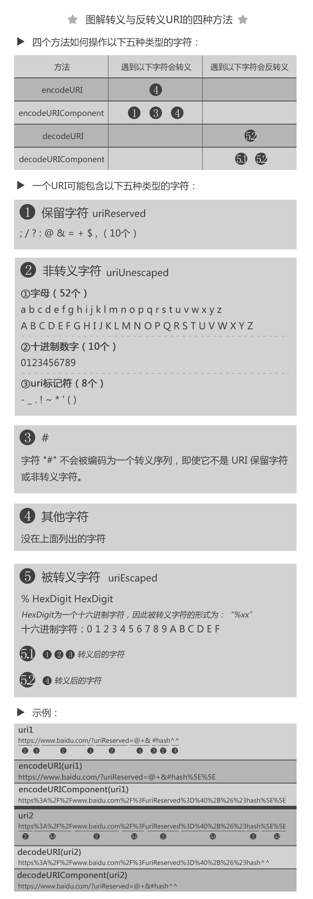

# 第八十日

## HTML

### **Question:** 简述`HTML`的快捷键属性是哪个？并举例说明有什么用

`accesskey`属性目前是 h5 标准中的一个全局快捷键访问属性，通过在*任意元素*上注入`accesskey`属性值，在浏览器中触发相应的快捷键 `alt + key` or `control + alt(option) + key`(macos)，即可实现对相应元素的 focus 或 click；

```html
<a
  href="https://developer.mozilla.org/zh-CN/docs/Web/HTML/Global_attributes/accesskey"
  target="_blank"
  accesskey="x"
  >快捷键x：accesskey</a
>
<div accesskey="z" onclick="this.style.color = 'red';">快捷键z：变红</div>
```

## CSS

### **Question:** 说明如何强制（自动）中、英文换行与不换行

1. `word-break:break-all;`只对英文起作用，以字母作为换行依据
2. `word-wrap:break-word;` 只对英文起作用，以单词作为换行依据
3. `white-space:pre-wrap;` 只对中文起作用，强制换行
4. `white-space:nowrap;` 强制不换行，都起作用
5. `white-space:nowrap;` `overflow:hidden;` `text-overflow:ellipsis;`不换行，超出部分隐藏且以省略号形式出现（部分浏览器支持）

## JavaScript

### **Question:** 什么是`decodeURI()`和`encodeURI()`是什么

- `encodeURI()`：将 `URI` 中的每个字符编码为 `1-4` 个格式为 `%xx` 的转义序列（`xx` 为十六进制数），但不包括 `ASCII` 数字、字母、URL 分隔符（`/、?、,、&、...`）、以及其他部分 `ASCII` 字符。具体见 MDN[^1]。
  [^1]:[encodeURI() - JavaScript | MDN](https://developer.mozilla.org/zh-CN/docs/Web/JavaScript/Reference/Global_Objects/encodeURI)

  - Example: `encodeURI('http://example.com/端点?键=值') => 'http://example.com/%E7%AB%AF%E7%82%B9?%E9%94%AE=%E5%80%BC'`

- `decodeURI()`：将已经编码的 `URI` 中的转义序列解码为它们表示的字符，但除了 `encodeURI()` 不会编码的字符。

- `encodeURIComponent()`：用于编码 `URI` 中的组成部分。它除了转义 `encodeURI()` 指定的字符，还会转义 URL 分隔符（`/、?、,、&、...`）

  - Example: `encodeURIComponent('测试/测试?测试=测试') => '%E6%B5%8B%E8%AF%95%2F%E6%B5%8B%E8%AF%95%3F%E6%B5%8B%E8%AF%95%3D%E6%B5%8B%E8%AF%95'`

- `decodeURIComponent()`：将已经编码的 URI 组成部分中的转义序列解码为它们表示的字符，但除了 `encodeURIComponent()` 不会编码的字符。



> - 都是编码 URL，唯一区别就是编码的字符范围
> - `encodeURIComponent`比`encodeURI`编码的范围更大。

## Reference

[haizlin/fe-interview](https://github.com/haizlin/fe-interview)

[lgwebdream/FE-Interview ](https://github.com/lgwebdream/FE-Interview)

[accesskey - HTML（超文本标记语言） | MDN](https://developer.mozilla.org/zh-CN/docs/Web/HTML/Global_attributes/accesskey)

[HTML accesskey 属性与 web 自定义键盘快捷访问 « 张鑫旭-鑫空间-鑫生活](https://www.zhangxinxu.com/wordpress/2017/05/html-accesskey/)

[CSS 单词换行 and 断词，你真的完全了解吗 | AlloyTeam](http://www.alloyteam.com/2016/05/css-word-for-word-breaker-do-you-really-understand/)

[彻底搞懂 word-wrap、white-space 等 - 掘金](https://juejin.cn/post/6844903697424580616)
