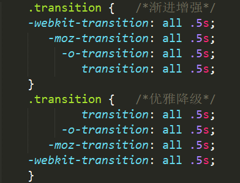

# 第九日

## HTML

**#Question:** 浏览器内多个标签页之间的通信方式有哪些？(网页间 消息 通讯)

### 是什么？

在浏览器中，两个不同页面（A 页面的 window ！= B 页面的 window）网页之间的消息传递

### 消息传递方式

#### 1. WebSocket - 可跨域

> WebSocket 是 HTML5 开始提供的一种在单个 TCP 连接上进行全双工通讯的协议。

> **[WebSocket 教程](https://www.ruanyifeng.com/blog/2017/05/websocket.html)**

#### 2. postMessage - 可跨域

`window.postMessage()` 方法安全地启用 Window 对象之间的跨源通信

对将接收消息的窗口的引用，获得此类引用的方法包括：

1. `<iframe>`
2. `Window.open` （生成一个新窗口然后引用它）
3. `Window.opener` （引用产生这个的窗口）

#### 3. Worker 之 ShareWorker

1. `webworker`，作为浏览器的一个新特性，可以提供一个额外的线程来执行一些 js 代码（真正的多线程），并且不会影响到浏览器用户界面，但是不能 DOM 操作。

2. `SharedWorker` 可以被多个 window 共同使用，所以可以用来跨页面传输数据，但必须保证这些标签页都是同源的(相同的协议，主机和端口号)。

#### 4. Server-Sent Events

`HTML5` 服务器发送事件（`server-sent event`）允许网页获得来自服务器的更新。
`Server-Sent` 事件指的是网页自动获取来自服务器的更新。

#### 5. localStorage

localstorage 是浏览器多个标签共用的存储空间，所以可以用来实现多标签之间的通信(ps：session 是会话级的存储空间，每个标签页都是单独的）。 直接在 window 对象上添加监听即可。

#### 6. Cookies

Cookies 在同一个域名内，并且目录也得相同，可以参考第三方库

> [js-cookie/js-cookie: A simple, lightweight JavaScript API for handling browser cookies](https://github.com/js-cookie/js-cookie)

#### 7. BroadcastChannel

只要是在同一原始域和用户代理下，所有窗口、iframe 之间都可以进行交互

## CSS

**#Question:** 简述下你理解的优雅降级和渐进增强

### 背景

渐进增强和优雅降级这两个概念是在 CSS3 出现之后火起来的。由于低级浏览器不支持 CSS3，但是 CSS3 特效太优秀不忍放弃，所以在高级浏览器中使用 CSS3，而在低级浏览器只保证最基本的功能。二者的目的都是关注不同浏览器下的不同体验，但是它们侧重点不同，所以导致了工作流程上的不同。

### 渐进增强

渐进增强 `（Progressive Enhancement）`：一开始就针对低版本浏览器进行构建页面，完成基本的功能，然后再针对高级浏览器进行效果、交互、追加功能达到更好的体验。

- **应关注于内容本身**

### 优雅降级

优雅降级`（Graceful Degradation）`：一开始就构建站点的完整功能，然后再针对低版本浏览器进行兼容。比如一开始使用 CSS3 的特性构建了一个应用，然后逐步针对各大浏览器进行 hack 使其可以在低版本浏览器上正常浏览。

- **应针对最高级、最完善的浏览器来开发网站**

### 用法简介



1. 很久以前：浏览器前缀 CSS3 和正常 CSS3 都不支持
2. 不久之前：浏览器只支持前缀 CSS3，不支持正常 CSS3
3. 现在：浏览器既支持前缀 CSS3，又支持正常 CSS3
4. 未来：浏览器不支持前缀 CSS3，仅支持正常 CSS3

### 如何选择

1. 若*低版本*用户居多，则优先采用**渐进增强**的开发流程

2. 若*高版本*用户居多，则为了提高大多数用户的使用体验，那当然优先采用**优雅降级**的开发流程

3. 多数大公司采用渐进增强的方式（通常业务优先）

## JavaScript

**#Question:** 写一个判断数据类型的方法

```js
function testType(obj) {
  return Object.prototype.toString
    .call(obj)
    .replace(/^.{8}(.+)]$/, (m, $1) => $1.toLowerCase());
}
```

---

```js
// typeof 只能判断 《基本类型》 string,number,boolean, undefined,object
// null 会被判断成 object
// toString()
Object.prototype.toString.call([]); //"[object Array]"
Object.prototype.toString.call({}); //"[object Object]"

function testType(obj) {
  return Object.prototype.toString.call(obj).replace(/\[object\s|\]/g, '');
}

console.log(testType([])); //"Array"
console.log(testType(1)); //"Number"
```

## Reference

[网页消息通信](https://xv700.gitee.io/message-communication-for-web/)

[前端面试题-渐进增强和优雅降级 - SegmentFault 思否](https://segmentfault.com/a/1190000013818745)

[前端面试每日 3+1-以前端面试题来驱动学习，提倡每日学习与思考，每天进步一点！](http://www.h-camel.com/index.html)
