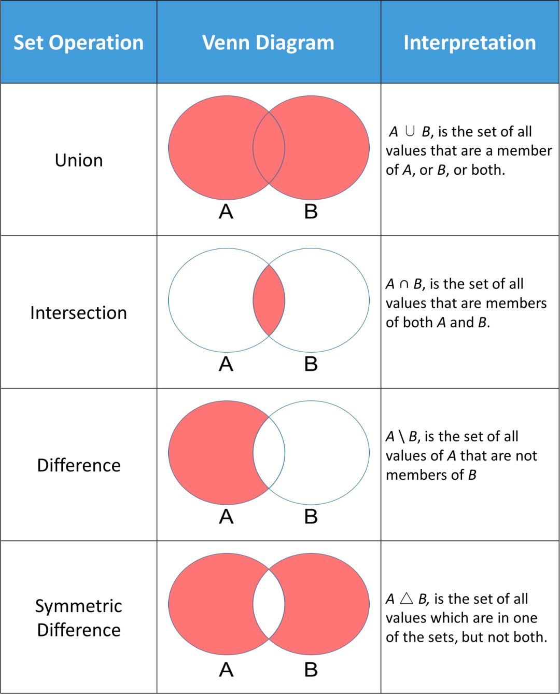

# 第九十五日

## HTML

### **Question:** HTML5 标准提供了哪些新的 API

1. 两个选择器 API

   - `document.querySelector()`
   - `document.querySelectAll()`

2. 地理定位 API

   - `getCurrrentPosition()`

3. 多媒体 API

   - `<video></video>`
   - `<audio></audio>`

4. 拖放

```html
<div ondrop="drop(event)" ondragover="allowDrop(event)"></div>
<div draggable="true" ondragstart="drag(event)"></div>
```

5. 文件

   - `window.requestFileSystem()`

6. XHR2

```js
var xhr = new XMLHttpRequest();
xhr.open("POST", "@Url.Action("Upload")")
```

7. `canvas`
8. `svg`

## CSS

### **Question:** 当一个元素被设置为浮动后，它的`display`值变为什么呢

一个元素被设为**绝对定位**或者**浮动**后，**其`display`计算值就变为了`block`**，尽管其表现形式和`inline-block`类似——包裹内部元素且不超出包含块的特性。

在控制台尝试可验证：

```js
var span = document.createElement('span');
document.body.appendChild(span);
console.log('1.' + window.getComputedStyle(span).display);
span.style.float = 'left';
console.log('2.' + window.getComputedStyle(span).display);

// 1.inline
// 2.block
```

## JavaScript

### **Question:** 分别写出数组的交集、并集、差集、补集这四个方法



---

```js
const intersect = (a, b) => a.filter((i) => b.includes(i)); // 交
const exclude = (a, b) => a.filter((i) => !b.includes(i)); // 差
const union = (a, b) => exclude(a, b).concat(b); // 并
const unionAll = (a, b) => a.concat(b); // 重复并
const xor = (a, b) => exclude(a, b).concat(exclude(b, a)); // 补
```

---

```js
var sa = new Set(a);
var sb = new Set(b);
// 交集
let intersect = a.filter((x) => sb.has(x));
// 差集
let minus = a.filter((x) => !sb.has(x));
// 补集
let complement = [
  ...a.filter((x) => !sb.has(x)),
  ...b.filter((x) => !sa.has(x)),
];
// 并集
let unionSet = Array.from(new Set([...a, ...b]));
```

## Reference

[haizlin/fe-interview](https://github.com/haizlin/fe-interview)

[lgwebdream/FE-Interview ](https://github.com/lgwebdream/FE-Interview)

[Map.prototype.has() - JavaScript | MDN](https://developer.mozilla.org/zh-CN/docs/Web/JavaScript/Reference/Global_Objects/Map/has)

[Array.from() - JavaScript | MDN](https://developer.mozilla.org/zh-CN/docs/Web/JavaScript/Reference/Global_Objects/Array/from)
