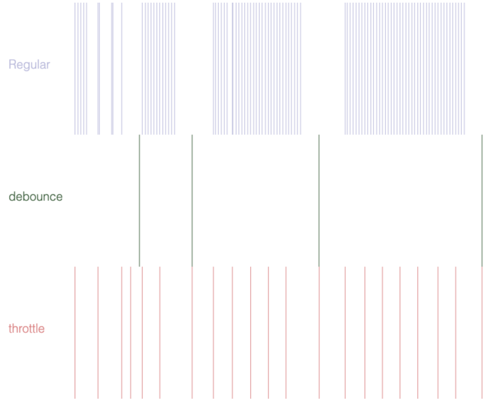

# 防抖 与 节流

# Debouncing and Throttling in Javascript

> Debouncing and Throttling are two widely-used techniques to improve the performance of code that gets executed repeatedly within a short time(a peroid of time).



## Debouncing 防抖

用来实现高频触发函数调用时，实际只调用最后一次函数执行。

用于可能出现高频调用的 DOM 或 样式修改， 这种高频调用会导致页面高频重排重绘，DOM 闪烁抖动，影响页面性能。

```js
//  Debounce
function debouce(handler, interval) {
  let lastDate = 0;
  let time;
  return function () {
    let self = this;
    let args = arguments;
    clearTimeout(time);
    time = setTimeout(function () {
      handler.apply(self, args);
    }, interval);
  };
}
```

## Throttling 节流

用来实现阻止在短时间内重复多次触发同一个函数。

用途： 防止使用脚本 循环触发网络请求的函数，确保请求的合理和真实性

```js
// Throttle

function throttle(handler, wait) {
  let lastDate = 0;
  return function () {
    var newDate = new Date().getTime();
    if (newDate - lastDate > wait) {
      handler.apply(this, arguments);
    }
    lastDate = newDate;
  };
}
```

## Reference

[javaScript 节流与防抖](https://www.huaweicloud.com/articles/289941d93ba2f7dc048d790d1697f80d.html)
